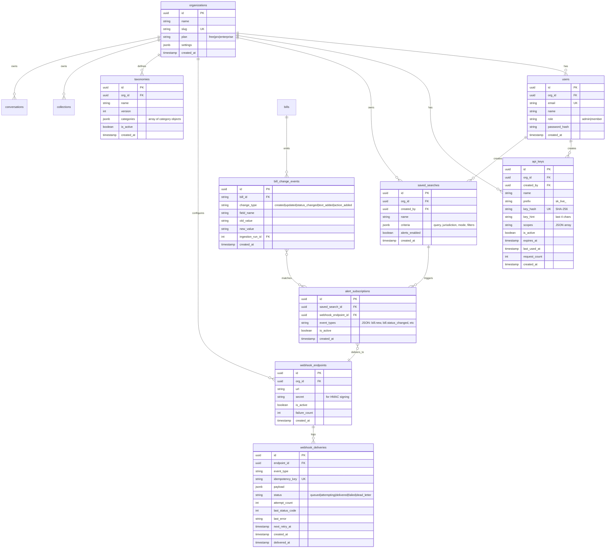

# Phase 4: Platform & Scale

## Overview

Phase 4 transforms the legislative research tool from a single-tenant application into a multi-org platform with webhook-driven alerts, historical trend analysis, custom taxonomies, and self-service API access. Phases 0-3 delivered 272 tests, 15 API routers, 11 data ingesters, 8 LLM analysis types, and a full Next.js frontend. Phase 4 adds the platform layer that lets multiple organizations use the system independently.

**User-selected priorities:**
1. Webhook/alert system for bill changes matching saved criteria
2. Historical analysis tools (multi-year trend analysis)

**Deployment model:** Hybrid — shared data pipeline, per-org API keys and configuration.

**Monetization:** Build key provisioning and usage tracking now; defer billing integration.

## Problem Statement

The platform currently has:
- **No identity model** — a single static API key via env var, unauthenticated `client_id` header for soft ownership
- **No change tracking** — ingesters log aggregate counts, not which bills changed
- **No notification system** — no webhooks, no event bus, no alert delivery
- **Client-side saved searches only** — localStorage, no server persistence
- **IP-based rate limiting** — in-memory via slowapi, resets on deploy
- **Missing time-series indexes** — `action_date`, `created_at`, `started_at` unindexed
- **Fixed taxonomy** — LLM classification uses hardcoded system categories only

Every Phase 4 feature depends on knowing *who* is making a request and *which org* they belong to. The identity/auth foundation must be built first.

## Technical Approach

### Architecture

Phase 4 introduces four new architectural layers:

```
┌──────────────────────────────────────────────────────────────┐
│                   Identity & Auth Layer                       │
│  Organizations → Users → API Keys → Rate Limit Tiers         │
│  SHA-256 hashed keys, per-org scoping, usage tracking         │
└──────────────────────┬───────────────────────────────────────┘
                       │
┌──────────────────────┴───────────────────────────────────────┐
│                   Event & Alert Layer                         │
│  Bill Change Events → Saved Search Eval → Webhook Delivery   │
│  Application-level diffing, HMAC-signed payloads, retry      │
└──────────────────────┬───────────────────────────────────────┘
                       │
┌──────────────────────┴───────────────────────────────────────┐
│                   Analytics Layer                             │
│  Time-series indexes → Aggregation endpoints → Trend UI      │
│  Bucketed counts, grouped by jurisdiction/topic/year          │
└──────────────────────┬───────────────────────────────────────┘
                       │
┌──────────────────────┴───────────────────────────────────────┐
│                   Per-Org Config Layer                        │
│  Custom Taxonomies → Org-scoped classifications               │
│  Dynamic prompt injection, per-org ai_analyses                │
└──────────────────────────────────────────────────────────────┘
```

### Data Model (ERD)



### Key Design Decisions

**1. API Key Hashing: SHA-256 (not bcrypt)**
API keys are high-entropy random strings (256 bits). Brute-force is infeasible regardless of hash speed. bcrypt would add ~200ms per request for key verification — unacceptable for an API. Keys use Stripe-style prefixes (`sk_live_...`) for leak detection.

**2. Webhook Delivery: PostgreSQL-backed queue (no Redis initially)**
Use the `webhook_deliveries` table as a job queue, processed by a new APScheduler job every 60 seconds. This avoids adding infrastructure. If delivery volume exceeds what polling can handle, upgrade to arq + Redis later. HMAC-SHA256 signed payloads. Exponential backoff with jitter, 8 retry attempts over ~24 hours. Circuit breaker disables endpoint after 5 consecutive dead-letter deliveries.

**3. Change Detection: Application-level diffing in ingesters**
Each ingester already runs through an upsert loop. Add field-level comparison before upsert and emit `BillChangeEvent` records for each detected change. The `BaseIngester` class gets a new `_track_change()` helper. This is cheaper and simpler than database triggers or CDC.

**4. Saved Search Evaluation: Two-tier strategy**
- **Filter-only searches** (jurisdiction + keyword ILIKE + status): evaluated via SQL against changed bill IDs immediately after ingestion. Fast, O(changed_bills).
- **Semantic/hybrid searches**: evaluated on a nightly schedule by re-executing the full search engine. Slower but accurate. Configurable per saved search.

**5. Tenant Isolation: Shared data, org-scoped access**
Bills, bill texts, actions, people, votes are **global shared data** — ingested once for all orgs. Per-org data includes: collections, conversations, saved searches, webhooks, custom taxonomies, org-scoped AI analyses. Access control enforced via SQLAlchemy `do_orm_execute` event filter on `OrgScoped` mixin models.

**6. Rate Limiting: Per-API-key with tier-based limits**
Migrate slowapi `key_func` from `get_remote_address` to API key extraction. Three tiers: free (50 req/min, read-only), pro (500 req/min, all endpoints), enterprise (5000 req/min, custom). LLM-powered endpoints (summarize, classify, constitutional, patterns, predict, report, chat) gated behind pro+ tier.

**7. `client_id` Migration: Backward-compatible**
If request has API key → derive org_id from key. If no API key and `settings.api_key` is empty → fall back to dev mode with `client_id` header. Existing collection/conversation records with string `client_id` can be retroactively linked to orgs via a data migration when the org is created.

### Implementation Phases

#### Phase 4A: Foundation (Identity + Auth + Rate Limiting)

This phase is the prerequisite for everything else. No other Phase 4 feature can ship without it.

**New files:**
- `src/models/organization.py` — Organization model
- `src/models/user.py` — User model
- `src/models/api_key.py` — API key model with SHA-256 hash
- `src/schemas/organization.py` — Org CRUD schemas
- `src/schemas/api_key.py` — Key provisioning schemas
- `src/services/auth_service.py` — Key generation, verification, org lookup
- `src/api/organizations.py` — Org management endpoints
- `src/api/api_keys.py` — Key CRUD endpoints
- `migrations/versions/004_add_org_user_apikey_tables.py`

**Modified files:**
- `src/api/deps.py` — Replace static key check with DB lookup, add org context
- `src/api/app.py` — Mount new routers, update rate limiting
- `src/config.py` — Add `redis_url` for rate limit persistence (optional, can defer)
- `src/models/collection.py` — Add `org_id` FK alongside `client_id`
- `src/models/conversation.py` — Add `org_id` FK alongside `client_id`

**Acceptance criteria:**
- [x] `organizations` table with name, slug, plan tier, settings JSONB
- [ ] `users` table with email, password_hash (argon2), org_id FK, role enum *(deferred — API keys only for now)*
- [x] `api_keys` table with SHA-256 hash, prefix, hint, scopes, usage tracking
- [x] `POST /api/v1/orgs` — create organization (returns first API key)
- [x] `POST /api/v1/orgs/{org_id}/api-keys` — provision new key
- [x] `GET /api/v1/orgs/{org_id}/api-keys` — list keys with hints
- [x] `DELETE /api/v1/orgs/{org_id}/api-keys/{key_id}` — revoke key
- [x] `require_api_key` dependency resolves to `AuthContext(org_id, tier)`
- [x] Rate limiting keyed by API key hash instead of IP
- [x] Per-tier rate limits enforced (free: 50/min, pro: 500/min)
- [x] LLM endpoints return 403 for free-tier keys
- [x] Existing `client_id` fallback in dev mode (when `api_key` env var is empty)
- [x] Alembic migration for all new tables
- [x] 30+ tests covering auth flows, key verification, tier enforcement, org isolation *(53 tests)*

```python
# src/services/auth_service.py (key generation pattern)
import secrets
import hashlib

def generate_api_key(prefix: str = "sk_live_") -> tuple[str, str, str]:
    """Returns (full_key, key_hint, key_hash). full_key shown once."""
    random_part = secrets.token_urlsafe(32)
    full_key = f"{prefix}{random_part}"
    key_hint = full_key[-4:]
    key_hash = hashlib.sha256(full_key.encode()).hexdigest()
    return full_key, key_hint, key_hash
```

```python
# src/api/deps.py (updated auth dependency)
async def require_api_key(
    api_key: str | None = Security(_api_key_header),
    db: AsyncSession = Depends(get_session),
) -> AuthContext:
    if not settings.api_key and not api_key:
        return AuthContext(org_id=None, user_id=None, tier="dev")
    if not api_key:
        raise HTTPException(status_code=401, detail="Missing API key")
    key_hash = hashlib.sha256(api_key.encode()).hexdigest()
    result = await db.execute(
        select(APIKey).where(APIKey.key_hash == key_hash, APIKey.is_active.is_(True))
    )
    key = result.scalar_one_or_none()
    if not key:
        raise HTTPException(status_code=401, detail="Invalid API key")
    return AuthContext(org_id=key.org_id, user_id=key.created_by, tier=key.organization.plan)
```

---

#### Phase 4B: Webhooks & Alerts

Depends on Phase 4A (needs org_id for scoping). This is the user's top priority.

**New files:**
- `src/models/bill_change_event.py` — Per-bill change tracking
- `src/models/saved_search.py` — Server-side saved searches
- `src/models/alert_subscription.py` — Alert configuration
- `src/models/webhook_endpoint.py` — Webhook URL registration
- `src/models/webhook_delivery.py` — Delivery log with retry state
- `src/schemas/webhook.py` — Webhook CRUD + delivery status schemas
- `src/schemas/saved_search.py` — Saved search CRUD schemas
- `src/services/change_tracker.py` — Change detection in ingesters
- `src/services/alert_evaluator.py` — Match changes against saved searches
- `src/services/webhook_dispatcher.py` — Webhook signing and delivery
- `src/api/saved_searches.py` — Saved search CRUD endpoints
- `src/api/webhooks.py` — Webhook management endpoints
- `migrations/versions/005_add_webhook_alert_tables.py`

**Modified files:**
- `src/ingestion/base.py` — Add `_track_change()` helper to BaseIngester
- `src/ingestion/govinfo.py` — Emit change events on upsert
- `src/ingestion/openstates.py` — Emit change events on upsert
- `src/ingestion/legiscan.py` — Emit change events on upsert
- `src/ingestion/federal_register.py` — Emit change events on upsert
- `src/ingestion/committee_hearings.py` — Emit change events on upsert
- `src/ingestion/crs_reports.py` — Emit change events on upsert
- `src/ingestion/scheduler.py` — Add post-ingestion alert evaluation job + webhook delivery job
- `frontend/src/hooks/use-saved-searches.ts` — Migrate to server-side API (keep localStorage as offline cache)

**Acceptance criteria:**
- [x] `bill_change_events` table records per-bill changes with field-level diffs
- [x] Every ingester emits change events via `BaseIngester._track_change()`
- [x] `saved_searches` table with serialized search criteria (query, jurisdiction, mode, filters)
- [x] `POST /api/v1/saved-searches` — create saved search
- [x] `GET /api/v1/saved-searches` — list org's saved searches
- [x] `PUT /api/v1/saved-searches/{id}` — update search criteria
- [x] `DELETE /api/v1/saved-searches/{id}` — delete search
- [x] `POST /api/v1/saved-searches/{id}/alerts` — enable alerts with webhook endpoint
- [x] `webhook_endpoints` table with URL, HMAC secret, event type filter
- [x] `POST /api/v1/webhooks` — register webhook endpoint
- [x] `GET /api/v1/webhooks` — list org's endpoints
- [x] `DELETE /api/v1/webhooks/{id}` — remove endpoint
- [x] `GET /api/v1/webhooks/{id}/deliveries` — delivery history with status
- [x] `POST /api/v1/webhooks/{id}/test` — send test payload
- [x] HMAC-SHA256 signed payloads with `X-Webhook-Signature` header
- [x] Exponential backoff: 8 attempts over ~24 hours with jitter
- [x] Circuit breaker: disable endpoint after 5 consecutive dead-letter deliveries
- [x] Webhook payload includes `event_type`, `bill_id`, `identifier`, `jurisdiction_id`, `change_summary`, `detail_url`
- [x] Filter-only saved searches evaluated within 5 minutes of ingestion
- [ ] Semantic saved searches evaluated nightly
- [x] `webhook_deliveries` table serves as job queue (status tracking)
- [x] APScheduler job processes delivery queue every 60 seconds
- [ ] Frontend migrates saved searches to server-side API
- [ ] 40+ tests covering change tracking, alert matching, webhook delivery, retry logic, HMAC verification

```python
# src/services/change_tracker.py (change detection pattern)
TRACKED_FIELDS = ["title", "status", "status_date", "ai_summary", "subject"]

async def track_bill_changes(
    session: AsyncSession,
    bill_id: str,
    old_values: dict,
    new_values: dict,
    ingestion_run_id: int,
) -> list[BillChangeEvent]:
    changes = []
    for field in TRACKED_FIELDS:
        old_val = old_values.get(field)
        new_val = new_values.get(field)
        if str(old_val) != str(new_val):
            changes.append(BillChangeEvent(
                bill_id=bill_id,
                change_type="field_changed" if old_val else "created",
                field_name=field,
                old_value=str(old_val) if old_val else None,
                new_value=str(new_val) if new_val else None,
                ingestion_run_id=ingestion_run_id,
            ))
    if changes:
        session.add_all(changes)
    return changes
```

```python
# src/services/webhook_dispatcher.py (HMAC signing pattern)
import hmac, hashlib, time, json

def sign_payload(payload: dict, secret: str) -> dict[str, str]:
    timestamp = str(int(time.time()))
    body = json.dumps(payload, separators=(",", ":"), sort_keys=True)
    sig = hmac.new(secret.encode(), f"{timestamp}.{body}".encode(), hashlib.sha256).hexdigest()
    return {"X-Webhook-Signature": f"t={timestamp},v1={sig}"}
```

---

#### Phase 4C: Historical Analysis

Independent of 4B. Can be built in parallel.

**New files:**
- `src/api/trends.py` — Trend aggregation endpoints
- `src/services/trend_service.py` — Time-series query builder
- `src/schemas/trend.py` — Trend response schemas
- `frontend/src/app/trends/page.tsx` — Trend analysis page
- `frontend/src/app/trends/trend-chart.tsx` — Chart component (recharts or similar)
- `frontend/src/app/trends/trend-filters.tsx` — Dimension/filter controls
- `migrations/versions/006_add_timeseries_indexes.py`

**Modified files:**
- `src/api/app.py` — Mount trends router
- `frontend/src/lib/api.ts` — Add trend API calls
- `frontend/src/types/api.ts` — Add trend response types
- `frontend/src/components/site-header.tsx` — Add trends nav link

**Acceptance criteria:**
- [ ] Index on `bill_actions.action_date`
- [ ] Composite index on `(bill_id, action_date)` for bill_actions
- [ ] Index on `bills.created_at` and `bills.updated_at`
- [ ] Index on `ai_analyses.created_at`
- [ ] Index on `ingestion_runs(source, started_at)`
- [ ] `GET /api/v1/trends/bills` — bill counts by time bucket
  - Params: `group_by` (jurisdiction, topic, status, classification), `bucket` (month, quarter, year), `date_from`, `date_to`, `jurisdiction`, `topic`
  - Returns: `[{period: "2024-Q1", jurisdiction: "us-ca", count: 145}, ...]`
- [ ] `GET /api/v1/trends/actions` — action counts by type and time
  - Params: same grouping + `action_type` filter
- [ ] `GET /api/v1/trends/topics` — topic distribution over time
- [ ] `GET /api/v1/trends/summary` — LLM-generated trend narrative (pro+ tier)
  - Uses a new `trend_narrative_v1.py` prompt
  - Summarizes key trends from aggregated data
- [ ] Frontend trend page with interactive charts
  - Time-series line chart (bill volume over time)
  - Stacked bar chart (by jurisdiction or topic)
  - Dimension selectors and date range picker
- [ ] Export trend data as CSV
- [ ] 20+ tests for aggregation queries, bucketing, filtering

```python
# src/services/trend_service.py (aggregation pattern)
from sqlalchemy import func, extract

async def bill_count_by_period(
    session: AsyncSession,
    bucket: str,       # "month", "quarter", "year"
    group_by: str,     # "jurisdiction_id", "status", "ai_topics"
    date_from: date,
    date_to: date,
    jurisdiction: str | None = None,
) -> list[dict]:
    bucket_expr = {
        "month": func.date_trunc("month", Bill.created_at),
        "quarter": func.date_trunc("quarter", Bill.created_at),
        "year": func.date_trunc("year", Bill.created_at),
    }[bucket]

    group_col = getattr(Bill, group_by)

    stmt = (
        select(bucket_expr.label("period"), group_col.label("dimension"), func.count().label("count"))
        .where(Bill.created_at.between(date_from, date_to))
        .group_by("period", "dimension")
        .order_by("period")
    )
    if jurisdiction:
        stmt = stmt.where(Bill.jurisdiction_id == jurisdiction)

    result = await session.execute(stmt)
    return [{"period": str(r.period), "dimension": r.dimension, "count": r.count} for r in result]
```

---

#### Phase 4D: Custom Taxonomy + API Access

Depends on Phase 4A. Lower priority.

**New files:**
- `src/models/taxonomy.py` — Per-org taxonomy with versioned categories
- `src/schemas/taxonomy.py` — Taxonomy CRUD schemas
- `src/services/taxonomy_service.py` — Taxonomy management
- `src/api/taxonomies.py` — Taxonomy CRUD endpoints
- `src/llm/prompts/classify_custom_v1.py` — Dynamic taxonomy classification prompt
- `frontend/src/app/settings/taxonomy/page.tsx` — Taxonomy management UI
- `migrations/versions/007_add_taxonomy_tables.py`

**Modified files:**
- `src/models/ai_analysis.py` — Add nullable `org_id` column + update unique constraint
- `src/llm/harness.py` — Support org-specific taxonomy injection in classify()
- `src/api/analysis.py` — Accept optional `taxonomy_id` in classify endpoint
- `src/api/app.py` — Mount taxonomy router

**Acceptance criteria:**
- [ ] `taxonomies` table with org_id, name, version, categories JSONB, is_active
- [ ] Categories JSONB schema: `[{name, description, keywords, parent_id}]` — supports hierarchy
- [ ] `POST /api/v1/taxonomies` — create custom taxonomy (admin only)
- [ ] `GET /api/v1/taxonomies` — list org's taxonomies
- [ ] `PUT /api/v1/taxonomies/{id}` — update taxonomy (bumps version)
- [ ] `POST /api/v1/analyze/classify` accepts optional `taxonomy_id` parameter
- [ ] Custom taxonomy injected into classification prompt dynamically
- [ ] `ai_analyses` gets nullable `org_id` column
- [ ] Unique constraint updated to include `org_id` (NULL for system, non-NULL for org-specific)
- [ ] Re-classification of previously analyzed bills is queued (not immediate)
- [ ] Taxonomy management UI for creating/editing categories
- [ ] 15+ tests for taxonomy CRUD, custom classification, org isolation

**API Access (self-service):**
- [ ] `POST /api/v1/register` — self-service org creation (email + password)
- [ ] Email verification flow (or defer to OAuth)
- [ ] Developer docs page at `/docs` (already exists via FastAPI)
- [ ] Rate limit headers in responses: `X-RateLimit-Limit`, `X-RateLimit-Remaining`, `X-RateLimit-Reset`
- [ ] Usage dashboard: `GET /api/v1/orgs/{org_id}/usage` — request counts, LLM token usage, by day
- [ ] 10+ tests for self-service registration, usage tracking

## Alternative Approaches Considered

**Redis for webhook delivery queue** — Recommended by best practices research (arq + Redis). Rejected for Phase 4 MVP to avoid adding infrastructure. PostgreSQL-backed queue is sufficient for initial scale. Redis can be added later for rate limiting persistence and faster webhook delivery when volume demands it.

**PostgreSQL Row-Level Security (RLS)** — Defense-in-depth tenant isolation at the database level. Deferred because the application currently uses a single DB role. Adding RLS requires a separate `app_user` role and `SET LOCAL` on every connection. Worth adding in a hardening pass after Phase 4 ships.

**Celery for async tasks** — Heavyweight, not async-native, requires Redis/RabbitMQ. Overkill for the current scale. APScheduler + PostgreSQL queue is simpler.

**Database triggers for change detection** — Catches all changes regardless of source. Rejected because all data changes come through our ingesters (single write path), making application-level diffing sufficient and easier to maintain.

**Separate vector DB (Qdrant/Pinecone) for semantic search at scale** — Current pgvector approach works for Phase 4 volumes. Revisit if query latency exceeds 200ms at 500K+ embeddings.

## Acceptance Criteria

### Functional Requirements

- [ ] Multiple organizations can use the platform independently
- [ ] API keys scoped to orgs with usage tracking
- [ ] Bill changes detected and tracked per-field during ingestion
- [ ] Saved searches persisted server-side with alert configuration
- [ ] Webhooks delivered with HMAC signatures and retry logic
- [ ] Historical trend queries return aggregated data by time/dimension
- [ ] Custom taxonomies injectable into LLM classification
- [ ] Self-service org registration and key provisioning

### Non-Functional Requirements

- [ ] API key verification < 5ms (SHA-256 + indexed lookup)
- [ ] Webhook delivery within 5 minutes of ingestion completion (filter-only)
- [ ] Trend aggregation queries < 500ms with indexes
- [ ] Zero cross-tenant data leakage (tested explicitly)
- [ ] Rate limiting survives process restarts (persistent storage or acceptable reset)
- [ ] Webhook retry covers 24-hour outage window (8 attempts with exponential backoff)

### Quality Gates

- [ ] 100+ new tests across all Phase 4 features
- [ ] All existing 272 tests continue to pass
- [ ] Ruff lint + format clean
- [ ] Alembic migrations reversible
- [ ] No breaking changes to existing API endpoints (backward compatible)

## Dependencies & Prerequisites

| Dependency | Status | Notes |
|-----------|--------|-------|
| Phase 0-3 complete | Done | 272 tests, 15 routers, 11 ingesters |
| PostgreSQL + pgvector | Done | docker-compose.yml |
| Anthropic SDK | Done | src/llm/harness.py |
| APScheduler | Done | src/ingestion/scheduler.py |
| argon2-cffi (new) | Needed | Password hashing for user accounts |
| recharts (new) | Needed | Frontend charting library |

## Risk Analysis & Mitigation

| Risk | Severity | Mitigation |
|------|----------|------------|
| Cross-tenant data leak | Critical | Explicit isolation tests, OrgScoped mixin, consider RLS later |
| Webhook delivery queue overwhelmed | High | Circuit breaker, rate limit outbound webhooks, monitor queue depth |
| Historical backfill data volume | Medium | Start with available data, backfill async, show data coverage |
| LLM cost from custom taxonomy re-classification | Medium | Queue re-classification, cost cap per org, batch API |
| Breaking existing client_id users | Medium | Backward-compatible dev mode fallback |
| Saved search eval performance at scale | Medium | Two-tier strategy (SQL filter vs. semantic), cap searches per org |

## References & Research

### Internal References

- Auth system: `src/api/deps.py:37-45` (single static key)
- Rate limiting: `src/api/deps.py:16` (IP-based, 200/min)
- Collections ownership: `src/models/collection.py:15` (`client_id` pattern)
- Conversations ownership: `src/models/conversation.py:15` (`client_id` pattern)
- Scheduler: `src/ingestion/scheduler.py` (7 cron jobs, APScheduler)
- Base ingester: `src/ingestion/base.py` (start_run/finish_run, no change tracking)
- AI analyses: `src/models/ai_analysis.py` (append-only, no org_id)
- Cost tracker: `src/llm/cost_tracker.py` (in-memory, no per-org attribution)
- Saved searches: `frontend/src/hooks/use-saved-searches.ts` (localStorage only)
- P2 refactor learnings: `docs/solutions/architecture/p2-refactor-findings-resolution.md`

### External References

- Webhook retry best practices: exponential backoff + full jitter (Hookdeck)
- Multi-tenancy with FastAPI + SQLAlchemy (MergeBoard guide)
- SQLAlchemy `do_orm_execute` event for tenant filtering (SQLAlchemy docs)
- API key management: SHA-256 for high-entropy secrets, bcrypt for passwords (OneUpTime)
- PostgreSQL RLS for defense-in-depth tenant isolation

### Related Work

- PR #2: P1 security fixes (auth gap noted, rate limiting added)
- PR #3: P2 refactor (service layer, schema organization, indexing)
- PR #9-14: Phases 1-3 implementation
- Roadmap: `AI_Legislative_Research_Tool_Roadmap.md` (Phase 4 spec, lines 478-485)
