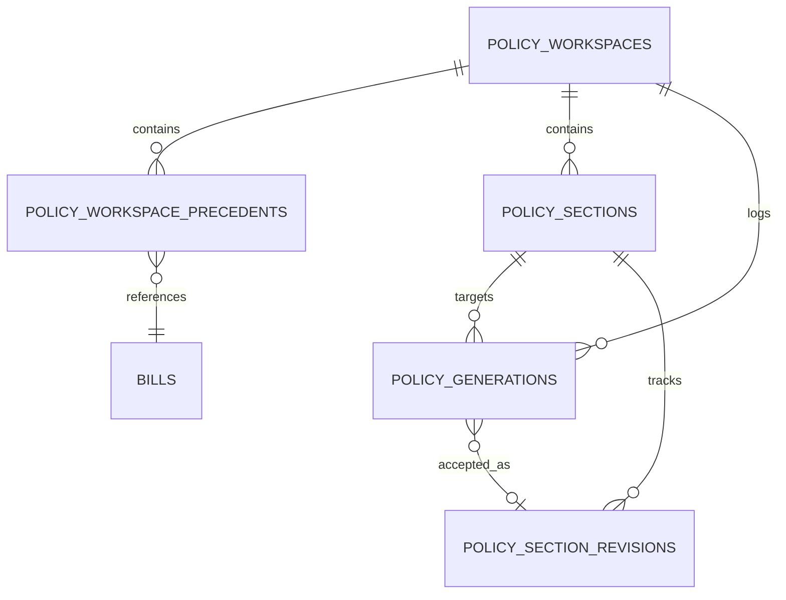

# feat: Add Policy Workspace Composer V1

## Overview

Add a new write-side product surface, `Composer`, that turns the existing legislative research platform into a drafting workspace for model legislation. V1 is intentionally narrow: the user selects precedent bills, chooses a target jurisdiction and drafting template, generates a proposed outline, and then drafts sections one at a time via inline compose actions with provenance and human approval controls (see origin: `docs/brainstorms/2026-03-20-policy-workspace-composer-requirements.md`).

This plan preserves the current Quorum-like research platform as substrate rather than replacing it. Search, bill detail, pattern analysis, prediction, reports, and the existing assistant remain supporting capabilities that feed the drafting experience (see origin: `docs/brainstorms/2026-03-20-policy-workspace-composer-requirements.md`).

## Problem Statement

The current application is strong on the read side but weak on the write side. The product today is still positioned as a legislative research database with supporting AI surfaces:

- The global navigation exposes `Collections`, `Reports`, and `Assistant`, but no drafting workspace: `frontend/src/components/site-header.tsx:11`
- Bill detail is organized as a read-heavy analysis page with tabs for summary, text, patterns, diffusion, and prediction: `frontend/src/app/bills/[id]/page.tsx:103`
- The assistant is implemented as an agentic research loop over data tools, not as a drafting environment: `src/api/chat.py:484`, `src/api/chat.py:548`
- Reports already demonstrate an LLM-backed synthesis flow over selected bills, but the output is a one-shot artifact rather than an editable workspace: `src/api/reports.py:23`, `src/api/reports.py:75`

That gap matters because the intended product direction is not just “better legislative chat.” The differentiated surface is a workspace where policy analysts actually draft model legislation, adapt precedent language, and manage revisions with auditable provenance (see origin: `docs/brainstorms/2026-03-20-policy-workspace-composer-requirements.md`).

## Proposed Solution

Introduce a new top-level `Composer` workspace backed by a dedicated backend domain and a new frontend route family.

### Product Flow

1. User creates a composer workspace.
2. User selects precedent bills using existing research/search capabilities.
3. User must choose a target jurisdiction and drafting template before generation starts.
4. The system generates a proposed bill outline grounded in the selected precedents.
5. The user edits the outline and requests full drafting one section at a time.
6. Inline compose actions let the user draft, rewrite, tighten, or harmonize language for the active section.
7. Each AI output is shown with provenance and must be explicitly accepted before it mutates the canonical draft.

This directly carries forward the origin document’s chosen v1 wedge: precedent-driven model legislation drafting, inline-first interaction, outline-before-full-text, and section-by-section generation rather than whole-bill autopilot (see origin: `docs/brainstorms/2026-03-20-policy-workspace-composer-requirements.md`).

## Technical Approach

### Architecture

Build a new `policy_workspaces` domain that reuses existing ownership, API, and LLM conventions:

- Use thin FastAPI endpoints and push business logic into services, consistent with the architecture rule documented in `docs/solutions/architecture/p2-refactor-findings-resolution.md:248`
- Reuse the current per-user ownership pattern of `client_id` plus optional `org_id`, matching `collections` and `conversations`: `src/models/collection.py:17`, `src/models/conversation.py:16`
- Gate composer routes behind the existing pro-tier dependency model used by chat and reports: `src/api/app.py:74`, `src/api/app.py:105`, `src/api/app.py:109`
- Reuse `frontend/src/lib/api.ts` client header handling so workspace state is scoped to the same browser identity as collections and chat: `frontend/src/lib/api.ts:382`, `frontend/src/lib/api.ts:394`
- Reuse the current tabbed/detail-page frontend patterns for the workspace shell instead of inventing an entirely different app container: `frontend/src/app/bills/[id]/page.tsx:103`

### Data Model

Use a structured draft model rather than a single markdown blob. The v1 flow is outline-first and section-driven, so the persistence model should make sections, generations, revisions, and provenance first-class.

Proposed tables:

- `policy_workspaces`
  - `id` string UUID/hex primary key
  - `client_id`, `org_id`
  - `title`
  - `target_jurisdiction_id`
  - `drafting_template`
  - `status` (`setup`, `outline_ready`, `drafting`, `archived`)
  - `goal_prompt` nullable
  - `created_at`, `updated_at`
- `policy_workspace_precedents`
  - `id`
  - `workspace_id`
  - `bill_id`
  - `position`
  - unique constraint on `(workspace_id, bill_id)`
- `policy_sections`
  - `id`
  - `workspace_id`
  - `section_key`
  - `heading`
  - `purpose`
  - `position`
  - `content_markdown`
  - `status` (`outlined`, `drafted`, `edited`, `accepted`)
  - `created_at`, `updated_at`
- `policy_generations`
  - `id`
  - `workspace_id`
  - `section_id` nullable
  - `action_type` (`outline`, `draft_section`, `rewrite_selection`, `tighten_definition`, `harmonize_with_precedent`)
  - `instruction_text` nullable
  - `selected_text` nullable
  - `output_payload` JSONB
  - `provenance` JSONB
  - `accepted_revision_id` nullable
  - `created_at`
- `policy_section_revisions`
  - `id`
  - `section_id`
  - `generation_id` nullable
  - `change_source` (`user`, `ai`, `system`)
  - `content_markdown`
  - `created_at`

This resolves the origin document’s deferred artifact-model question by choosing a workspace plus structured sections and append-only revision/generation history, not a generic graph model and not a single opaque document blob (see origin: `docs/brainstorms/2026-03-20-policy-workspace-composer-requirements.md`).

### ERD

### Backend Surface

Add a new router, schema module, and service modules:

- `src/models/policy_workspace.py`
- `src/schemas/policy_workspace.py`
- `src/services/policy_workspace_service.py`
- `src/services/policy_composer_service.py`
- `src/api/policy_workspaces.py`
- `migrations/versions/<new_revision>_add_policy_workspaces.py`

Recommended initial endpoints:

- `POST /api/v1/policy-workspaces`
- `GET /api/v1/policy-workspaces`
- `GET /api/v1/policy-workspaces/{workspace_id}`
- `PATCH /api/v1/policy-workspaces/{workspace_id}`
- `DELETE /api/v1/policy-workspaces/{workspace_id}`
- `POST /api/v1/policy-workspaces/{workspace_id}/precedents`
- `DELETE /api/v1/policy-workspaces/{workspace_id}/precedents/{bill_id}`
- `POST /api/v1/policy-workspaces/{workspace_id}/outline/generate`
- `PATCH /api/v1/policy-workspaces/{workspace_id}/sections/{section_id}`
- `POST /api/v1/policy-workspaces/{workspace_id}/sections/{section_id}/compose`
- `POST /api/v1/policy-workspaces/{workspace_id}/generations/{generation_id}/accept`
- `GET /api/v1/policy-workspaces/{workspace_id}/history`

Key endpoint rules:

- Endpoints stay thin and delegate orchestration to services, matching the project’s architecture rule: `docs/solutions/architecture/p2-refactor-findings-resolution.md:249`
- Ownership checks should mirror the `_get_collection_or_404()` pattern to avoid introducing a new access-control variant: `src/api/collections.py:33`
- Live section content must only change on explicit accept, not immediately on generation, so approval semantics are real rather than decorative

### LLM Integration

Add dedicated prompt modules and harness methods rather than routing composer through the existing generic chat loop.

Recommended prompt modules:

- `src/llm/prompts/policy_outline_v1.py`
- `src/llm/prompts/policy_section_draft_v1.py`
- `src/llm/prompts/policy_rewrite_v1.py`

Recommended harness methods:

- `generate_policy_outline(...)`
- `draft_policy_section(...)`
- `rewrite_policy_selection(...)`
- `harmonize_policy_section(...)`

Prompt/output design:

- Outline generation should return structured sections with heading, purpose, and cited source refs
- Section drafting should return proposed text plus rationale and provenance refs
- Compose actions should be bounded, explicit, and selection-aware where relevant

Composer should reuse existing research primitives when assembling context:

- Precedent bill text via existing bill loading and `extract_bill_text()` flows
- Existing summaries/pattern analyses when available, without requiring fresh analysis for every compose action
- Jurisdiction metadata via the current jurisdictions API

This resolves the origin document’s deferred question on reuse by keeping current research/data capabilities as substrate while adding write-oriented composer methods on top (see origin: `docs/brainstorms/2026-03-20-policy-workspace-composer-requirements.md`).

### Frontend Surface

Add a new top-level route family:

- `frontend/src/app/composer/page.tsx`
- `frontend/src/app/composer/[id]/page.tsx`
- `frontend/src/components/composer/*`

Update navigation:

- Add `Composer` to `frontend/src/components/site-header.tsx`
- Update home-page positioning to mention drafting in addition to research

Recommended v1 UI structure:

- `Composer index`
  - list of workspaces
  - create-workspace action
  - status badges for setup/outline/drafting
- `Composer detail`
  - setup header with target jurisdiction and template
  - precedent rail
  - outline/section navigation pane
  - active section editor
  - provenance drawer or side panel
  - history drawer

Editor approach:

- Do not introduce a heavy editor framework in v1
- `frontend/package.json` currently has no editor dependency such as TipTap, Lexical, Slate, Monaco, or CodeMirror: `frontend/package.json:12`
- Use section-scoped textareas or simple markdown text inputs with inline action controls
- Support selection-based actions by reading textarea selection state for the active section

This keeps v1 aligned with the user’s chosen interaction model: inline compose actions, not always-on autocomplete and not a full IDE/editor framework upfront (see origin: `docs/brainstorms/2026-03-20-policy-workspace-composer-requirements.md`).

## Implementation Phases

### Phase 1: Workspace Foundation

Tasks:

- Add data model, migration, and schemas for workspaces, precedents, sections, generations, and revisions
- Add `src/api/policy_workspaces.py` with CRUD and ownership enforcement
- Add `src/services/policy_workspace_service.py` for create/list/detail/update flows
- Extend `frontend/src/types/api.ts` and `frontend/src/lib/api.ts` for workspace APIs
- Build `frontend/src/app/composer/page.tsx` as the list/create entry point
- Build the create-workspace flow requiring title, target jurisdiction, and drafting template before generation
- Add `Composer` to the global nav

Success criteria:

- A user can create, list, open, and delete workspaces
- A workspace persists target jurisdiction, template, and selected precedents
- Ownership rules match collections/chat behavior

Estimated effort:

- 1-2 focused implementation sessions

### Phase 2: Precedent Selection and Outline Generation

Tasks:

- Add precedent selection endpoints and UI
- Reuse search/bill detail data to let users add bills as precedents
- Build composer context assembly from selected bills plus existing summaries/analyses when available
- Add outline prompt, harness method, and generation endpoint
- Persist generated sections in `outlined` state
- Build outline review UI with editable headings/purpose text and provenance badges

Success criteria:

- A user can choose precedents, generate an outline, and inspect which sources informed each section
- Outline generation is blocked until target jurisdiction and template are set
- Outline generation failures do not create partial sections

Estimated effort:

- 1-2 focused implementation sessions

### Phase 3: Section-by-Section Drafting and Acceptance

Tasks:

- Add section compose endpoint with bounded action enum
- Implement `draft_section` as the first required compose action
- Add secondary v1 actions: `rewrite_selection`, `tighten_definition`, `harmonize_with_precedent`
- Persist generated outputs as pending generation records
- Add accept-generation endpoint that creates a revision and updates current section content in one transaction
- Add section history UI and basic diff view between current content and prior revision
- Reuse abort/cancellation patterns similar to `useAnalysis()` for generation requests: `frontend/src/hooks/use-analysis.ts:18`

Success criteria:

- A user can draft a section on explicit request
- Generated text does not overwrite current section content until accepted
- Every accepted AI change produces a durable revision entry and provenance trail

Estimated effort:

- 2-3 focused implementation sessions

### Phase 4: Secondary Agent Support and Product Polish

Tasks:

- Add at least one bounded research-oriented secondary action from the composer surface, such as “compare this section to precedent language” or “find a missing definition”
- Refine mobile layout and stacked panes for smaller screens
- Update home page and onboarding copy so the product is visibly a drafting-and-research environment
- Add list filtering/search on the composer index page
- Add export-ready markdown output for the current workspace draft if implementation time permits
- Add instrumentation hooks for future evaluation of outline quality and acceptance rates

Success criteria:

- The composer experience is visibly distinct from the existing assistant and reports surfaces
- Secondary actions feel additive to the inline flow rather than replacing it with chat
- Users can navigate from research surfaces to composer without losing context

Estimated effort:

- 1-2 focused implementation sessions

## Alternative Approaches Considered

### 1. Upgrade the existing chat assistant into a drafting agent

Rejected. The current assistant is an agentic research loop over tools, not a document workspace: `src/api/chat.py:484`, `src/api/chat.py:548`. Extending it would produce a better drafting chat, but still not the first-class write-side surface required by the origin document.

### 2. Store the whole draft as one markdown blob

Rejected. V1 requires outline-first drafting, section-by-section generation, provenance, approval, and revision history. A single document blob makes section-local generation and acceptance semantics harder and pushes too much logic into ad hoc JSON fields.

### 3. Add a full editor framework and Cursor-like autocomplete immediately

Deferred. The frontend currently has no editor stack installed: `frontend/package.json:12`. The user explicitly chose inline compose actions over true always-on autocomplete in the brainstorm. A section-based editor with action controls is the right v1 tradeoff.

### 4. Generate a full bill immediately after precedent selection

Rejected. The origin document explicitly chose outline-first and section-by-section progression. Immediate full-bill drafting increases hallucination and reduces analyst control without adding durable product leverage (see origin: `docs/brainstorms/2026-03-20-policy-workspace-composer-requirements.md`).

### 5. Keep drafts jurisdiction-agnostic until late in the flow

Rejected. The origin document explicitly chose target jurisdiction and template before generation starts, so the system can ground structure and language in a concrete drafting context (see origin: `docs/brainstorms/2026-03-20-policy-workspace-composer-requirements.md`).

## System-Wide Impact

### Interaction Graph

Workspace creation flow:

1. `frontend/src/app/composer/page.tsx` calls `frontend/src/lib/api.ts`
2. API client attaches `X-Client-Id` via the existing `clientHeaders()` pattern: `frontend/src/lib/api.ts:394`
3. `src/api/policy_workspaces.py` validates ownership and input
4. `src/services/policy_workspace_service.py` persists workspace + precedent state
5. `src/models/policy_workspace.py` records are committed

Section drafting flow:

1. `frontend/src/app/composer/[id]/page.tsx` triggers an inline compose action for the active section
2. `src/api/policy_workspaces.py` dispatches to `src/services/policy_composer_service.py`
3. Composer service loads workspace, precedent bills, active section, and any reusable analyses
4. Composer service calls the new harness method
5. Harness executes the prompt and returns structured output
6. Service stores a pending generation with provenance but does not mutate the live section
7. User accepts the generation
8. Accept endpoint creates a section revision and updates current section content transactionally

### Error & Failure Propagation

Expected error classes and handling:

- `404` for missing workspace/section/precedent, following existing collection/chat patterns
- `403` for ownership mismatch, again matching current persisted-user-object flows
- `400` for invalid workflow state, such as requesting outline generation before setting target jurisdiction/template or drafting a section before an outline exists
- `429` for rate-limited compose actions, consistent with current LLM endpoint behavior
- `500` or service-level failure for LLM/provider errors after logging, without mutating current section content

Critical rule:

- Generation endpoints must not update `policy_sections.content_markdown` directly
- Only accept endpoints are allowed to update live section state
- Failed generation calls should leave at most a logged error and no partially accepted revision

### State Lifecycle Risks

Primary risks:

- Orphaned outline sections if outline generation inserts rows before the model output is fully validated
- Live section corruption if generation results overwrite current text before user acceptance
- Provenance drift if accepted text is not tied back to a stable generation record
- Ownership drift if workspace routes invent a new identity mechanism instead of reusing `X-Client-Id`

Mitigations:

- Validate LLM outputs against Pydantic schemas before persistence
- Persist outline sections only after a successful, fully parsed outline response
- Persist section generations as pending records first, then require explicit accept
- Make accept-generation transactional: create revision, update section, link accepted revision, commit once
- Reuse current `get_client_id` dependency style from collections/chat: `src/api/collections.py:28`

### API Surface Parity

Interfaces that must stay consistent:

- Frontend API client patterns for user-owned resources: `frontend/src/lib/api.ts:398`, `frontend/src/lib/api.ts:472`
- Ownership enforcement patterns from collections/chat
- Router registration and pro-tier gating in `src/api/app.py`
- TypeScript response typing in `frontend/src/types/api.ts`

Parity implications:

- Composer needs list/detail/create/update semantics similar to collections
- Composer generation endpoints should feel similar to existing analysis/report APIs, but with approval-aware state transitions
- Navigation and home page copy need updating so the product surface reflects the new capability set

### Integration Test Scenarios

1. Create workspace, add precedents, generate outline, and verify sections plus provenance persist correctly.
2. Attempt to access another client’s workspace and verify `403` on list/detail/update/generate endpoints.
3. Draft a section, reject it implicitly by not accepting, and verify the live section text remains unchanged.
4. Accept a generated section and verify a revision row, a linked generation row, and updated current content are all persisted together.
5. Trigger an LLM failure or invalid-state error during section compose and verify no partial generation acceptance or section mutation occurs.

## Acceptance Criteria

### Functional Requirements

- [x] R1. Add a first-class composer workspace for model-legislation drafts rather than only read-side research surfaces.
- [x] R2. The default v1 flow starts from selected precedent bills.
- [x] R3. Workspace creation requires target jurisdiction and drafting template before outline generation.
- [x] R4. Outline generation happens before any full-text section drafting.
- [x] R5. The dominant editor interaction is inline compose actions, not generic chat or passive autocomplete.
- [x] R6. Full-text drafting is section-by-section and only on explicit user request.
- [x] R7. Bounded drafting/research actions are available from the workspace and require user review before acceptance.
- [x] R8. Outline and section generations include visible provenance linking back to bills and analyses.
- [x] R9. Accepted AI outputs create durable revision history and support comparison against previous text.
- [x] R10. Existing research platform capabilities remain usable as substrate and are not displaced by the composer launch.

### Non-Functional Requirements

- [x] Endpoints remain thin wrappers with orchestration in `src/services/`
- [x] New persisted resources enforce ownership consistently
- [x] Mobile layout remains usable with stacked or collapsible panes
- [x] Prompt outputs are validated via Pydantic before persistence

### Quality Gates

- [x] API tests cover workspace CRUD, ownership, outline generation, section acceptance, and history
- [ ] Frontend tests or smoke coverage validate the create-workspace flow and draft-section acceptance path
- [x] Ruff and existing test suites remain green
- [x] OpenAPI surface and TypeScript API types are updated for new endpoints

## Success Metrics

- A user can go from precedent selection to accepted draft text for at least one section without leaving the product.
- Composer is discoverable as a top-level navigation item and is positioned as part of the product’s core value, not an experimental side tool.
- In manual evaluation, the precedent-to-outline-to-section flow is materially faster and more usable than the current workflow of search plus external LLM chat.
- No AI-generated section becomes canonical without an explicit acceptance action.

## Dependencies & Prerequisites

- Origin decisions in `docs/brainstorms/2026-03-20-policy-workspace-composer-requirements.md`
- Existing bill search/detail/analysis infrastructure as composer substrate
- Existing `X-Client-Id` ownership pattern from collections/chat
- Existing LLM harness and prompt versioning infrastructure
- New database migration for workspace persistence

## Risk Analysis & Mitigation

| Risk | Impact | Mitigation |
| --- | --- | --- |
| Too much context from long precedent bills | High | Cap precedent count in v1, trim excerpts, and reuse summaries where possible |
| Heavy editor complexity slows delivery | High | Use section-based textareas and action menus; defer richer editor frameworks |
| Users perceive composer as “chat with extra steps” | Medium | Make outline, sections, provenance, and revisions first-class UI objects |
| Draft privacy/ownership regressions | High | Reuse existing ownership checks and test cross-client access explicitly |
| Partial failure corrupts draft state | High | Separate generation from acceptance and make acceptance transactional |
| Jurisdiction/template catalog becomes too broad | Medium | Ship a small static v1 catalog and expand only after usage feedback |

## Resource Requirements

- Solo-developer friendly implementation across 4 phases
- One migration touching only new composer tables
- New prompt modules and schema classes, but no new external infrastructure
- No new frontend framework dependency required for v1

## Future Considerations

- Imported-bill adaptation and redlining existing legislation
- Whole-bill draft generation as an explicit advanced action
- True autocomplete and richer editor capabilities once the compose-action flow proves value
- Collaborative multi-user drafts tied more deeply to `organizations` and user identities
- Workspace-aware assistant/chat side panel
- Export to shareable bill package or memo package

## Documentation Plan

- Update navigation and home-page copy to mention composer
- Add API docs for `policy-workspaces` endpoints through FastAPI/OpenAPI
- After implementation, document any durable composer patterns in `docs/solutions/`

## Sources & References

### Origin

- **Origin document:** [docs/brainstorms/2026-03-20-policy-workspace-composer-requirements.md](C:/Users/marcu/legislative-research-tool/docs/brainstorms/2026-03-20-policy-workspace-composer-requirements.md)
  - Carried-forward decisions: first-class write-side workspace, precedent-selected drafting, jurisdiction/template required before generation, outline-first flow, section-by-section drafting, inline compose actions as the dominant interaction

### Internal References

- Nav and current product surfaces: `frontend/src/components/site-header.tsx:11`
- Read-side bill detail composition pattern: `frontend/src/app/bills/[id]/page.tsx:103`
- Existing workspace-adjacent collection UI: `frontend/src/app/collections/page.tsx`
- Collection detail notes/editing pattern: `frontend/src/app/collections/[id]/page.tsx:29`
- Client-scoped API headers: `frontend/src/lib/api.ts:382`, `frontend/src/lib/api.ts:394`
- Chat agentic loop: `src/api/chat.py:484`, `src/api/chat.py:548`
- Report generation flow: `src/api/reports.py:23`, `src/api/reports.py:75`
- Collection ownership and persisted-user-object model: `src/models/collection.py:13`
- Conversation model and persisted tool-call metadata: `src/models/conversation.py:12`, `src/models/conversation.py:44`
- Architecture rule for thin endpoints/services: `docs/solutions/architecture/p2-refactor-findings-resolution.md:248`

### External References

- None. External research was intentionally skipped because the codebase already contains the relevant architectural patterns and this feature does not depend on a new high-risk external integration.

### Related Work

- Existing research assistant feature: `frontend/src/app/assistant/page.tsx`
- Existing reports feature: `frontend/src/app/reports/page.tsx`
- Existing collections feature: `frontend/src/app/collections/page.tsx`
