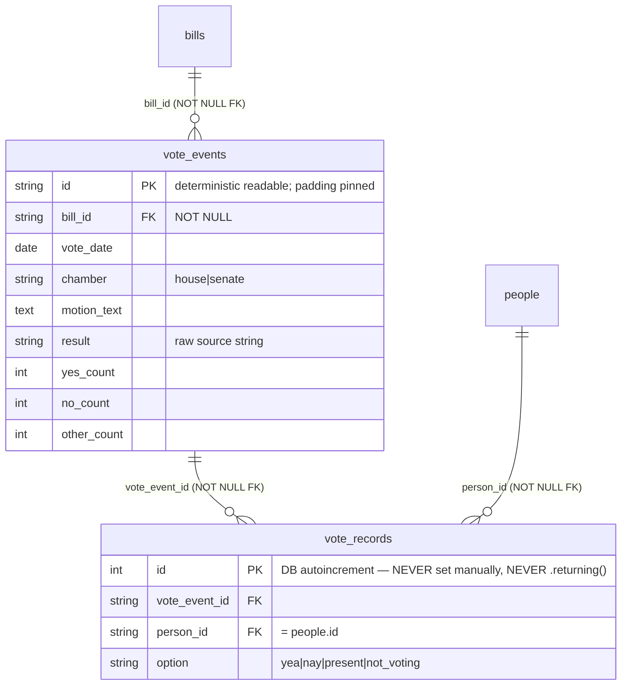

# ✨ Federal Roll-Call Vote Ingester (Congress 110–119)

> Revised 2026-06-24 after a technical-review panel (data-integrity, architecture, simplicity, performance). Accepted findings are folded into the sections below; see **Resolved Decisions** and **Benchmark-integrity flags**.

## Overview

Build a new `src/ingestion/votes.py` (`VotesIngester(BaseIngester)`) that populates the currently-empty `vote_events` and `vote_records` tables with U.S. federal roll-call votes for Congress 110–119 (House + Senate). This is the **prerequisite** that unblocks the Condorcet Lab's **Family 1** (roll-call retrieval/aggregation) — the highest-trust-value factual family, where a single hallucinated vote is brand-fatal.

Verified DB reality (2026-06-24): `bills` 144,088 · `sponsorships` 1.79M · `bill_actions` 981K · `people` 1,541 · **`vote_events` 0 · `vote_records` 0**. GovInfo/Congress.gov never ingested roll-calls.

**Source strategy (locked):** authoritative government XML — **clerk.house.gov** (House) + **senate.gov LIS** (Senate). VoteView is future cross-validation only, not a v1 source.

**v1 scope:** bill-linked roll-call votes only (`vote_events.bill_id` is `NOT NULL`). Procedural/quorum/nomination/Speaker-election votes are out of scope.

## Problem Statement

Family 1 templates are 100% backed by `vote_events`/`vote_records`, which are empty. The ingester must populate them **without ever fabricating or miscounting a vote** (Condorcet hard rule). Without it the Lab has no federal trust floor and System 2's cross-pressure thesis has no vote substrate.

## Proposed Solution

A single async ingester mirroring `src/ingestion/govinfo.py` / `committee_hearings.py`, with all XML parsing/normalization extracted into pure, unit-testable functions. Every voter and bill is resolved against existing rows; anything unresolved is **skipped and logged, never invented**. Every run records skip-rate/quality metrics to `IngestionRun.metadata_`.

### Module layout

```
src/ingestion/votes.py          # VotesIngester(BaseIngester): HTTP (concurrent fetch), orchestration, upserts, run accounting
src/ingestion/vote_parsers.py   # PURE functions (no I/O) — also the SINGLE SOURCE OF TRUTH for the canonical
                                 #   vocabularies the Family 1 graders import: parse_house_roll_xml,
                                 #   parse_senate_vote_xml, normalize_vote_ref, normalize_vote_option,
                                 #   parse_house_index, build_lis_bioguide_map, vote_event_id, derive_senate_year,
                                 #   OPTION_MAP / CHAMBER values
tests/test_ingestion/test_vote_parsers.py    # pure-fn tests (C-1, C-4, H-1, crosswalk, collisions) — no DB/HTTP
tests/test_ingestion/test_votes_ingester.py  # mocked httpx + AsyncMock session (committee_hearings style)
scripts/backfill_historical.py  # add --votes and --chamber {house,senate,both}
src/config.py                   # add house_clerk_base_url, senate_lis_base_url, vote_ingester_user_agent
```

### Target schema (no migration in v1 — tables exist, alembic head `013`)



## Technical Approach

### Data sources (verified live, June 2026)

**House — clerk.house.gov:** `https://clerk.house.gov/evs/<YEAR>/roll<NNN>.xml` (`NNN` 3-pad). Numbered **per calendar year**, resets each January; Congress 110–119 = years **2007–2026** (iterate by year, derive years from `govinfo.py:60 CONGRESS_DATES`, not a parallel table). **Requires a browser `User-Agent`** (else 403). Enumerate: scrape `/evs/<YEAR>/index.asp` for **max roll** (authoritative; needed for concurrent fetch), then fetch `roll001..rollMAX`; interior 404 = skip. Schema: `<rollcall-vote>`→`<vote-metadata>`(`<congress>`,`<session>`,`<chamber>`,`<rollcall-num>`,`<legis-num>`,`<vote-question>`,`<vote-type>`,`<vote-result>`,`<action-date>`=`DD-Mon-YYYY`,`<vote-totals>`/`<totals-by-vote>`)+`<vote-data>`(`<recorded-vote>`→`<legislator name-id="A000055">`+`<vote>`). **Member id = `name-id` = bioguide.** Vote strings vary by `<vote-type>`: `Yea/Nay` or `Aye/No`, plus `Present`,`Not Voting`. `<legis-num>` = `H R 1234`/`S 567`/`H RES 5`/`H J RES 12`/`H CON RES 7`; procedural votes carry a **sentinel** (`QUORUM`) → out-of-scope skip.

**Senate — senate.gov LIS:** menu `roll_call_lists/vote_menu_<congress>_<session>.xml`; detail `roll_call_votes/vote<congress><session>/vote_<congress>_<session>_<NNNNN>.xml` (`NNNNN` 5-pad). Detail: `<roll_call_vote>`→`<congress>`,`<session>`,`<congress_year>`,`<vote_number>`,`<vote_date>`(`January 9, 2025, 02:54 PM`),`<question>`,`<vote_result>`,`<count>`(`<yeas>`/`<nays>`/`<present>`/`<absent>`),`<document>`(`<document_type>`,`<document_number>`,`<document_name>`=`S. 5`),opt `<amendment>`,`<members>`→`<member>` with `<lis_member_id>`(`S###`, **not** bioguide),`<vote_cast>`. Menu date is year-less → use detail full-date (date only; see H-1). Nominations = `PN###` (no `<document>`) → out-of-scope skip.

### Identity resolution (make-or-break)

**Bill resolution (C-1 — the dataset-killing bug, rationale corrected per review C-A).** The stored `bills.identifier` has **no internal space** (`HR1234`, `S5`) because `govinfo` builds it as `normalize_identifier(f"{type}{number}")` — input already has no separator (`normalizer.py:62-66` only *collapses* existing whitespace, never inserts). The vote sources, by contrast, emit a *spaced* ref (`H R 1234` / `S. 5`). So the fix is a dedicated `normalize_vote_ref` that strips **all** whitespace and dots before upper-casing — **do not** reuse `normalize_identifier` on the raw vote ref (it would preserve the space → `HR 1234` → miss every bill → empty dataset, the opposite bug):

```python
def normalize_vote_ref(raw: str) -> str:  # 'H R 1234'->'HR1234'; 'S. 5'->'S5'; 'H J RES 1'->'HJRES1'
    return re.sub(r"[\s.]", "", raw).upper()
```
Resolve: `bill_id = generate_bill_id("us", f"us-{congress}", normalize_vote_ref(legis_num))`, then test membership against a **global** `frozenset(bills.id)` (loaded once — see Performance). **Highest-value test:** assert `generate_bill_id("us","us-118", normalize_vote_ref("H R 1234"))` is byte-identical to the stored id `generate_bill_id("us","us-118", normalize_identifier("hr1234"))` — i.e. equal to the actual stored form, not merely "looks like HR1234".

**Member resolution (people.id ≠ bioguide; canonical tie-break is REQUIRED — confirmed by Phase 0).** Build `{bioguide → set(people.id)}` once from `SELECT id, bioguide_id FROM people WHERE bioguide_id IS NOT NULL`. `people` holds ~281 **duplicate** person rows: the same member as a canonical `id==bioguide` row (from `congress_legislators`) AND a hash-PK row (from GovInfo sponsor parsing); `people.bioguide_id` has no unique constraint, so ~251 bioguides map to >1 `people.id`. Resolve by: **prefer the canonical row where `id == bioguide`; else the lone hash row; only a true unresolvable collision when >1 row and none canonical → drop+log.** Phase 0 evidence (roll 517, 118th): naive collision-drop gave **57.9%** resolution; the canonical tie-break gives **100% (430/430)**. House voters key on `name-id`; Senate on `lis_member_id` → lis→bioguide crosswalk → `people.id`. **Never filter member resolution by chamber** (a former House member now a senator has `current_chamber='upper'` yet cast historical House votes). *Latent: the ~281 duplicate person rows are a `people`-table data-quality issue worth a separate dedupe task; the vote ingester does not depend on it being fixed.*

**Senate lis→bioguide crosswalk.** Built at runtime in-memory (no migration in v1) from CC0 `congress-legislators` JSON (`legislators-current.json` + `legislators-historical.json`), emitting `id.lis → id.bioguide`. `lis` is Senate-only, ~100% complete for senators 2007–2026. Unresolved `lis` → drop+log. Isolated behind `build_lis_bioguide_map()` so persistence is a one-call-site swap later.

### Canonical vocabularies (single source of truth in `vote_parsers.py`; graders import from here)

| Field | Set | Mapping |
|---|---|---|
| `vote_records.option` | `yea`, `nay`, `present`, `not_voting` | `Yea`/`Aye`→`yea`; `Nay`/`No`→`nay`; `Present`→`present`; `Not Voting`/Senate `absent`→`not_voting`. **Unknown cast string OR unknown `<vote-type>` → skip the whole event + log (never default-bucket).** |
| `vote_events.chamber` | `house`, `senate` | (reuse `committee_hearings._normalize_chamber` vocabulary) |
| `vote_events.result` | raw source string preserved | pass/fail interpretation deferred to the Family 1 grader phase |
| counts | `yes_count`=yea/aye, `no_count`=nay/no, `other_count`=present+not_voting/absent | from the **official** header — authoritative |

### Counts + integrity cross-check (per-bucket; review C-B)

Store **official header sub-totals verbatim** as `yes/no/other_count` (authoritative — the ingester never sums them). Then validate the member records: **de-duplicate casts by `name-id` first** (a duplicate is a logged `duplicate_member_in_source` anomaly, never silently swallowed by the upsert), and reconcile **per bucket** against the official per-option sub-totals (`<totals-by-vote>` gives yea/nay/present/not-voting; Senate `<count>` gives yeas/nays/present/absent):

```
for o in {yea, nay, present, not_voting}:
    computed_resolved[o]  +  dropped_unresolved[o]   ==   official_subtotal[o]
    # dropped_unresolved bucketed by the member's PARSED option (known even when the person can't resolve)
```
If any bucket fails → **skip the event + log both per-bucket tallies + increment `reconciliation_mismatch`** (store no records for it). This is a parser-bug signal, expected ≈0 on clean gov data and caught by Phase-3 hand-verification. *No quarantine/reprocess state machine in v1 — mismatch is just another skip bucket.*

### Deterministic vote_event IDs (review: documented exception to the hash-ID convention; padding pinned)

- House: `f"us-house-{congress}-{year}-{roll:04d}"` (e.g. `us-house-118-2024-0123`)
- Senate: `f"us-senate-{congress}-{session}-{vote:05d}"` (e.g. `us-senate-118-2-00543`)

Readable (good for Family 10 provenance) — a **deliberate divergence** from the repo's `sha256[:16]` id convention (`normalizer.py:8`, `committee_hearings.py:26`). Zero-padding widths (`:04d` House, `:05d` Senate) are part of the contract — a width change forks the id space. Idempotency rides on this PK (`on_conflict_do_update`) + `UNIQUE(vote_event_id, person_id)` for records.

### Idempotency, atomicity & resumability (review H-A/H-B; --force-refresh cut per simplicity)

- `vote_records.id` is DB autoincrement — **never set it; never `.returning()`** on the bulk record insert. Records upsert: `pg_insert(...).on_conflict_do_nothing(index_elements=["vote_event_id","person_id"])`.
- **Atomic ordering:** parse → resolve members → reconcile in memory → **only if reconciled**, within **one** `begin_nested`, upsert the event AND all its records together. Commit cadence falls on event boundaries (every ~100–200 events), never mid-event.
- **Resumability is per-`vote_event.id`, not per-chamber:** load the set of existing event ids for the congress once; skip a roll only if its id exists **and** has non-zero records (a zero-record event = a crash mid-insert → reprocess). Skipping at chamber granularity would silently drop un-ingested rolls after an interruption.
- **v1 assumes `bills`+`people` are fully loaded and stable.** Re-running after a material `people` change is not guaranteed idempotent for re-mapped members (documented v1 limitation — not expected for a one-shot finalized-historical backfill). No `--force-refresh` in v1 (finalized votes are immutable).

### Performance & scale (review C1/C2/O1–O3)

- **Concurrent fetch** — mirror `govinfo.py:645 enrich_bills`: `asyncio.Semaphore(8)` + `asyncio.gather(return_exceptions=True)`. ~20–25K fetches drop from ~3h serial to ~30min. Resolve House `max_roll` from `index.asp` **first**, then fetch the exact range concurrently (interior 404 = skip; the consecutive-404 probe is fallback-only and doesn't compose with `gather`). Be polite to gov static servers — semaphore 8, not 50.
- **Global caches, loaded once** at `ingest()` start: one `frozenset(bills.id)` (~30 MB across all 144K) — *not* per-congress (avoids 10 reloads in `--chamber both`); one `{bioguide→people.id}` dict (~300 KB).
- **Commit cadence pinned:** one multi-row `pg_insert` per event for records (never per-record flush — P2-015); `flush` per event in its savepoint; `commit` every ~100–200 events (~250 txns total). ~2 statements/event.
- **Load-call-persist:** load caches (brief session) → release → gather HTTP for a batch with no pending writes → upsert the batch → commit (the `enrich_bills` boundary; avoids pool starvation).
- **Memory:** discard each parsed XML tree immediately after extracting its records; cap `FETCH_BATCH` ~50–100 rolls (≤~160 MB raw XML resident); never accumulate the full record corpus.

### Conventions to mirror (verified file:line)

- `BaseIngester(session)`; implement `async def ingest()`; `source_name="votes"`; own `httpx.AsyncClient` + own `close()` (`base.py:15-72`, `govinfo.py:103-106,885-886`). **`BaseIngester`'s bill-change-tracking helpers (`_track_changes`/`_prefetch_old_values`) are intentionally NOT used — votes are not bills** (mirrors `congress_legislators.py`).
- `start_run("full")` → set `run.records_created/updated` → `finish_run(...)`; `run.metadata_` (JSONB) holds skip metrics (`base.py:26-41`, `ingestion_run.py:10-22`).
- Upserts `pg_insert().on_conflict_*`, no SELECT-before-INSERT, in-memory dedup (`govinfo.py:577-604`). `_rate_limited_get` 429 backoff copied in (`govinfo.py:166-193`). `defusedxml` (`govinfo.py:16`).

## Implementation Phases (double as loop/goal-run iterations; checkpoint between each)

### Phase 0 — House-only verification spike
Fetch one House roll XML live; parse with draft pure functions; resolve its bill + members against the live DB; confirm browser-UA, `name-id`=bioguide join, `normalize_vote_ref` round-trip, and per-bucket reconciliation by hand. (Senate/crosswalk deliberately excluded from the spike.) **Done when:** one House roll fully resolves and reconciles to official totals by hand.

### Phase 1 — House ingester (the vertical slice; first-loop "done" = Congress 118 House)
House pure functions + `normalize_vote_ref` + `normalize_vote_option` + `vote_event_id` + `parse_house_index`; `VotesIngester` House path (concurrent fetch, global caches, per-event resumability, per-bucket reconciliation, skip+log, run accounting); `--votes --chamber house` in `backfill_historical.py`; tests (parsers + mocked-HTTP ingester, idempotent double-run). **Makes Family 1 runnable on the House.**

### Phase 2 — Senate ingester + lis→bioguide crosswalk — ✅ DONE (2026-06-24)
`build_lis_bioguide_map` (327 entries); Senate menu+detail parsers; Senate full-date parse; document→bill resolution; nomination(`PN`)/amendment skip; shared `_process_vote` across chambers; `--chamber senate`; tests. **Pilot Congress 118 Senate: 145 events / 14,498 records, 100% resolution, 0% bill-skip, 0 mismatch, 0 orphans; 541 correctly out-of-scope.** Senate vote 339 (HR10545, 85/11/4) hand-matches; both chambers now linked to HR10545.

### Phase 3 — Full backfill + verification
`--chamber both`; per-event resumability across 110–119; full backfill; coverage report (events/records per congress, skip buckets, per-congress+chamber resolution rates); hand-verify ~10 events against official totals.

### Future work (out of v1 scope — separate plans)
Persist `Person.lis_id` (column + migration; **has direct precedent in `openstates_id`/`legiscan_id`** — promote to the critical path if the senator member-resolution gate is missed in Phase 2). VoteView cross-validation pass. Backfill historical `people` if resolution rate falls short (see flags).

## ⚠️ Benchmark-integrity flags (surface to Lab owner before extending past the 118-House pilot)

- **Historical member coverage (review H-D).** `people` = `legislators-current.json` + GovInfo bill sponsors. Historical members of 110–117 who never sponsored a captured bill are **absent** → systematic per-member drops for older Congresses, invisible in a pooled resolution rate. **The 118-House pilot masks this.** Report resolution rate **per (congress, chamber)** + distinct-unresolved-bioguide counts + their frequency; treat historical `people` backfill as a **likely prerequisite** for 110–117, not optional.
- **Counts authoritative vs. incomplete records (review H-E).** Official counts are authoritative; member records may be a subset when members are dropped. A Family-1 *aggregation* grader tallying records will disagree with one reading header counts (`person_service.get_person_votes` and `api/votes.py` expose both). Persist per-event dropped-member count (in `IngestionRun.metadata_` keyed by event id for v1) so a grader can detect incompleteness; require `member_resolution_rate` ≈100% before trusting record-based aggregation templates.

## Alternatives Considered
- **VoteView bulk** — fast (≈4 files vs ≈25K fetches) but nullable `bill_number`, internal `rollnumber`≠official, paired/announced cast-codes, ICPSR-not-bioguide joins, citation-only license. Slowness of per-roll fetch is fixable with concurrency; VoteView's correctness debt is not. → Future cross-validation only.
- **Vendor `unitedstates/congress` (CC0)** — battle-tested parsers but sync/CLI/file-cache, fights the async/upsert pattern. → Reference oracle only.
- **Congress.gov API (House votes, beta)** — reuses key/backoff; no Senate, limited history. → Optional redundancy for current congress.
- **Persist `Person.lis_id` now** — cleaner, strong precedent; adds a migration + legislators re-run. → Deferred; promote if senator gate missed.

## System-Wide Impact
- **Interaction graph:** `backfill_historical.py --votes` → `VotesIngester.ingest()` → `start_run` → concurrent HTTP fetch → pure parse → global-cache resolution → per-event savepoint upsert → `finish_run`. Downstream readers already exist (`GET /bills/{id}/votes`, `person_service.get_person_votes`, MCP `get_bill_detail`) — **verify they render correctly post-load** (API parity).
- **Error propagation:** `_rate_limited_get` handles 429/transient; per-roll failure caught at the savepoint, run continues; `defusedxml.ParseError`/resolution-miss/reconcile-fail → skip+counter; only unexpected exceptions → `finish_run("failed")`.
- **State lifecycle:** deterministic ids + per-event upsert = idempotent; zero-record-event guard prevents orphans; record-set shrinkage unhandled (documented; not possible for finalized votes).
- **Integration scenarios:** (1) ingest a House roll twice → identical counts; (2) resolution-referencing vote resolves & stores; (3) `QUORUM` sentinel → zero events, out-of-scope counter; (4) Senate `PN###` → nomination skip; (5) one unresolved member → event stored with official counts, dropped record logged, per-congress resolution rate <100%; (6) two `people` rows with same bioguide → resolver refuses + logs collision.

## Acceptance Criteria

### Resolution & normalization
- [ ] Unit: `normalize_vote_ref("H R 1234")` → same `bills.id` as the stored `normalize_identifier("hr1234")` form (byte-equal); plus `H.R. 1234`, `HR 1234` (C-1/C-A).
- [ ] Unit: `S. 5`→`S5`, `H RES 5`→`HRES5`, `H J RES 1`→`HJRES1`, `H CON RES 3`→`HCONRES3`.
- [ ] Unit: every House (Yea/Nay/Aye/No/Present/Not Voting) + Senate cast maps to canonical `option`; unknown cast **or unknown `<vote-type>`** → skip event (C-4/M-D).
- [x] Unit: Senate date parse → correct calendar date (date-only, no UTC); uses full detail date (sidesteps menu Dec/Jan ambiguity) (H-1/M-A).
- [x] Unit: lis→bioguide crosswalk resolves a known senator; absent lis / unknown bioguide → drop (TestSenate).
- [ ] Unit: member resolver maps a bioguide to `people.id` when `people.id` is a hash (281-row case); **two rows sharing a bioguide → refuse+log collision** (H-C).

### Data integrity (no fabrication / no miscount)
- [ ] Post-run: zero `vote_records` with `person_id` ∉ `people`; zero `vote_events` with unresolved `bill_id`.
- [ ] **Per-bucket** reconciliation holds for every stored event; casts de-duplicated by `name-id` (dup = logged anomaly); failing event skipped+logged, not stored (C-B).
- [ ] Out-of-scope votes (sentinel/quorum/nomination/speaker/adjourn) → zero events, distinct counter.

### Idempotency & resumability
- [ ] Ingesting the same congress twice → identical counts; `vote_event.id` byte-identical across runs.
- [ ] Kill mid-congress + re-run → full expected event count (not partial), no duplicate-key errors, no re-inserted completed events; resumability checked **per-event** (H-A).
- [ ] No code sets `vote_records.id`; no `.returning()` on bulk record insert.

### Reporting / observability (trimmed to gate-relevant + integrity metrics)
- [ ] `IngestionRun.metadata_` records **per (congress, chamber)**: `events_created`, `skipped_unresolved_bill`, `skipped_out_of_scope`, `reconciliation_mismatch`, `records_created`, `records_dropped_unresolved_member`, `member_resolution_rate`, `distinct_unresolved_bioguides`. (`max_roll_per_year` → log only.)
- [ ] Member-resolution rate reported per (congress, chamber); below threshold (e.g. <99%) marks the run degraded — surfaces an old-Congress cliff (H-D).
- [ ] Bill-resolution skip rate reported; above threshold fails the run (guards the C-1 bug shipping silently).

### Scope & prerequisites
- [x] `vote_events`/`vote_records` tables exist (alembic head `013`, 0 rows).
- [x] `people` contains historical members for 110–119 (1,541 incl. e.g. Sen. Obama; all have `bioguide_id`) — **but see H-D flag re: backbencher gaps for 110–117.**
- [ ] `chamber`/`result`/`option`/`other_count` vocabularies live in `vote_parsers.py` + asserted by tests.
- [ ] `--votes --chamber {house,senate,both}` added to `backfill_historical.py`, resumable per-event.

### End-to-end pilot target (first-loop "done") — ✅ MET (2026-06-24)
- [x] **Congress 118 House** loaded: **1,210 events / 526,299 records**; bill-skip **0%**, member-resolution **100%** (0 dropped), **0** reconciliation mismatches, **0** orphan rows (FK-verified); roll 517 (HR10545) hand-matches clerk `<totals-by-vote>` exactly (yea366/nay34/present1/nv29). Idempotent re-run created 0 new events. 49 unit tests + ruff pass.

## Resolved Decisions
G1 readable composite ids (deliberate exception; padding pinned) ✅ · G2 in-memory lis crosswalk, persist deferred (promote if senator gate missed) ✅ · **G3 per-bucket reconcile + dedup; mismatch → skip+log+metric, not a quarantine machine** ✅ · G4 official header sub-totals authoritative ✅ · G5 clerk+senate.gov primary ✅ · G6 `house/senate` + raw `result`; vocabularies single-sourced in `vote_parsers.py` ✅ · G7 tables exist ✅ · G8 `other_count`=present+not_voting/absent ✅ · G9 all bill-referencing votes in scope; procedural sentinels out ✅ · G10 Congress-118-House pilot ✅ · **G11 records `do_nothing`; no `--force-refresh` in v1; people/bills assumed stable** ✅.
Review adds: per-event resumability (not per-chamber) · atomic event+records in one savepoint · global bills cache · concurrent fetch (Semaphore 8) · collision-safe member map · no chamber filter on resolution · `BaseIngester` change-tracking bypassed · H-D/H-E flagged.

## Risks & Mitigations
- **C-1 normalization miss → empty dataset.** `normalize_vote_ref` + byte-equal round-trip test + bill-skip-rate run gate.
- **Structural member under-coverage for 110–117 (H-D).** Per-(congress,chamber) resolution rate + distinct-unresolved counts; historical `people` backfill as prerequisite; 118-House pilot chosen to be clean.
- **Counts-vs-records benchmark hazard (H-E).** Persist per-event dropped count in run metadata; require ~100% resolution before record-based aggregation templates.
- **clerk.house.gov 403 / 20-yr format drift.** Browser UA (config); smoke test; distinguish 403 vs 404; index-scrape primary.
- **Senate Dec/Jan year error → leakage.** Detail full-date, date-only, no UTC; rollover unit test.
- **Wrong vote via map collision / re-map drift.** Collision refuse+log (H-C); stable-people assumption documented (G11).

## Test Plan
- **Pure-function tests** (`test_vote_parsers.py`, no DB/HTTP): fixtures = saved real `roll<NNN>.xml` / `vote_<c>_<s>_<n>.xml` snippets. Cover C-1, C-4, M-D, H-1, crosswalk, collisions, deterministic ids, per-bucket reconcile.
- **Ingester tests** (`test_votes_ingester.py`): `AsyncMock()` session + `patch.object(ingester.client,"get")`; assert upsert calls, skip counters, idempotent double-run, skip-on-reconcile-mismatch, collision refusal.
- **Manual** (Phase 3): hand-compare ~10 events.

## Sources & References
- **Origin:** [docs/scopes/2026-06-24-roll-call-vote-ingester-scope.md](../scopes/2026-06-24-roll-call-vote-ingester-scope.md)
- **Internal:** `govinfo.py:60,103-106,166-193,233,261,404,560-604,645-719,885-886` · `base.py:15-72` · `ingestion_run.py:10-22` · `normalizer.py:8-11,62-66` · `models/vote.py` · `person.py:23-25` (lis_id precedent) · `congress_legislators.py:21,63,91` · `committee_hearings.py:26-45,164-322` · `person_service.py:80,108-123` · `api/votes.py:38-59`
- **External (verified live 2026):** House `clerk.house.gov/evs/<YEAR>/roll<NNN>.xml` + `/index.asp` · Senate `senate.gov/legislative/LIS/roll_call_lists/vote_menu_<c>_<s>.xml` + `.../roll_call_votes/vote<c><s>/vote_<c>_<s>_<NNNNN>.xml` · Crosswalk (CC0) `unitedstates.github.io/congress-legislators/legislators-{current,historical}.json` · Reference (CC0) `github.com/unitedstates/congress` · VoteView `voteview.com/static/data/out/`
- **Learnings (docs/solutions/):** P2-015 (singleton client, batch flush); 429 backoff; load-call-persist; skip-unresolved.
