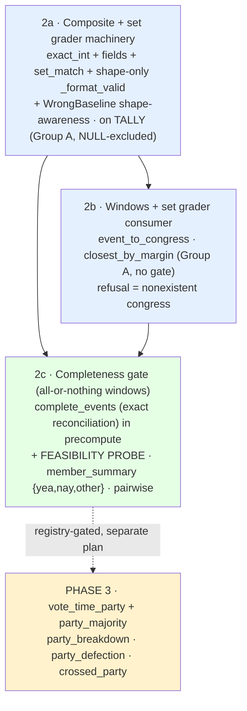

# Family 1 Benchmark Harness — Phase 2 (Aggregate Templates) ✨

> **Follow-on plan.** Phase 0 (vertical slice) and Phase 1 (the *frozen spine* — `lab/scoring.py`, `graders.py`, `trace.py`, `precompute.py`, `harness.py`, `templates.py`, `generate.py`, `solvers.py`, `run.py`, the v1 `TraceRecord`, split anti-cheat hashes, drift stack) are **DONE** on `feat/lab-family1` (PR #31). This plan covers **Phase 2: the aggregate roll-call templates**. The design was resolved in a design conversation and pressure-tested by a 5-lens adversarial review; this revision **encodes both**.

> **Revision 2 — folds a 5-lens review (architecture / Python-contracts / data-integrity / simplicity / performance).** Material changes from rev 1, all below: **(1) all party-keyed templates DEFERRED to Phase 3** — `people.party` is *current-only*; party-keyed gold reads post-dated party onto historical votes (a point-in-time violation the schema can't fix). `vote_time_party` is now filed in `docs/condorcet/registry-open-questions.md`. **Phase 2 is fully party-blind.** (2) Group A still **excludes NULL/`missing_official_count` events** (the "no completeness gate" ≠ "no NULL guard" bug — broke the oracle). (3) The format gate validates **shape only**, decoupled from `gold` (was mis-scoring wrong-keyed answers as malformed). (4) Window templates use **all-or-nothing complete windows** (per-event filtering inside a window was fabrication-by-omission), and are **feasibility-gated**. (5) refusal twins proven absent against the *real* id space (a "nonexistent congress" must not exist at all, not merely be ongoing). (6) `WrongBaselineSolver` perturbs a **generic** field / adds a sentinel to sets. (7) `member_summary` reports **`{yea, nay, other}`** (every field reconciles). (8) all three grader modes land **atomically in 2a** (one contract-hash move). (9) DuckDB read pins explicit **`columns={'gold':'JSON', ...}`**. (10) precompute scan-widening for party is a **Phase 3** concern (party is fully deferred).

## Overview

Phase 1 graded a single scalar or a refusal. Phase 2 introduces the family's first **aggregate** answers — multi-field tallies, ranked "closest" lists, per-member summaries, pairwise agreement — and the composite/set grader machinery they need. **Everything party-keyed is held to Phase 3**, because correct party attribution needs vote-time party the schema doesn't carry (see Registry below).

Templates by gold-derivation dependency (Phase 2 rows only; party-keyed rows are Phase 3):

| Group | Phase 2 templates | Gold source | Completeness gate |
|-------|-------------------|-------------|-------------------|
| **A** — stored-count | `tally`, `closest_by_margin` | `vote_events.{yes,no,other}_count` + `result` (**NULL-excluded**) | none (but NULL guard) |
| **B** — record-derived, party-blind | `member_summary`, `pairwise_agreement` | `GROUP BY` over `vote_records` | **yes — all-or-nothing window** |
| ~~C — party-aware~~ | *(Phase 3:* `party_breakdown`, `party_defection`, `crossed_party`*)* | records + `vote_time_party` (+ `party_majority`) | yes |

Two structural facts drive everything:

1. **Stored counts are canonical; `vote_records` are a resolved *subset*.** Group A gold reads the count columns directly (overcount-immune) — but those columns are **nullable**, so Group A must still exclude `missing_official_count` events (else the oracle returns NULL gold and fails itself). Group B `GROUP BY` over an *incomplete* record subset is **fabrication-by-omission** — so Group B samples only **exactly-reconciled** events, and a *windowed* Group B question is answerable only when **every** event in the window reconciles (all-or-nothing — filtering events *inside* a window silently changes the denominator).
2. **Aggregates are the first non-scalar answers.** The new surface is (a) a **shape-only** format gate for dict/set answers (decoupled from gold), (b) a **field-wise-AND composite grader** + a **set-match grader**, both landing atomically in 2a, and (c) keeping the JSONL→DuckDB read-side typed via **explicit `JSON` columns**.

## Problem Statement / Motivation

- **The factual floor needs breadth, honestly.** A trust-floor benchmark needs the aggregate questions researchers actually ask — but only where gold is *verifiable*. Party attribution isn't (vote-time party is missing), so it waits; tallies, margins, rankings, and per-member/pairwise records over reconciled data are, so they ship.
- **Completeness is a correctness boundary.** A summary that silently drops unmatched voters is a fabricated fact wearing a number. The all-or-nothing window gate is what keeps windowed Group B honest.
- **Point-in-time discipline is absolute.** Reading a member's *current* party onto a 2009 vote is post-dating. The schema can't express vote-time party, so party-keyed gold is blocked and filed as a registry gap — not approximated into the trust floor.
- **The composite-answer contract is frozen-once.** `tally` forces the dict/set answer shape now; the grader machinery (incl. the live-agent-facing format-gate semantics) must be right before any template builds on it.

## Proposed Solution

A dependency-ordered set of sub-phases, **one new axis per sub-phase**, each on the *smallest* template that exercises it, **each its own PR + review checkpoint** (the first PR boundary is 2a alone — the freeze-once grader contract deserves isolated review).

### Locked decisions (encoded here, not re-litigated)

1. **Group A gold = stored count columns**, NULL-excluded; `margin = yes_count − no_count`; pass/fail = raw `result` string.
2. **All party-keyed templates → Phase 3**, gated on `vote_time_party` + (for defection/crossed-party) `party_majority`. Phase 2 is party-blind.
3. **Completeness gate = exact reconciliation**; *windowed* Group B is **all-or-nothing** (only emit a (congress, chamber) instance where every event reconciles). New `complete_events` set in `Precomputed`, folded into the existing single scan.
4. **`member_summary` reports `{yea, nay, other}`** (every field reconciles against a stored bucket; present/not_voting are *not* split — that split rests on ingest classification the gate can't re-verify).
5. **Composite-answer contract**: normalized dict graded **field-wise AND**; set-valued templates graded **set equality**. `answer_correct` is **binary** in v1 (field-fraction/set-F1 is a v2 re-baseline, documented — not a silent grader edit).
6. **All grader modes land in 2a**: `grade_exact_int`, `grade_fields`, `grade_set_match` + the full **shape-only** `_format_valid` generalization — one atomic contract change, one `grading_contract_hash` move, one grading review. 2b/2c touch only content files.
7. **Sequencing**: **2a** (`tally`) → **2b** (windows + set grader: `closest_by_margin`, Group A) → **2c** (completeness gate + `member_summary` + `pairwise_agreement`, party-blind, all-or-nothing, **feasibility-gated**). **Phase 3** (separate plan) = `vote_time_party` + `party_majority` + the three party templates.

### Sub-phase dependency graph



Critical path: **2a → 2b → 2c**. 2a stands up the full grader contract on the simplest vehicle (`tally`: single event, stored counts, no window, no gate). 2b adds the window axis on a Group A template (no completeness gate — stored counts). 2c adds the completeness-gate axis (all-or-nothing) on the party-blind windowed templates, **gated on a feasibility probe** (fully-complete windows may be rare).

### Architecture (current → target)

| File | Phase 1 (now) | Phase 2 (target) |
|------|---------------|------------------|
| `lab/scoring.py` | frozen Verdict math | **unchanged** (immutable) |
| `lab/graders.py` | `grade_exact`, `grade_refusal_correct`, `GRADERS`, `_is_canonical`, `build_verdict` | **+** `grade_exact_int`, `grade_fields` (+ fully-specified `_match_field`), `grade_set_match`; **+** shape-only `_format_valid(grader, answer)` (no `gold` coupling) replacing the single `_is_canonical` call; existing primitives **untouched** — **all in 2a** |
| `lab/precompute.py` | `excluded_events`, `completed_congresses`, `total_vote_records` | **+** `complete_events: frozenset[str]` (exact reconciliation, same scan); **+** `event_to_congress`/`fully_complete_windows` (built once, 2b/2c). *(party scan-widening: Phase 3.)* |
| `lab/templates.py` | `family1.vote_lookup` | **+** `tally` (2a), `closest_by_margin` (2b), `member_summary`/`pairwise_agreement` (2c). Single module (no package split). |
| `lab/solvers.py` | scalar wrong-baseline | `WrongBaselineSolver`: perturb a **generic int field** (dict) / **add a sentinel id** (set); never a hardcoded key, never element-removal (empty-set gold is legal) |
| `lab/harness.py` | `validate_gold` (vote_lookup arm) | **additive arms**: dict gold non-empty + every value a non-None int/str; **allow empty set** for set graders |
| `lab/trace.py` | `gold/answer: Any` | unchanged shape; set gold/answer → **sorted list** at `build_record` (determinism); DuckDB read pins `columns={'gold':'JSON','answer':'JSON'}` |
| `lab/run.py` | one template wired | `--template` selector over the roster; invariants unchanged in meaning |
| `tests/test_lab/_sqlguard.py`, `_manifest.py` | Phase 1 helpers | extend portability scan + DuckDB fixtures to the new gold SQL |
| `docs/condorcet/registry-open-questions.md` | (updated this rev) | `vote_time_party` filed; `party_majority` consumers corrected — **done** |

---

### 2a · Composite + set grader machinery — on `tally` (Group A)

**Goal:** stand up the *entire* dict/set grader contract on the smallest vehicle. One atomic contract change.

**`tally`** — `family1.tally`. One sampled `vote_event`, **excluding `missing_official_count` events** (`pre.excluded_events`) so counts/`result` are never NULL. Gold (stored columns only):
```python
gold = {"yea": ve.yes_count, "nay": ve.no_count, "margin": ve.yes_count - ve.no_count, "result": ve.result}
grader = "fields"
```
- `result` = raw `vote_events.result` string (a source value), graded `exact` (case-normalized). No `{passed, failed}` normalization in Phase 2 (a definitional mapping we don't need; raw string is unimpeachable). *Accepted consequence: `result` is an exact-string sub-task for the future agent.*
- **Refusal twin**: synthetic nonexistent `vote_event` id, **proven absent against `vote_events` before emit** (mirroring Phase 1's `people` existence check), `refusal_reason = "event_not_in_data"`.

**Grader extension** (`lab/graders.py`, additive — existing primitives untouched):
```python
def grade_exact_int(gold, answer) -> bool:                 # counts/margins; exact, NO tolerance
    return isinstance(answer, int) and not isinstance(answer, bool) and gold == answer

def _match_field(g, a) -> bool:                            # FROZEN per-field dispatch on GOLD type
    if isinstance(g, bool):    return g is a               # (defensive; no bool fields today)
    if isinstance(g, int):     return grade_exact_int(g, a)
    if isinstance(g, str):     return grade_exact(g, a)    # case-normalized via _norm
    return _norm(g) == _norm(a)                            # None / fallback: plain equality

def grade_fields(gold: dict, answer) -> bool:              # field-wise AND; keys must match
    if not isinstance(answer, dict) or answer.keys() != gold.keys() or not gold:
        return False
    return all(_match_field(gold[k], answer[k]) for k in gold)

def grade_set_match(gold, answer) -> bool:                 # order-independent set equality
    try: return set(map(_norm, gold)) == set(map(_norm, answer))
    except TypeError: return False

GRADERS = {"exact": grade_exact, "refusal_correct": grade_refusal_correct,
           "exact_int": grade_exact_int, "fields": grade_fields, "set_match": grade_set_match}
```
- **Shape-only format gate** — the one surgical edit to `build_verdict`: replace `_is_canonical(answer)` with `_format_valid(grader, answer)` (note: **no `gold` argument** — the gate is about answer *shape*, not key-set match; `grade_fields` owns the key check):
  ```python
  def _format_valid(grader, answer) -> bool:
      if answer == REFUSAL:                       return True       # refusal well-formed for any grader
      if grader in ("exact", "refusal_correct"):  return _is_canonical(answer)   # UNCHANGED scalar path
      if grader == "exact_int":                   return isinstance(answer, int) and not isinstance(answer, bool)
      if grader == "fields":                      return isinstance(answer, dict)   # shape only
      if grader == "set_match":                   return isinstance(answer, (set, list, tuple))
      return False
  ```
  Everything else in `build_verdict` is unchanged (`answer_correct = float(GRADERS[grader](gold, answer))` already dispatches by name). The scalar `exact`/`refusal_correct` path still routes through `_is_canonical` → **behavior-identical**, proven by Phase 1 `test_scoring.py`/`test_graders.py` passing **unchanged**. *Why shape-only matters:* a live agent that returns a dict with the wrong keys must score `decision_correct=1, answer_correct=0 → 0.5` (attempted-but-wrong), **not** `format_valid=0 → 0.0` (malformed). The deterministic solvers never exercise that path, so the bug would be invisible until the agent arrives — exactly the moment this shape is frozen for.

**`WrongBaselineSolver`** (`lab/solvers.py`, swappable — not frozen): per answerable instance, return a **well-formed-but-wrong** value of the *right shape*:
- dict gold → perturb the **first key whose gold value is a non-bool int** (`+1`); assert one exists (every composite template has ≥1 int field).
- set gold → **add** a synthetic sentinel id (`"NX-wrong"`, guaranteed absent); never remove (so **empty-set gold** still yields a wrong answer).
This keeps the invariant `decision_correct==1.0 ∧ answer_correct==0.0 ∧ format_valid==1.0`. (Oracle returns gold; over-refuse returns REFUSAL — both already shape-agnostic.)

**`validate_gold`** (`lab/harness.py`, additive arms): for answerable composite gold, require a **non-empty dict whose every value is a non-None `int`/`str`** (turns a `{yea: None}` into a loud fail-at-the-gate, not a silent wrong grade); for set graders, **allow the empty set**.

**Trace / DuckDB**: `gold`/`answer` stay `Any` (dicts serialize via `model_dump_json`; sets serialize too but **nondeterministically ordered** — so coerce set gold/answer to a **sorted list** in `build_record`, keeping the in-memory value a set for grading). DuckDB read pins **explicit** `read_json(..., columns={'gold':'JSON','answer':'JSON', ...})` (auto-inference over a heterogeneous, append-ordered dir can mis-type the payload columns). The analytic surface (`verdict.score`, `subscores.*`, `template_id`) stays uniformly typed.

**Acceptance (2a):**
- [x] `family1.tally` excludes NULL-count/NULL-result events (the airtight Group-A NULL guard via SQL `IS NOT NULL`, stronger than `missing_official_count` alone); gold from stored columns only; never a record `COUNT(*)`.
- [x] `grade_exact_int` + `grade_fields` (+ full `_match_field`) + `grade_set_match` added; `GRADERS` extended; **shape-only** `_format_valid` (no `gold` arg); scalar path behavior-identical (Phase 1 `test_scoring`/`test_graders` pass unchanged).
- [x] `WrongBaselineSolver` returns well-formed-but-wrong dict/set (generic int field / sentinel add); invariants hold on live Postgres (`oracle` pass-all incl. NULL-free gold; `wrong-baseline` `decision==1 ∧ answer_correct==0`; `over-refuse` `decision==0` on answerable, passes refusals).
- [x] `validate_gold` rejects empty/None-valued dict gold; allows empty set. Refusal twin proven absent before emit.
- [x] `grading_contract_hash` moves (attested as an additive extension); stability/flip relationship tests green; no test pins an absolute hash (verified — all relationship-based).
- [x] Set gold serialized as sorted list (determinism); DuckDB `read_json` with explicit JSON columns over a **mixed** scalar+dict+set run dir parses and `verdict.score` aggregates. `ruff` clean; lab + project suite green (only the pre-existing `lightgbm` collection errors, unrelated, remain — fixed separately in PR #32).

---

### 2b · Windows + set grader consumer — `closest_by_margin` (Group A)

**Goal:** add the window axis on a Group A template (stored counts → no completeness gate), and exercise `grade_set_match`.

**Window semantics (locked):** a window = a **single completed congress, chamber-scoped** (point-in-time/leakage is out of scope → no as-of dates). Windows draw from `precompute.completed_congresses`. `event_to_congress` is built **once** in precompute (`vote_events.bill_id` is `NOT NULL` per schema → every event maps; congress via `bill_id → bills.session_id → sessions.identifier`; verify no NULL `bills.session_id`).

**`closest_by_margin`** (Group A): "the K roll calls in {congress, chamber} with the smallest `|yes_count − no_count|`," **excluding `missing_official_count` events** (a NULL margin can't be ranked — and would sort engine-dependently, breaking portability).
- **Tie-deterministic gold**: total order `(margin ASC, id ASC)` → unique gold set even on ties; `gold = {ids of first K}` (serialized sorted); `grader = "set_match"`. Fixed small `K` (e.g. 5); if a window has `< K` rankable events, define behavior explicitly (return all `< K`, or mark the window ineligible — decide at build, test it).
- **Refusal twin**: a congress that **does not exist at all** (e.g. `"999"`), **proven absent against `sessions`/`bills`** — *not* merely absent from `completed_congresses` (an ongoing congress exists in the DB; calling it "not in the data" would be a fabricated refusal). `refusal_reason = "congress_not_in_data"`.

**Acceptance (2b):**
- [x] Window = completed-congress + chamber, via a per-window `vote_events→bills→sessions` join (one query per window, no N+1). **Deviation from plan letter:** `event_to_congress`/`fully_complete_windows` precompute maps are NOT built in 2b — deferred to 2c where `member_summary`/`pairwise` actually reuse them (YAGNI; the per-window join has no N+1). `bills.session_id` NULL-soundness **verified** (probe: 0 events with NULL/broken bill→session linkage, so no window-membership omission).
- [x] `closest_by_margin` excludes NULL-count events (unrankable margin); tie-deterministic `(margin, id)` total order proven unique on a tied fixture (e5 in / e6 out by id); prompt states the tie-break so the question is determinate; `< K` handled by the slice (returns all rankable — defensive; every real window has ≥123).
- [x] Refusal twin = nonexistent congress, proven absent against `sessions` before emit; `refusal_reason="congress_not_in_data"`.
- [x] Gold SQL passes the determinism/portability regex scan + a DuckDB-fixture test (tie + NULL-count + cross-chamber window-filter cases); three invariants green on live Postgres (oracle 18 windows + 5 refusals; wrong-baseline 0; over-refuse fails answerable). `ruff` clean; lab suite green.

---

### 2c · Completeness gate + party-blind windowed templates — `member_summary`, `pairwise_agreement`

**Goal:** add the completeness-gate axis (all-or-nothing windows). **Feasibility-gated** — fully-complete windows may be rare.

**Precompute extension** (same single scan — **zero new full-table passes**). The scan-#2 loop already computes `resolved_bucket` + `stored` per event; add the exact-equality classification:
```python
complete = (not has_missing and not has_overcount
            and all(resolved_bucket[b] == stored[b] for b in stored))   # EXACT reconciliation
if complete: complete_events.add(event_id)
```
`Precomputed` gains `complete_events: frozenset[str]`. **Strict-superset distinction:** an *undercount* event (resolved `<` stored, no overcount/NULL) is in **neither** `excluded_events` nor `complete_events`. Then build `fully_complete_windows` once: the set of (congress, chamber) pairs where **every** event ∈ `complete_events`.

**🔴 Feasibility probe — the first 2c task, a hard gate.** Reusing precompute (no extra scan), measure: (a) count of **fully-complete (congress, chamber) windows** — the real `member_summary`/`pairwise` pool — broken down by congress/chamber; (b) for context, the per-event exact-reconciliation rate. **All-or-nothing is demanding:** one unmatched voter on one roll call disqualifies an entire congress-chamber. If fully-complete windows are too few to sample, **STOP and surface** — do **not** relax to per-event filtering inside a window (that is the fabrication-by-omission this gate exists to prevent). Likely-acceptable outcome: ship Phase 2 as `tally` + `closest_by_margin` only, and move `member_summary`/`pairwise` to a fast-follow pending better record matching. *(Phase 1's "0 excluded / total==COUNT(*)" does NOT imply per-event reconciliation, let alone whole-window completeness — this is unmeasured.)*

**`member_summary`** (Group B, gated): "across {fully-complete congress, chamber}, how did {member} vote?" Gold = the member's option counts over the window: **`{yea, nay, other}`** (`other` = present + not_voting, reconciled against the stored `other_count` bucket; the present/not_voting split is *not* reported — it rests on ingest classification the gate can't re-verify). `grader = "fields"`. Uses `ix_vote_records_person_id`.
- **Refusal twin**: synthetic nonexistent member over a real fully-complete window, proven absent, `refusal_reason = "person_not_in_data"`.

**`pairwise_agreement`** (Group B, gated; **simplicity may defer this** — it's the only self-join; if kept, build it *last*): "across {fully-complete congress, chamber}, on roll calls where **both voted (yea/nay)**, how often did {A} and {B} agree?" Gold = `{agreements, shared_events}` via two sargable `person_id = %s` index scans joined on `vote_event_id`, **filtered `option IN ('yea','nay')`** for both counts (a mutual `not_voting` is not "both voted" and not an "agreement"). `grader = "fields"`.
- **Refusal twin**: one synthetic nonexistent member paired with a real member, `refusal_reason = "person_not_in_data"`.

**Differential PG↔DuckDB layer — recommended deferred again.** Hand-literals prove *absolute* correctness (PG==DuckDB agreement is strictly weaker — they can agree on a wrong answer) at lower cost. Broaden the hand-literal fixtures instead (tie / empty-result / single-shared-event / undercount-excluded cases). Flagged so review can overrule for PG-execution coverage of the self-join.

**Acceptance (2c):**
- [x] Feasibility probe run (reusing precompute): **18/18 completed windows fully complete** (94.6% of all events reconcile exactly; the only undercount is the ongoing 119th, already point-in-time-gated). Feasibility GREEN — both templates built.
- [x] `complete_events` (exact reconciliation) built in the existing precompute scan (no new pass); `_fully_complete_windows` (all-or-nothing) computed in a `templates` helper (keeps precompute join-free — same separation as 2b's per-window join). Tests prove an *undercount* fixture event is in neither `complete_events` nor `excluded_events`, and a window with one incomplete event is dropped.
- [x] `member_summary` samples only fully-complete windows; gold `{yea, nay, other}` (present/not_voting collapsed — every field reconciles); uses `person_id` index. `pairwise_agreement` filters `"option" IN ('yea','nay')` on both sides (mutual absence excluded), two `person_id` index scans joined on `vote_event_id`.
- [x] Each template: refusal twin proven absent against `people`; gold SQL passes regex scan + DuckDB-fixture-vs-literals; three invariants green on live Postgres (oracle 18 windows + 5 refusals each; gold magnitudes sane — e.g. member sum == window size). `ruff` clean; lab suite green.

---

### Phase 3 (separate plan) · `vote_time_party` + `party_majority` + party templates

> **Why a separate plan, double-gated.** Party-keyed gold needs **two** registry definitions that don't exist yet: `vote_time_party` (a member's party *at vote time* — the schema holds only current party; filed 2026-06-25) and `party_majority` (denominator/ties/absences — the blessed package). Both are recorded in `docs/condorcet/registry-open-questions.md`. Phase 3 resolves them (the vote-time-party source is an ingest/data prerequisite, not just a definition) and builds `party_breakdown` (counts-only, single-party), `party_defection`, `crossed_party`. Performance note: when party lands, **widen precompute scan #1** to `GROUP BY vote_event_id, party, option` (a small-dim PK join, ~3× aggregate rows) so `party_majority` folds into the *same* single scan rather than adding a second 5.4M pass. Out of scope for this plan.

## System-Wide Impact

- **Interaction graph.** Unchanged from Phase 1: `run()` → `precompute(conn)` (once; now also `complete_events` + `event_to_congress` + `fully_complete_windows`) + `RunContext` (once) → `template.generate(conn, n, seed, pre)` → per (solver, instance): `solver.solve` → `grade`/`build_verdict` (shape-only format gate) → `build_record` (sorts set payloads) → `write_trace`. No app callbacks; lab stays standalone on raw psycopg2.
- **Error propagation.** Feasibility-probe shortfall → **STOP and surface** (never silently shrink). Empty instance set → existing `RuntimeError` with fingerprint. Empty/None composite gold → loud fail at `validate_gold`. Malformed record → Pydantic fails at `build_record`. `requires_pg` tests `skip` (never false-green).
- **State lifecycle.** Append-only JSONL, read-only on the federal DB. No new write paths (differential layer deferred).
- **API-surface parity.** `lab/run.py` (CLI) is the only entry; gains `--template`. The future agent drops into the `solver` slot; composite `gold`/`answer`/set shapes already flow through the `Any`-typed `TraceRecord`. The **shape-only format gate** is what makes the agent's wrong-keyed answers score correctly.
- **Integration scenarios.** (1) `tally` invariants in Verdict terms (NULL-excluded) on live PG; (2) mixed scalar+dict+set `read_json` (explicit JSON cols) parses + aggregates `verdict.score`; (3) a wrong-keyed dict scores 0.5 not 0.0; (4) an undercount fixture event in neither set + a window with one incomplete event excluded; (5) tie-deterministic `closest_by_margin` gold unique; (6) nonexistent-congress refusal proven absent against `sessions`.

## Acceptance Criteria (rollup)

### Functional
- [ ] Phase 2 is **party-blind**; all party-keyed templates deferred to Phase 3; `vote_time_party` filed in the registry.
- [ ] Group A (`tally`, `closest_by_margin`): gold from stored columns, **`missing_official_count` excluded**; never a record `COUNT(*)`.
- [ ] Group B (`member_summary`, `pairwise_agreement`): sample only `complete_events` within **fully-complete windows** (all-or-nothing); `member_summary` = `{yea, nay, other}`; `pairwise` filters `yea/nay`.
- [ ] Grader contract (all in 2a): `grade_exact_int`, `grade_fields` (+`_match_field`), `grade_set_match`; **shape-only** `_format_valid`; scalar primitives untouched; scalar path behavior-identical.
- [ ] `WrongBaselineSolver` shape-aware (generic int field / sentinel add, never element-removal). `validate_gold` rejects empty/None dict gold, allows empty set.
- [ ] Each template has a correct refusal twin **proven absent against the real id space** (`event_not_in_data` / `congress_not_in_data` / `person_not_in_data`).

### Non-Functional / Quality Gates
- [ ] All new gold/precompute SQL engine-portable: passes the determinism/portability regex scan **and** runs on DuckDB fixtures vs hand-authored literals (absolute-correctness guarantee).
- [ ] No new full-table scans (completeness + windows fold into precompute's existing scan; per-template SQL hits indexed/small sets — `pairwise` via two `person_id` index scans, not a materialized self-join).
- [ ] Heterogeneous JSONL: set payloads serialized as **sorted lists**; DuckDB read pins explicit `JSON` columns; mixed-dir read test green.
- [ ] `grading_contract_hash` moves **once** (2a), attested as an additive extension (no weakening); `content_hash` grows in 2b/2c.
- [ ] No hand-authored production gold (literals are test expectations only); `ruff` clean (line length 100); Phase 1 lab tests pass **unchanged** + new tests green. `answer_correct` binary-in-v1 documented in `lab/README.md` as a v2-rebaseline boundary.

## Alternative Approaches Considered
- **Ship party templates with current party** — rejected (point-in-time hard rule): reads post-dated party onto historical votes; the schema can't express vote-time party. Deferred + filed as a registry gap.
- **Per-event filtering inside a window** — rejected (data-integrity BLOCKER): silently changes the denominator → fabrication-by-omission. Windows are all-or-nothing.
- **Format gate keyed on `gold`** — rejected (architecture BLOCKER): mis-scores wrong-keyed answers as malformed, collapsing the over-refuse/wrong distinction. Gate is shape-only; `grade_fields` owns keys.
- **Group A with no NULL guard** — rejected (Python/data-integrity BLOCKER): NULL counts crash `margin`; NULL `result` makes the oracle fail itself. Group A excludes `missing_official_count`.
- **`member_summary` `{yea, nay, present, not_voting}`** — rejected (data-integrity): present/not_voting split unreconcilable against the collapsed `other_count`. Report `{yea, nay, other}`.
- **set_match deferred to its 2c consumer** — rejected (architecture): keeps the frozen contract changing twice; all grader modes land atomically in 2a (one hash move).
- **`event_to_congress`/`event_chamber` precompute maps for everything** — trimmed (simplicity/perf): `event_chamber` is redundant (`chamber` is a column); only `event_to_congress` + `fully_complete_windows` are built (genuinely reused).
- **Build the differential PG↔DuckDB layer now** — recommended deferred: hand-literals prove *absolute* correctness more cheaply.
- **Normalize `tally.result`** — deferred: raw string is a source value; normalization is a definitional mapping we don't need.
- **`lab/templates/` package** — dropped: a 4-function module is not unwieldy.

## Dependencies & Risks
- **🔴 Fully-complete-window feasibility (highest risk):** all-or-nothing windows may be rare/absent (unmeasured). Mitigation: probe is the first 2c task; STOP-and-surface; acceptable fallback = ship `tally` + `closest_by_margin`, defer `member_summary`/`pairwise`.
- **Frozen-core extension scrutiny:** the `_format_valid` generalization touches `build_verdict`. Mitigation: existing primitives untouched; scalar path through `_is_canonical` unchanged; Phase 1 grader/scoring tests pass **unchanged**.
- **NULL columns:** all `vote_events.{yes,no,other}_count`/`result` nullable. Mitigation: Group A excludes `missing_official_count`; `validate_gold` rejects None-valued composite gold.
- **DuckDB heterogeneous payloads:** mitigated by explicit `JSON` columns + sorted-list set serialization + a mixed-dir test (run on the pinned duckdb version before relying on it).
- **`closest_by_margin` ties / `<K` windows:** total order `(margin, id)` → unique gold; `<K` behavior defined + tested.
- **Pre-build verifications (cheap, at sub-phase start):** fully-complete-window counts (2c probe); `bills.session_id` NULL-soundness for windows (2b); confirm no test pins an absolute `grading_contract_hash` (2a).

## Out of Scope (do NOT build)
All party-keyed templates (`party_breakdown`, `party_defection`, `crossed_party`) + `party_majority` + `vote_time_party` (→ Phase 3); live chat/MCP agent run; `get_bill_votes` agent tool; free-text answer extraction; point-in-time/as-of-date windows; Families 2–10; the differential PG↔DuckDB layer; `tally.result` normalization; per-member present/not_voting split; app-wide schema-drift cleanup (resolved in PR #32).

## Open Decisions (resolved)
1. **Party-keyed templates → Phase 3** (point-in-time party gap filed). *(User, 2026-06-25.)*
2. **`member_summary` = `{yea, nay, other}`.** *(User, 2026-06-25.)*
3. **All grader modes in 2a** (one contract-hash move). *(User, 2026-06-25.)*
4. **Each sub-phase is its own PR**, first boundary = 2a alone. *(Simplicity review.)*
5. **`pairwise_agreement` may be cut/deferred** if 2c feasibility is tight or it bloats the sub-phase (build last). *(Simplicity review — flagged, not forced.)*
6. **Differential layer deferred again; DuckDB explicit `JSON` cols; raw `tally.result`; single templates module.** *(Panel-endorsed.)*

## Sources & References
- **Parent / prior plan:** `docs/plans/2026-06-25-feat-family1-frozen-spine-plan.md` (Phase 1 ✅).
- **Scope:** `docs/scopes/2026-06-24-family1-harness-scope.md`. **Hard rules:** `docs/condorcet/`; `CLAUDE.md`. **Registry (updated this rev):** `docs/condorcet/registry-open-questions.md` — `vote_time_party` + `party_majority`.
- **Review:** 5-lens adversarial panel (architecture / kieran-python / data-integrity / simplicity / performance), 2026-06-25 — findings folded into this revision.
- **Code (verified):** `lab/graders.py` (`build_verdict`/`_is_canonical` — the format-gate edit site); `lab/scoring.py` (frozen); `lab/precompute.py:46-91` (single scan `complete_events` folds into); `lab/trace.py:97-123` (`gold/answer: Any`; set→sorted-list at `build_record`); `lab/harness.py:57-73` (`validate_gold`), `:76-113` (run loop); `lab/solvers.py:35-47` (`WrongBaselineSolver`); `src/models/vote.py:13,18-22` (`bill_id NOT NULL`; nullable counts/result), `person.py:17` (`party` current-only — the point-in-time gap), `bill.py:20` (`session_id`); `src/ingestion/vote_parsers.py` (`OPTION_BUCKETS`, `VOTE_OPTION_MAP`, the 4-bucket `reconcile`).
- **Memory:** `project_condorcet_family1.md`.

---

[](https://github.com/EveryInc/compound-engineering-plugin) 🤖 Generated with [Claude Code](https://claude.com/claude-code)
