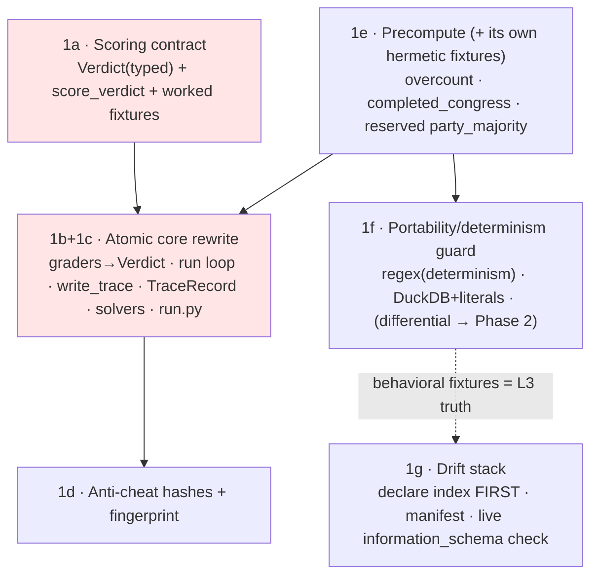

# Family 1 Benchmark Harness — Phase 1 (Frozen Spine) ✨

> **Follow-on plan.** Phase 0 (the vertical slice — `lab/` skeleton + Template #1 `vote_lookup` end-to-end, oracle/wrong-baseline/over-refuse invariants on live Postgres) is **DONE** (commit `7e21dfc`, branch `feat/lab-family1`). This plan covers **only** Phase 1: the *frozen spine* the whole trace flywheel depends on. The six design decisions below were resolved in a long design conversation and are **locked** — this plan *encodes* them; it does not re-open them. Phases 2–4 (aggregate templates, party-majority, fast-follow) remain in the parent plan.

> **Revision 2 — incorporates a 5-lens adversarial technical review** (architecture / Python contracts / data-integrity / simplicity / performance). Material changes from rev 1, all folded in below: bool→float subscore coercion (was a latent training-data-poisoning bug); 1b+1c merged into one atomic core rewrite; `frozen_hash` split into `grading_contract_hash` + `content_hash`; the Verdict typed at the Pydantic seam; `missing_official_count` NULL arm hardened; **drift Layer 2 swapped** from scoped `compare_metadata` to a live `information_schema` column check; **differential PG↔DuckDB layer deferred to Phase 2** (user decision); net new `lab/` runtime modules trimmed **+6 → +3**.

## Overview

Phase 1 hardens the harness into a **frozen, training-grade trace producer**. Today graders return `bool` and the JSONL record is pass/fail-shaped — fine for validating gold, useless for the eventual GEPA + RL/SFT flywheel. The load-bearing insight: **a live-agent rollout is a perishable, point-in-time artifact that cannot be re-run.** So we must freeze a record shape rich enough for the live agent *now*, and use the deterministic solvers (oracle/wrong-baseline/over-refuse) as the **test fixtures that exercise and round-trip-test that shape** before the agent slot is filled.

Phase 1 delivers: (1) a `Verdict` grading contract with decomposed, **numeric** subscores + grader feedback; (2) a forward-compatible trace record with a `policy`/`trajectory` split, non-destructive raw capture, and a synthetic-vs-rollout discriminator; (3) JSONL-as-truth + DuckDB read-side via a single typed `write_trace` chokepoint; (4) split anti-cheat hashes + a per-run `dataset_fingerprint` (drift-detection, not reproduction); (5) a 2-layer portability/determinism guard (differential deferred); (6) precompute scaffolding (overcount + completed-congress live + verified; party-majority *reserved*); plus a 3-layer schema-drift guard with a **live** proxy check.

## Problem Statement / Motivation

- **Perishability.** The factual layer's gift is a *verifiable, programmatic reward* (gold by trusted SQL — no LLM-judge drift). Every future live-agent rollout yields a clean `(trajectory, reward)` tuple. But the trajectory is a perishable artifact; if the schema can't hold it, the data is lost forever and retrofitting means re-running rollouts we can never reproduce. **Freeze the shape now.**
- **GEPA needs textual feedback, not a bool.** GEPA's reflective mutation reads *why* an answer failed. A boolean gives the optimizer nothing.
- **RL/SFT need decomposed reward + trajectory.** A single `pass` collapses partial credit and discards the action sequence.
- **Portability + determinism are hard rules.** Gold SQL must run on DuckDB later (engine-portable) and be reproducible (no engine `random()`/`now()`).
- **The gold corpus sits on the live federal DB.** A silent schema rename would launder as a data bug. The columns gold reads must be **proven present in the live DB**, not just in the ORM.

## Proposed Solution

A dependency-ordered set of sub-phases. The critical-path head is the **scoring contract** (everything in the Verdict work is blocked on it), followed by an **atomic rewrite of the frozen core** (graders + run loop + `write_trace` + solvers + `run.py`) to the *final* signature in one pass — the review showed that doing the Verdict, the trace chokepoint, the trajectory split, and the precompute signature change as separate passes would break `harness.py`/`run.py` several different ways and break the "frozen core" twice.

### Locked decisions (encoded here, not re-litigated)
1. **Verdict contract** — graders' public dispatch returns `Verdict {passed, score∈[0,1], feedback, subscores}`; subscores `{decision_correct, answer_correct, grounded, format_valid}`.
2. **Trace shape** — `policy` (what GEPA optimizes) split from per-instance `prompt`; `trajectory[]` + non-destructive `raw`; `refusal_reason`; `trace_schema_version="v1"`.
3. **Storage** — JSONL source-of-truth + DuckDB read-side; single typed `write_trace`.
4. **Anti-cheat** — content hash(es) over frozen lab source + resolved vocab values + a `dataset_fingerprint`.
5. **Guard** — regex (determinism) + DuckDB-fixture vs hand-literals (correctness). Differential PG↔DuckDB **deferred to Phase 2**. No sqlglot.
6. **Precompute** — `precompute(conn)->Precomputed` once per run; overcount + completed-congress live; party-majority *reserved*.
7. **Drift** — REQUIRED_COLUMNS manifest + ORM-reflection (L1); **live `information_schema` column check** (L2); behavioral fixtures = truth (L3); model-file drift comments; declare `ix_vote_records_person_id` on the model.

### Sub-phase dependency graph



Critical path: **1a → (1b+1c) → 1d**. 1e ships *with its own hermetic fixtures* and its signature change folds into 1b's single rewrite (core breaks once). 1d finalizes last among core changes (hashes stabilize only after source settles). 1g declares the index *before* freezing the L2 live check.

### Architecture (current → target)

| File | Phase 0 (now) | Phase 1 (target) |
|------|---------------|------------------|
| `lab/scoring.py` | — | **new**: frozen `Verdict` dataclass (+`__post_init__` invariant), `Subscores` TypedDict, `score_verdict()` |
| `lab/graders.py` | `grade()→bool`; pure `grade_exact`/`grade_refusal_correct` | primitives **stay pure** (0/1); new `build_verdict()` composer (float-coerces) + `grade()→Verdict` |
| `lab/trace.py` | — | **new**: Pydantic `TraceRecord` + nested `VerdictModel`, `write_trace()`, `build_record()`, `grading_contract_hash()`, `content_hash()`, `dataset_fingerprint()`, `RunContext` |
| `lab/harness.py` | `Instance`, `validate_gold`, `run()` hand-builds JSONL | `Instance` gains `refusal_reason`; run loop: `precompute` → `generate(...,pre)` → `build_verdict` → `write_trace` |
| `lab/precompute.py` | — | **new**: `Precomputed`, `precompute(conn)`, overcount + completed-congress, reserved `party_majority`, reserved event→congress map slot |
| `lab/solvers.py` | `solve()→answer` | unchanged return (bare answer) + a frozen `policy` property |
| `lab/templates.py` | `generate(conn,n,seed)` | `generate(conn,n,seed,precomputed)`; emit `refusal_reason` |
| `lab/run.py` | 3 invariants on `bool` | invariants restated in Verdict terms (4 concrete edit sites) |
| `tests/test_lab/_manifest.py` | — | **new (test-only)**: `REQUIRED_COLUMNS` |
| `tests/test_lab/_sqlguard.py` | — | **new (test-only)**: `scan_sql()` determinism/portability regex |
| `src/models/vote.py` | index NOT on model | declare `ix_vote_records_person_id`; drift comment |
| `src/models/{person,session,bill}.py` | bill names autoresearch only | add/extend lab drift comments |

> **Deferred / dropped vs rev 1** (simplicity review): `lab/analysis.py` (inline the one-line `read_json_auto`); `sqlguard.py`/`schema_deps.py` → `tests/test_lab/` (test-only helpers, dropped from the hash set); `SolverOutput` struct (reintroduced by the agent slice when it actually carries steps). Net new **runtime** modules: `scoring.py`, `trace.py`, `precompute.py` = **+3**.

---

### 1a · Scoring contract (critical-path head) — `lab/scoring.py`

Pure, no DB. The review found the `score` formula was undefined, the null arithmetic unspecified, and (critically) that composing subscores from `bool`-returning primitives would emit boolean reward fields that pass `==1.0` tests while poisoning the training data. Pinned:

```python
# lab/scoring.py  (FROZEN)
from dataclasses import dataclass
from statistics import mean
from typing import TypedDict

class Subscores(TypedDict):
    decision_correct: float | None
    answer_correct: float | None
    grounded: float | None
    format_valid: float          # gate; always present (0.0/1.0)

@dataclass(frozen=True)
class Verdict:
    passed: bool
    score: float          # [0,1]
    feedback: str         # grader-authored "why"
    subscores: Subscores
    def __post_init__(self):
        assert 0.0 <= self.score <= 1.0, self.score
        assert self.passed == (self.score == 1.0)   # passed is fully-correct only

def score_verdict(s: Subscores, *, is_refusal: bool) -> float:
    if s["format_valid"] == 0.0:
        return 0.0                                   # gate: garbage in
    if is_refusal and s["decision_correct"] == 0.0:
        return 0.0                                   # fabrication hard floor
    present = [v for k, v in s.items() if k != "format_valid" and v is not None]
    assert present, "format_valid==1 must imply decision_correct present"
    return float(mean(present))                      # equal weights v1; float-coerced
```

**Subscore definitions** (each `float∈[0,1]` or `None`; **never bool**):
- `format_valid` — **gate.** `1.0` iff the normalized answer ∈ `OPTION_BUCKETS ∪ {REFUSAL}`, else `0.0`. If `0.0` ⇒ other subscores `None`, `score=0.0`, `passed=False`. *Phase 1 deterministic solvers always emit canonical values ⇒ always `1.0`.*
- `decision_correct` — **every instance.** Answerable: `1.0` if answer ≠ REFUSAL (attempted), else `0.0` (over-refusal). Refusal: `1.0` if answer == REFUSAL, else `0.0` (fabrication).
- `answer_correct` — answerable **and** `decision_correct==1.0`: `float(grade primitive)` (`exact`→{0.0,1.0}; the continuum is reserved for later set-F1/margin graders). Else `None`.
- `grounded` — `None` for all of Phase 1 (reserved for the agent slice + v2). **Activating it is a `trace_schema_version` bump to v2 that re-baselines the invariants** (a real `[0,1]` grounded would drop a correct answer below `1.0` and break oracle-100%); v1 `passed`/`score` are *not* comparable across that boundary. Documented in `lab/README.md`, not a free flip.

**`build_verdict(grader, gold, answer, *, is_refusal) -> Verdict`** composes subscores by `float()`-coercing the pure primitives, calls `score_verdict`, sets `passed=(score==1.0)`, and authors a **derived templated** `feedback` string (e.g. `f"{grader}: answer={answer!r} gold={gold!r} -> {'pass' if passed else 'fail'}"`). Hand-crafted reflection prose is deferred to when GEPA consumes it; Phase 1 asserts feedback is non-empty and contains the answer/gold (substring), never exact wording.

**Frozen worked examples** → `tests/test_lab/test_scoring.py` (the verifiable contract; assert *types* are `float|None`, not just `==`):

| case | format_valid | decision_correct | answer_correct | grounded | score | passed |
|------|---|---|---|---|---|---|
| correct answer | 1.0 | 1.0 | 1.0 | None | **1.0** | ✓ |
| wrong-but-attempted | 1.0 | 1.0 | 0.0 | None | **0.5** | ✗ |
| over-refusal | 1.0 | 0.0 | None | None | **0.0** | ✗ |
| correct refusal | 1.0 | 1.0 | None | None | **1.0** | ✓ |
| fabrication (refusal item) | 1.0 | 0.0 | None | None | **0.0** (floor) | ✗ |
| malformed output | 0.0 | None | None | None | **0.0** | ✗ |

> **Note (review M2):** for Phase-1 rows the step-2 hard floor is value-equivalent to the mean (refusal rows have only `decision_correct` present). It is retained because the *intent* — fabrication tanks score even once a second non-null subscore (grounded/F1) exists — must be locked before those subscores arrive. A divergent worked row is added when grounded activates (v2).

**Acceptance:** `lab/scoring.py` frozen; six rows asserted incl. subscore *types* and feedback substrings; correct-refusal proven `==1.0`; `score_verdict` empty-`present` guard covered.

---

### 1b+1c · Atomic core rewrite — `graders.py`, `trace.py`, `harness.py`, `solvers.py`, `templates.py`, `run.py`

One pass to the **final** signatures (the run loop references `write_trace`/`TraceRecord`, so they land together).

**Graders** — pure primitives unchanged; `build_verdict()` (above) composes; `grade()` delegates and returns `Verdict`.

**Trace record + chokepoint** (`lab/trace.py`):
```python
class VerdictModel(BaseModel):     # Pydantic v2 — validates the payload that matters
    passed: bool; score: float; feedback: str
    subscores: dict[str, float | None]

class TraceRecord(BaseModel):
    trace_schema_version: str = "v1"
    instance_id: str; template_id: str; tier: str
    params: dict; prompt: str
    gold: Any; grader: str; is_refusal: bool
    refusal_reason: str | None = None
    policy: dict                        # {"name": ...} deterministic; agent config later
    solver_kind: Literal["deterministic", "agent"]   # discriminator: filter fixtures from training
    answer: Any; trajectory: list[dict] = []; raw: str
    verdict: VerdictModel
    seed: int; engine: str = "postgres"
    grading_contract_hash: str; content_hash: str; dataset_fingerprint: dict
    latency_ms: float | None = None; input_tokens: int | None = None
    output_tokens: int | None = None; cost: float | None = None   # cost is NOT a subscore
```
- `RunContext` (computed **once** in `run()` while the connection is open): `grading_contract_hash`, `content_hash`, `dataset_fingerprint`.
- `build_record(inst, solver, answer, verdict, ctx, seed)` centralizes the deterministic-solver defaults: `trajectory=[]`, `raw=str(answer)`, `solver_kind="deterministic"`, `policy=solver.policy`, `refusal_reason=inst.refusal_reason`.
- `write_trace(record: TraceRecord, fh)` — the **only** writer: validates, appends one JSON line. It does **not** recompute hashes/fingerprint (those are stamped from `ctx` in `build_record`).
- **DuckDB read-side**: a documented one-liner `duckdb.sql("SELECT * FROM read_json_auto('lab/runs/*.jsonl')")` (no module until a second caller exists).

**`Instance`** gains `refusal_reason: str | None = None` (the one intended frozen-core field addition); `templates.generate` sets it (`"person_not_in_data"` for the synthetic-absent refusal).

**Solvers** — return bare answers (unchanged); add a frozen `policy` property: deterministic solvers → `{"name": self.name}`. (`SolverOutput` reappears with the agent slice, the real seam for trajectory/tokens.)

**`harness.run()`** — final loop:
```python
conn = get_connection()
try:
    pre = precompute(conn)                                  # 1e
    ctx = RunContext(grading_contract_hash(), content_hash(), dataset_fingerprint(conn, pre))
    instances = template.generate(conn, n, seed, pre)
finally:
    conn.close()
if not instances:
    raise RuntimeError(f"no instances generated; fingerprint={ctx.dataset_fingerprint}")
for inst in instances: validate_gold(inst, valid_options)
with open(out_path, "a", encoding="utf-8") as fh:
    for solver in solvers:
        for inst in instances:
            answer = solver.solve(inst)
            verdict = grade(inst.grader, inst.gold, answer, is_refusal=inst.is_refusal)
            write_trace(build_record(inst, solver, answer, verdict, ctx, seed), fh)
            results[solver.name].append((inst.instance_id, inst.is_refusal, verdict))
```
Run summary records `requested_n` vs realized answerable/refusal counts + `dataset_fingerprint` (reproducibility = `(seed, dataset_fingerprint)`, never seed alone).

**`run.py` — 4 concrete edit sites** (the third tuple element is now a `Verdict`, not a bool): `_counts()` (`sum(v.passed ...)`), the summary print (`v.passed`), and the three invariant asserts. Restated:
- oracle: every `v.passed` **and** mean `v.score == 1.0`.
- wrong-baseline: `passed` rate `== 0%`; mean `answer_correct == 0` on answerable, with `decision_correct == 1`.
- over-refuse: `decision_correct == 0` on **all answerable**; correctly `passed` the refusal instances. Label `passed`-rate (quality gate) vs `score` (reward signal) distinctly in output.

**Acceptance:** the 8 grader tests updated to `Verdict` assertions; round-trip test (build → `write_trace` → read line → `TraceRecord.model_validate` → identical) **and** `read_json_auto` over the run dir parse; the two Phase-0 v0 traces **deleted** (quarantine — *acceptable only because they are pre-freeze validation artifacts*; the post-freeze forward strategy is "readers tolerate older versions", never delete-on-bump); three invariants green on live Postgres via `uv run python -m lab.run --n 20 --seed 42`; full suite + ruff green.

---

### 1d · Anti-cheat hashes + dataset fingerprint — in `lab/trace.py`

Two hashes (the review showed a single hash conflates anti-cheat with legitimate template growth — template #4 in Phase 2 would flip it and destroy the red-flag signal):
- **`grading_contract_hash`** = `sha256(` source of `{scoring.py, graders.py}` + `json.dumps(resolved vocab, sort_keys=True)` of `{OPTION_BUCKETS, VOTE_OPTION_MAP, CHAMBER_HOUSE, CHAMBER_SENATE}` `)`. **A change here is a review red flag** (someone touched the grading rules).
- **`content_hash`** = `sha256(` source of `{templates.py, generate.py, precompute.py}` `)`. Grows legitimately each phase.
- **Excluded** (documented rationale, not omission): `harness.py`/`trace.py` (machinery, guarded by tests), `solvers.py` (the swappable agent slot), `tests/` helpers. *Phase-2 note:* when PK-scoped templates (#8) consume `house_vote_event_id`/`senate_vote_event_id`, fold those helpers' resolved outputs (or source) into `content_hash` — vocab *values* alone don't cover function logic.

**`dataset_fingerprint(conn, pre)`** — reframed as **drift-detection, not reproduction** (you cannot reproduce gold against a mutating live DB without a snapshot): `{vote_events, people, sessions, bills}` counts + `completed_congresses` count + `max_vote_date` + `MAX(people.updated_at)`. The `vote_records` count is **derived from the precompute aggregate** (sum of bucket sums) — no second `COUNT(*)` over 5.4M rows. Documented limitation: `vote_events`/`vote_records` have no `updated_at`, so in-place count/option edits (the ingester uses `on_conflict_do_update`) are invisible to the fingerprint; a per-table portable checksum is a future option if true reproducibility is needed. All stamped via `RunContext`; **audit metadata, not a gate.**

**Acceptance:** `test_hashes.py` — both hashes stable across two identical runs; `grading_contract_hash` flips on a simulated `scoring.py`/vocab change; `content_hash` flips on a `templates.py` change but `grading_contract_hash` does **not**. `lab/README.md` states frozen-ness is convention + hash-attestation (not a hard gate) and that a `grading_contract_hash` change is a PR red flag.

---

### 1e · Precompute scaffolding (with its own hermetic fixtures) — `lab/precompute.py`

```python
ExclusionReason = Literal["overcount", "missing_official_count"]

@dataclass
class Precomputed:
    excluded_events: dict[str, ExclusionReason]   # CLASSIFICATION, not a silent drop
    completed_congresses: set[str]                # congress identifiers, all-sessions-ended
    # event_to_congress: reserved slot for Phase 2 (build once, never per-instance)
    # party_majority: reserved — see _party_majority()

def precompute(conn) -> Precomputed: ...          # ONCE at top of run(); in-memory; NO temp tables
```

- **Overcount / reconciliation** — per `(event, option-bucket)`: classify, with an **explicit `IS NULL` arm before any comparison** (a NULL `<=` is SQL-unknown and would silently false-include):
  - stored count `IS NULL` → `reason="missing_official_count"` (verified: the ingester writes `0`, never NULL, via `votes.py:429-437`, so this is a *defensive* arm — but a NULL must never pass the guard as valid gold).
  - `SUM(resolved for bucket) > stored` → `reason="overcount"` (this correctly catches the `stored=0 & resolved>0` inconsistency).
  - `SUM == stored` or `SUM < stored` → **fine, not excluded** (records are a resolved subset of the canonical official total).
  - Precedence when multiple buckets fail: **`overcount` wins** (it is the active data bug). Bucket mapping verified against the persistence layer: `yea→yes_count`, `nay→no_count`, `present+not_voting→other_count` (`votes.py:429-437`, `other_count = present + not_voting`).
  - `excluded_events` is a **data-quality artifact + Family 10 seed** ("records inconsistent → no clean answer"), valuable even though Template #1 doesn't consume it.
- **Completed-congress** — `sessions.end_date IS NOT NULL`; congress = `sessions.identifier`; event→congress via `vote_events.bill_id → bills.session_id → sessions.id` (FK-sound, no NULL/orphan risk — `vote.py:13`, `bill.py:20`). **Verify session granularity for 110–119 first**: if a congress maps to multiple session rows, "completed" requires *all* of them `end_date IS NOT NULL` (`GROUP BY` / `NOT EXISTS`), else a point-in-time leak.
- **Reserved `party_majority`** — raises, docstring **references** (does not duplicate) `docs/condorcet/registry-open-questions.md`, which files the three open registry definitions (denominator: voted-only vs present vs all-members; ties: 5-5 → null/both/tie-break; absences: do not_voting/present count). A test asserts it raises and that no Phase-1 graded run reaches it.

**Phase-1 status (documented, not a regression):** precompute runs once per run as **deliberate scaffolding**; Template #1 (`vote_lookup`, a single recorded option) does not consume `excluded_events`/`completed_congresses` (its gold is valid even on an overcounted event — the `precomputed` param is accepted and ignored, named to satisfy ruff). The once-per-run aggregate (a single `GROUP BY (vote_event_id, option)` seq-scan, ~3–4 MB result) is acceptable (perf review); optional sidecar memoization keyed by `dataset_fingerprint` is a future optimization, not built now.

**Acceptance:** `precompute(conn)` returns both live sets on Postgres; **hermetic DuckDB fixtures land *with* 1e** (`test_precompute.py`): overcount `<`/`==`/`>`/NULL boundaries (incl. a NULL-count row proving exclusion), and completed-congress incl. a multi-session congress if that granularity exists; `test_party_majority_reserved.py` asserts it raises (does not assert exact prose); all precompute SQL passes the 1f regex guard.

---

### 1f · Portability / determinism guard — `tests/test_lab/`

Two layers in Phase 1 (differential **deferred to Phase 2** with the aggregate templates):

1. **Regex determinism scan** (`tests/test_lab/_sqlguard.py::scan_sql`) — primary job: catch `random()`, `now()`, `current_date`, `current_timestamp`, `TABLESAMPLE` (execute fine on DuckDB but break reproducibility — execution can *never* catch these). Secondary tripwire: `@>`, `= ANY(`. `test_sql_portability.py` runs every gold/precompute SQL string through it and asserts empty.
2. **DuckDB fixtures vs hand-authored literals** (always-on hermetic core) — `test_gold_fixtures.py`: build a small controlled in-memory DuckDB schema mirroring the 5 tables, run each gold/precompute SQL, assert results `==` hand-authored Python literals. Proves *absolute correctness* (PG and DuckDB could agree on the same wrong answer). Engine-neutral types (counts `int`, sets canonical-ordered) to avoid driver float drift.

**Fixture-literal isolation guard** — `test_no_fixture_imports.py` asserts no `lab/` module imports `tests/test_lab/`. **Stated honestly** (review M4): this prevents *test↔production coupling*; it does **not** structurally enforce "gold only by trusted SQL" (a developer could still inline a literal into `templates.py`). That hard rule is enforced by the gold-validation gate + code review, and the plan says so rather than implying the test covers it.

**Deferred to Phase 2:** the differential PG↔DuckDB layer (user decision — Phase 1's 3 gold queries are trivial; DuckDB+literals already proves correctness + DuckDB-portability; reintroduced with non-trivial aggregate SQL, and *only* against a disposable Docker PG via `LAB_TEST_PG_URL`, never the federal `DATABASE_URL`, using session `TEMP TABLE`s + a never-COMMIT guard).

**Acceptance:** both layers green hermetically (`uv run python -m pytest tests/test_lab/`); a `requires_pg` marker is registered in `pyproject.toml` (used by 1g's live check).

---

### 1g · Drift stack — model edits + `tests/test_lab/_manifest.py` + tests

**Order matters:** declare the index on the model **first**, else the L2 live check / any reflection flags self-inflicted drift.

1. **Declare `ix_vote_records_person_id` on `VoteRecord`** — add `index=True` to `person_id`. Verified: `src/` has **no custom `naming_convention`**, so SQLAlchemy's default name is exactly `ix_vote_records_person_id`, matching migration 003 → model == migration == DB.
2. **Schema-drift comments** — extend `src/models/bill.py:10-11` (names only `autoresearch/prepare.py` today) to add `lab/templates.py` + `lab/precompute.py`; add the same-style comment to `vote.py`, `person.py`, `session.py`.
3. **Layer 1 — manifest + ORM reflection** (hermetic, always-on) — `tests/test_lab/_manifest.py`:
```python
REQUIRED_COLUMNS = {
  "vote_events": {"id","bill_id","vote_date","chamber","motion_text","result","yes_count","no_count","other_count"},
  "vote_records": {"id","vote_event_id","person_id","option"},
  "people": {"id","name","party"},
  "sessions": {"id","identifier","end_date"},
  "bills": {"id","identifier","session_id"},
}
```
`test_schema_columns.py` reflects `src.models` ORM, asserts `REQUIRED_COLUMNS[t] ⊆ {model cols}`. (Test imports `src.models`; `lab/` runtime stays standalone.)
4. **Layer 2 — live `information_schema` check** (`requires_pg`) — `test_schema_live.py`: query `information_schema.columns` on the live DB and assert `REQUIRED_COLUMNS[t] ⊆ {live cols}` for the 5 tables. **This replaces rev-1's scoped `compare_metadata`**, which (review C1) would never be empty on these tables (`bills.enriched_at`, `server_default "now()"` string mismatches, ARRAY/JSONB + index false-positives) and would have to be weakened to pass — brushing the "never weaken the guard" rule. The column-existence check validates the *exact* proxy property gold depends on (the columns exist in the live DB) and sidesteps the entire `compare_metadata` false-positive swamp. L1 (ORM) + L2 (live) together prove the ORM is a faithful proxy *for the columns gold reads*.
5. **Layer 3 — truth** = the 1f behavioral fixtures (same mechanism, second hat). No separate build.

**Acceptance:** `index=True` on `VoteRecord.person_id`; `test_schema_columns.py` (hermetic) green; `test_schema_live.py` (`requires_pg`) green against the live DB; drift comments present in `vote/person/session/bill`.

## System-Wide Impact

- **Interaction graph.** `run()` → `precompute(conn)` (once) + `RunContext` (once) → `generate(conn,n,seed,pre)` → per (solver,instance): `solver.solve` → `grade`/`build_verdict` → `build_record`(stamps ctx) → `write_trace`(validate+append). No app callbacks/middleware (lab is a standalone CLI on raw psycopg2; does not import the app runtime). `tests/test_lab/*` import `src.models` (reflection) — test-only coupling.
- **Error propagation.** Empty/short DB → explicit `RuntimeError` with fingerprint. `write_trace`/`TraceRecord` validation error → fail loud (a malformed record must never silently append — Pydantic now validates the *verdict payload*, not just the envelope). The `requires_pg` live/drift tests `pytest.skip` with reason when PG is down (never a false green).
- **State lifecycle.** Append-only JSONL; a crashed run leaves a partial last line — readers tolerate it. **No DB writes from lab** (read-only on the federal DB; the only write-path risk, the differential test, is deferred and will target a disposable PG when it lands).
- **API-surface parity.** `lab/run.py` (CLI) is the only entry. The agent slot drops into the `solver` position later, returning a richer output; `TraceRecord` already holds `policy`/`trajectory`/`raw`/token/`cost` fields and a `solver_kind` discriminator.
- **Integration scenarios.** (1) full live run reproduces Phase-0 invariants in Verdict terms; (2) overcount classification incl. NULL exclusion on a fixture; (3) gold correctness vs hand-literals on DuckDB; (4) live `information_schema` check green for the 5 tables; (5) `grading_contract_hash` flips on a simulated grader edit while `content_hash` is unmoved by it.

## Acceptance Criteria

### Functional
- [x] `lab/scoring.py` frozen: `Verdict` (+`__post_init__`), `Subscores` TypedDict, `score_verdict(... , *, is_refusal)`; six worked rows asserted incl. subscore **types** (`float|None`, never bool). *(feedback-substring assertions deferred to 1b, where `build_verdict` authors feedback.)*
- [x] `grade()` returns `Verdict`; pure primitives unchanged; `build_verdict` float-coerces and authors derived feedback.
- [x] Atomic 1b+1c: `harness.run()` calls `precompute`→`RunContext`→`generate(...,pre)`→`build_verdict`→`write_trace`; empty-DB raises; `Instance.refusal_reason` wired; `run.py`'s 4 sites use `v.passed`; all three invariants green on live Postgres.
- [x] `lab/trace.py`: Pydantic `TraceRecord` + nested `VerdictModel` + `solver_kind`; `write_trace` validates+appends (no per-record hashing); round-trip + `read_json_auto` green; v0 traces deleted.
- [ ] `grading_contract_hash` + `content_hash` (split) + `dataset_fingerprint` (counts incl. derived vote_records count + `MAX(people.updated_at)`); stability/flip tests green; hash exclusion rationale documented.
- [ ] `precompute`: overcount (`overcount`/`missing_official_count`, explicit `IS NULL` arm, overcount-wins precedence) + completed-congress (all-sessions if multi-session) live + **hermetic fixtures land with 1e**; `party_majority` reserved (raises; 3 questions in `docs/condorcet/registry-open-questions.md`); event→congress slot reserved.
- [ ] Guard: regex determinism scan over all SQL (empty); DuckDB+literals correctness (hermetic, green); fixture-import-isolation test (honestly scoped). Differential deferred to Phase 2 (noted in plan + parent plan).
- [ ] Drift: `ix_vote_records_person_id` on the model; `REQUIRED_COLUMNS` manifest; ORM-reflection test (L1, hermetic); live `information_schema` test (L2, `requires_pg`); drift comments in 4 model files.

### Non-Functional / Quality Gates
- [ ] All gold/precompute SQL engine-portable (regex guard + runs on DuckDB); subscores serialize as numbers, not booleans.
- [ ] Precompute once-per-run (no per-instance scans); fingerprint reuses the precompute aggregate (one heavy pass, not two).
- [ ] Full `uv run python -m pytest` green; `ruff check`/`ruff format` clean (line length 100); `uv sync --all-extras`; `requires_pg` marker registered.
- [ ] No hand-authored production gold (literals are test expectations only); the frozen-core edits in this phase are the intended one-time re-freeze (noted in PR).

## Alternative Approaches Considered
- **Graders return `Verdict` directly** — rejected: composing above pure 0/1 primitives keeps "never weaken a grader" structurally clear.
- **Single `frozen_hash`** — rejected (review M1): conflates anti-cheat with legitimate template growth; split into grading-contract vs content.
- **Scoped `compare_metadata` for drift L2** — rejected (review C1/simplicity): never empty on the 5 tables; replaced with a live `information_schema` column-existence check.
- **Differential PG↔DuckDB in Phase 1** — deferred (user): trivial Phase-1 SQL; live-DB write risk; reintroduced in Phase 2 against a disposable PG.
- **`SolverOutput` struct / `analysis.py` / `lab/sqlguard.py` now** — deferred/relocated (simplicity): ceremony ahead of a consumer.
- **Postgres `lab_traces` / `ai_analyses` / sqlglot** — rejected per locked decisions.

## Dependencies & Risks
- **DB drift (mitigated):** the 5 gold tables are clean (only `ix_vote_records_person_id`, index-only, reconciled in 1g). App-wide drift is **out of scope** (`project_schema_drift_followup.md`).
- **Pre-implementation verifications (cheap, do at sub-phase start):** session granularity for 110–119 (1e); whether any `vote_events.{yes,no,other}_count` are NULL (1e); `information_schema` reachable for the 5 tables (1g). Index-name match already confirmed (no custom naming_convention).
- **Scoring-weight default = equal** (v1); doesn't affect Phase-1 invariants; revisit with RL reward.
- **Fingerprint is drift-detection, not reproduction** — in-place count/option edits on `vote_records` are invisible (no `updated_at`); documented limitation.

## Out of Scope (do NOT build)
Live chat/MCP agent run; `get_bill_votes` agent tool; free-text answer extraction (fields **reserved**, logic deferred); v2 refusal-clarification grader (Abstain-R1, arXiv 2604.17073 — `refusal_reason` reference captured now); `party_majority` implementation; aggregate templates #2–#8; the differential test layer (Phase 2); app-wide schema-drift cleanup.

## Open Decisions (resolved — flagged for the record)
1. **Verdict `score` weights = equal** (v1). Revisit with the live agent + RL reward.
2. **v0 trace handling = delete** — acceptable *only* as pre-freeze validation artifacts; post-freeze strategy is "readers tolerate older versions", never delete-on-bump.
3. **`format_valid==0` nulls the other subscores** — safe (over-refuse emits clean REFUSAL, `format_valid==1`, so the over-refusal invariant is unaffected).
4. **Differential layer → Phase 2** (user decision, this review).

## Sources & References
- **Parent plan:** `docs/plans/2026-06-24-feat-family1-benchmark-harness-plan.md` (Phase 0 ✅; review findings).
- **Scope:** `docs/scopes/2026-06-24-family1-harness-scope.md`. **Hard rules:** `docs/condorcet/`; `CLAUDE.md`.
- **Memory:** `project_condorcet_family1.md`, `project_schema_drift_followup.md`.
- **Code (verified in review):** `lab/{harness,templates,graders,generate,solvers,run}.py`; `src/ingestion/votes.py:429-442` (count persistence: `other_count=present+not_voting`, `on_conflict_do_update`); `src/ingestion/vote_parsers.py` (`OPTION_BUCKETS`, `VOTE_OPTION_MAP`, `CHAMBER_*`, PK helpers, `official={}`→0 default); `src/models/vote.py:13,28,32` (no `index=True` on `person_id`), `person.py:15-19,28` (`updated_at`), `session.py:15-18` (`end_date`), `bill.py:10-11,20` (drift comment, `session_id` FK); `migrations/versions/003_add_vote_record_person_index.py:18`; `migrations/env.py:20` (`target_metadata = Base.metadata`); `autoresearch/prepare.py:33-71` (psycopg2 lifecycle).
- **Pattern docs:** `docs/solutions/architecture/p2-refactor-findings-resolution.md`.
- **External:** Abstain-R1 (arXiv 2604.17073) — v2 reference only.

---

[](https://github.com/EveryInc/compound-engineering-plugin) 🤖 Generated with [Claude Code](https://claude.com/claude-code)
