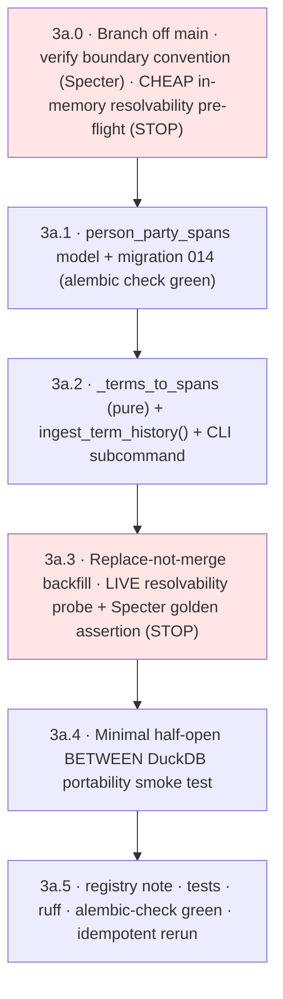
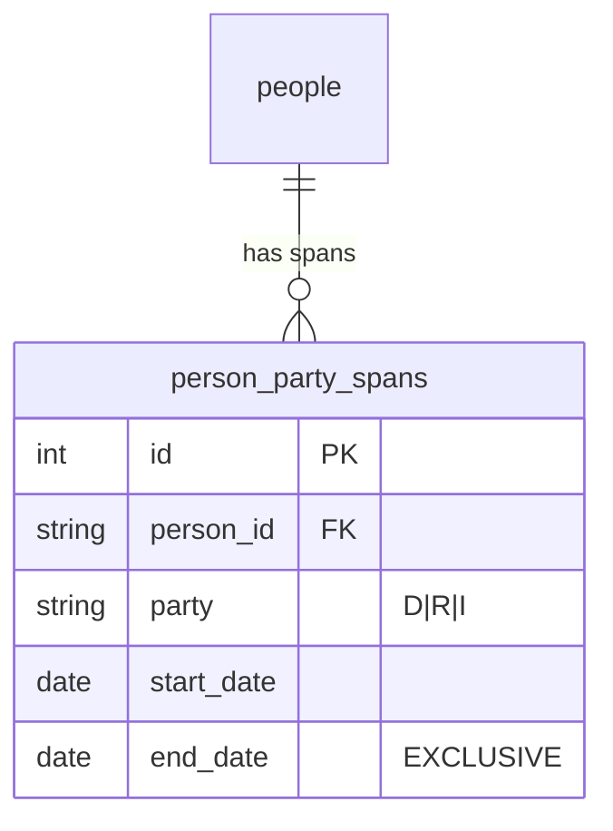

# Family 1 Phase 3a — vote-time party data layer (`person_party_spans`) ✨

> **App-layer prerequisite, its own PR (off green `main`).** Unblocks the deferred party-keyed
> Family 1 templates (`party_breakdown`/`party_defection`/`crossed_party` = **3b/3c, NOT here**),
> which need a member's party **at vote time** — which `people.party` (one *current* value) can't
> give. 3a persists the per-span party history `congress-legislators` already carries, and resolves
> it as-of `vote_date`.

> **Revision 2 — folds a 5-lens panel (data-integrity / migration / python / architecture /
> simplicity).** Material changes: **(1) HALF-OPEN intervals** — the panel caught that inclusive
> `BETWEEN` over boundary-sharing spans double-resolves party on a switch/term-junction day (the
> exact case this table exists for). **(2) table renamed `person_party_spans`** (was `person_terms`
> — it holds party spans, not full terms). **(3) minimal 4-column table** (defer caucus/congress/
> chamber — the join needs only person+party+dates). **(4) replace-not-merge backfill** (can't
> accumulate phantom spans). **(5) collect-and-surface** unknown parties (not raise-on-first).
> **(6) separate `ingest_term_history()` + CLI subcommand** (routine syncs don't pay the historical
> fetch). **(7) two-tier probe** — cheap in-memory pre-flight in 3a.0 + live probe + a **live Specter
> golden assertion** in 3a.3. **(8) 3a.4 lab bits deferred to 3b** (their consumer) — 3a keeps only a
> minimal portability smoke test. Branch base resolved: off `main` (both PRs merged).

## Overview

`people.party` is one current value per member (`congress_legislators.py:77-79` keeps only
`terms[-1].party`; historical members get party from govinfo bill XML). Attributing it to a 2009
vote post-dates party-switchers (Specter flipped mid-111th) — a point-in-time violation. **No new
source is needed** — `congress-legislators` `terms[]` already carries each member's per-term party
with dates (and `party_affiliations` for mid-term switches). 3a persists that as date-ranged
**party spans** and resolves party as-of `vote_date`.

3a delivers: a `person_party_spans` table (4 columns), an **extended ingester**
(`ingest_term_history()` fetching `legislators-historical` + `current`), a **replace-not-merge
backfill** behind its own CLI subcommand, a **two-tier resolvability probe** (STOP-and-surface), and
a minimal **half-open-`BETWEEN` portability smoke test**. It builds **no** lab template — those
consume this in 3b/3c.

## Problem Statement / Motivation
- **Point-in-time is a hard rule.** Party-keyed gold must read party *as of the vote*, never current.
- **Source already in hand.** `terms[].party` + `party_affiliations[{start,end,party,caucus}]`
  (present only on mid-term change; covers the whole term). A *sourced* fix — not a hand-authored
  switcher list (hard-rule-adjacent, silently lossy).
- **Fabrication-by-omission must be gated.** A voter who can't resolve to a vote-time party would be
  silently dropped from a party breakdown. 3a *measures* resolvability and hands 3b a clean predicate.

## Proposed Solution

### Locked decisions (encoded here)
1. **As-of-vote-date resolution, HALF-OPEN.** Resolve with `span.start_date <= vote_date <
   span.end_date` where `end_date` is an **exclusive** upper bound. **Construction (convention-
   agnostic):** for a member's spans sorted by start, `end_date = min(next_span.start_date,
   inclusive_end + 1 day)`; for the last span, `inclusive_end + 1 day`. This is disjoint whether the
   dataset shares a boundary day (`span1.end_incl == span2.start`) or abuts (`+1`), and leaves true
   service gaps uncovered (correctly unresolvable). Both ends are real `date` objects.
2. **`person_party_spans`** — 4 columns: `id` (int PK), `person_id` (FK→`people.id`,
   `ondelete=CASCADE`, NOT NULL), `party` (str D/R/I, NOT NULL), `start_date` (Date NOT NULL),
   `end_date` (Date NOT NULL, **exclusive**). `UniqueConstraint(person_id, start_date)` (also the
   integrity guard against duplicate spans). **No separate `person_id` index / no `index=True`** —
   the unique constraint already indexes `person_id` as its prefix (the panel caught a duplicate-
   index drift trap). Defer `caucus`/`congress`/`chamber` (additive migration when 3c needs them).
3. **Party normalization** `{Democrat→D, Republican→R, Independent→I, Libertarian→L}` (the 3a.0 probe
   found `Libertarian`/Amash is the only non-D/R/I value among voters; L is degenerate for
   defection like I, fine for counts). An unrecognized value is **collected and surfaced** (run
   fails at end with the full list), **never coerced**. Templates use
   `person_party_spans.party` as the authoritative vote-time party — **3b/3c MUST NOT read
   `people.party` for vote-time attribution** (enforced by the model drift comment).
4. **Scope to voters.** FK to `people.id`; backfill writes spans only for bioguides already in
   `people` (covers all 1,290 voters; skips ~12k non-voter members). Log the dropped-span count.
5. **Backfill = replace-not-merge per member**, in a transaction: `DELETE ... WHERE person_id=:id`
   then bulk-insert that member's freshly computed spans. Idempotent + resumable; cannot accumulate
   phantom/overlapping spans if the source corrects a date. Assert per member: inserted count ==
   computed span count, and no two spans overlap (half-open).
6. **Separate `ingest_term_history()` + CLI subcommand** (`ingest legislator-terms`), reusing
   `BaseIngester`; the routine `congress_legislators.ingest()` stays current-only (no historical
   fetch on every sync).
7. **3a is the data layer + probe + a minimal portability smoke test.** The lab drift-manifest entry,
   the full mid-switcher DuckDB fixture, and the registry "resolved" marking land in **3b**, with the
   consuming template.

### Step dependency graph

### ERD

### Architecture (current → target)
| File | Now | Target |
|------|-----|--------|
| `src/models/person_party_span.py` | — | **new**: `PersonPartySpan` (4 cols; FK CASCADE; `UniqueConstraint(person_id,start_date)`; drift comment: voter-scoped, lab 3b/3c consumer, "do not use people.party for vote-time") |
| `src/models/__init__.py` | — | **import** `PersonPartySpan` (+ `__all__`) — **hard gate**: the import is what puts it in `Base.metadata` (the historical `committee_hearing` drift was an *unimported* model) |
| `migrations/versions/014_add_person_party_spans.py` | — | **new**: hand-written `create_table` mirroring `013`; `down_revision="013_add_collection_artifacts"` |
| `src/ingestion/congress_legislators.py` | `ingest()` current-only; `terms[-1].party`; **stale `theunitedstates.io` JSON URL (410 Gone)** | **migrate source → GitHub-raw YAML** (`raw.githubusercontent.com/.../legislators-{current,historical}.yaml`, `yaml.safe_load`); **+** `HISTORICAL_URL`; pure `_terms_to_spans(leg: dict) -> list[PartySpan]` (sorts spans, half-open `end_date`, normalizes party incl. `Libertarian→L`, collects unknowns); `ingest_term_history()` (fetch both, filter to existing `people`, replace-not-merge upsert). Routine `ingest()` URL also fixed; logic untouched. |
| `src/cli.py` | `ingest legislators` | **+** `ingest legislator-terms` subcommand → `ingest_term_history()` |
| `tests/test_ingestion/test_congress_legislators.py` | — | **new**: `_terms_to_spans` pure tests — plain term→1 span; `party_affiliations` (Specter)→N disjoint half-open spans; boundary-day resolves to the *later* party; unknown party collected; gap left uncovered; date typing. Mocked-`AsyncSession` upsert (replace-not-merge) — mirror `test_votes_ingester.py` |
| `tests/test_ingestion/test_person_party_span_portable.py` | — | **new**: half-open `BETWEEN`/`<` resolution on a tiny DuckDB fixture (switcher + single-span) — portability smoke test (no lab/ coupling) |
| `docs/condorcet/registry-open-questions.md` | `vote_time_party` open | note **data layer shipped in 3a**; full "resolved" marking in 3b (with consumer) |

---

### 3a.0 · Branch + verify + cheap pre-flight 🔴
- Branch `feat/vote-time-party` off `main` (PRs #31+#32 merged → `lab/`, `duckdb`, `include_object`,
  registered models, green `alembic check` all present).
- **Verify the boundary convention against real data:** fetch Specter (`S000709`) + a consecutive-
  term member; record whether `party_affiliations[i].end == [i+1].start` (shared) or `+1` (abut).
  *(The half-open `min()` construction in Locked #1 is correct either way — this confirms no
  surprise; if a 3rd convention appears, STOP.)* Confirm party strings ∈
  `{Democrat, Republican, Independent}` and `terms[].end` always present.
- **Cheap in-memory resolvability pre-flight (STOP gate):** load the 1,290 `vote_records.person_id`
  bioguides + each voter's event `vote_date`s; fetch raw `current`+`historical` JSON; in memory,
  compute the fraction of (voter, vote_date) pairs that fall inside exactly one of that voter's
  spans — *before* building the table. STOP-and-surface if coverage is hopeless. (Coarse — can't
  detect persisted-overlap; the precise check is 3a.3.)
- **Acceptance:** branch up; convention recorded; party strings confirmed; pre-flight coverage
  recorded (adequate or STOP documented).

> **3a.0 FINDINGS (recorded 2026-06-25 — PASS, proceed):**
> - **Data source moved.** `theunitedstates.io/.../*.json` is **410 Gone** — the existing ingester
>   URL (`congress_legislators.py:21`) is **stale/broken for fresh runs**. Source is now the
>   GitHub-raw **YAML**: `https://raw.githubusercontent.com/unitedstates/congress-legislators/main/legislators-{current,historical}.yaml`
>   (parse with `pyyaml`, already a dep). Sizes: current 537 legislators (~1.1 MB), historical
>   12,230 (~9 MB). **3a.2 must update the URL + switch `resp.json()` → `yaml.safe_load`.**
> - **Boundary convention = SHARED.** Specter `S000709` `party_affiliations`: `[…04-30 Republican]`,
>   `[04-30… Democrat]` (end == next.start). The half-open `min(next.start, incl_end+1)` construction
>   handles it: **0 overlaps across 1,050,514 (voter,date) pairs**, and Specter resolves **R** for
>   2009-04-28, **D** for 2009-04-30 onward — point-in-time correct. Construction VALIDATED on live data.
> - **Resolvability = 99.60%** of 1,050,514 pairs resolve to exactly one span; **0 overlaps**; **0
>   NULL `vote_date`** events. Unresolved: 0.40% (4,165 pairs / 31 voters), almost all **hash-id
>   pseudo-voters** (e.g. `0772102013907765`) — vote-ingestion artifacts where a member couldn't be
>   matched to a bioguide; these aren't real bioguides so they have no spans. 3b's gate correctly
>   excludes their events. (Minor data-quality follow-up: why ~31 voters carry hash ids — not 3a.)
> - **16 switchers among voters** (Specter, Shelby, Lieberman, Manchin, Sinema, Hall, Van Drew,
>   Amash, Alexander, Emerson, Mitchell, Kiley, Sablan, …) — exactly the members current-party
>   mis-attributes. This is the payoff the layer exists for.
> - **Party domain is NOT just {D,R,I}** — the surface-don't-coerce rule fired on **Justin Amash
>   `A000367` = "Libertarian"** (the only non-{D,R,I} value across all 1,290 voters). Recommend
>   extending normalization to `{…, Libertarian→L}` (faithful; L is degenerate for defection like
>   I/ID, fine for counts); keep collect-and-surface for any genuinely unknown future value.

### 3a.1 · Model + migration
- `PersonPartySpan` per Locked #2. **Register in `src/models/__init__.py` (import + `__all__`)**.
  Drift comment: voter-scoped (not a full member registry), lab 3b/3c consumer, "vote-time party
  lives here — do not read people.party for it".
- Migration `014` hand-written (mirror `013`): `create_table` (4 cols + PK), the FK with
  `ondelete="CASCADE"`, the `UniqueConstraint`. `PYTHONPATH=. uv run alembic upgrade head`.
- **Acceptance:** model registered (in `Base.metadata`); `PYTHONPATH=. uv run alembic check` **green**
  (model == migration == DB; no new drift); FK `ondelete` matches model+migration (alembic doesn't
  detect ondelete drift — set it identically by hand).

### 3a.2 · Pure parser + term-history ingester
- `@dataclass(frozen=True) class PartySpan: party: str; start_date: date; end_date: date`.
- `_terms_to_spans(leg: dict) -> list[PartySpan]` — **pure, no DB/network** (unit-testable like
  `test_votes_ingester`'s parsers): collect each term's spans (a term with `party_affiliations` →
  one per entry; else one span); parse dates via `date.fromisoformat`; normalize party (unknown →
  append to a collected-anomalies list, skip); sort by start; set half-open `end_date =
  min(next.start, inclusive_end + 1 day)` (last → `inclusive_end + 1 day`).
- `ingest_term_history()`: fetch `current` + `historical`; pre-load existing `people` ids (after any
  people upsert, or rely on the routine sync having run); per in-`people` legislator, compute spans,
  then **replace-not-merge** in a txn (DELETE that person's spans, bulk-INSERT new). Collect unknown
  `(bioguide, raw_party)`; **fail at end** with the full list if any. `BaseIngester` run tracking;
  log spans-written + members-dropped (not in `people`) + anomalies.
- **Acceptance:** pure-function tests cover plain term, Specter-shaped `party_affiliations` (→
  disjoint half-open spans; boundary day → later party), gap uncovered, date typing, unknown-party
  collected (not raised mid-run); replace-not-merge upsert tested (mocked session); `ruff` clean.

### 3a.3 · Backfill + live probe + Specter golden assertion 🔴
- Run `ingest legislator-terms` (idempotent). Then **probe** (read-only) and record:
  - voters with ≥1 span; voters resolving to **exactly one** span as-of each of their event dates;
  - **party-resolvable events** = non-NULL `vote_date` AND every voter resolves to exactly one span;
  - **unresolved by reason**: NULL `vote_date`; voter **in `people` but absent from
    `congress-legislators`** (the real gap — the FK already guarantees every voter has a `people`
    row, so "absent from `people`" is impossible/tautological); no span covers the date; **>1 span**
    (genuine overlap — should be zero given half-open construction; non-zero ⇒ data bug ⇒ STOP).
  - **switcher count** (members with >1 distinct party across spans) — the payoff.
- **Live Specter golden assertion:** a real pre-switch House/Senate `vote_date` resolves **R**, a
  real post-switch date resolves **D**, against the *populated DB* (proves the data, not just the
  SQL). STOP-and-surface if coverage thin or any unexplained overlap.
- **Acceptance:** probe numbers + switcher count recorded in the PR; zero unexplained overlaps;
  Specter golden assertion passes; coverage adequate (or STOP documented).

### 3a.4 · Portability smoke test (minimal)
- One DuckDB test (`duckdb` dev dep only; **no lab/ coupling**) proving the half-open resolution is
  engine-portable + correct: a 2-span switcher + a single-span member; assert a boundary-date vote
  resolves to exactly one (the later) party. *(The full lab fixture + `REQUIRED_COLUMNS` 6th-table
  entry + the production join land in 3b with the consuming template.)*
- **Acceptance:** smoke test green; the half-open SQL (`start <= date < end`) passes the portability
  regex scan pattern (no banned constructs).

### 3a.5 · Close-out
- Registry note: `vote_time_party` **data layer shipped in 3a** (table + as-of resolution); full
  "resolved" marking deferred to 3b (its consumer).
- **Acceptance:** registry noted; full `ruff` + global `alembic check` green; tests green; rerun of
  `ingest legislator-terms` is a no-op net change (replace-not-merge idempotent).

## System-Wide Impact
- **Interaction graph.** New CLI subcommand → `ingest_term_history()` → fetch 2 URLs → per
  in-`people` legislator: `_terms_to_spans` → replace-not-merge upsert. Routine
  `congress_legislators.ingest()` (current-only) **unchanged**. The table is read by **lab gold in
  3b**, not 3a. No request-path/API surface.
- **Error propagation.** Fetch failure → `finish_run("failed")` + raise (existing). Unknown party →
  **collected**, run fails at end with the full list (never coerce). Per-member overlap/count
  mismatch → raise (data bug). Probe shortfall → STOP-and-surface.
- **State lifecycle.** Replace-not-merge per member in a txn; partial run resumable; rerun
  idempotent; cannot accumulate phantom spans. `NOT NULL` dates (a NULL `end_date` would make
  `<` never true → silent drop). No request-path writes.
- **API-surface parity.** None (ingestion + a new table). A future "member party history" reader is
  out of scope.
- **Integration scenarios.** (1) backfill populates spans for all voters; (2) Specter resolves R
  pre-switch / D post-switch on real votes; (3) a boundary-date vote resolves to exactly one span on
  DuckDB; (4) `alembic check` green post-`014`; (5) rerun = 0 net change.

## Acceptance Criteria (rollup)
- [x] `PersonPartySpan` (4 cols, FK CASCADE, unique key, **registered/imported**, drift comment) +
  migration `014`; global `alembic check` green (verified: "No new upgrade operations detected").
- [x] `_terms_to_spans` pure → `list[PartySpan]`; **half-open `end_date = min(next.start, incl_end+1)`**;
  `date.fromisoformat`; party normalized (incl. `Libertarian→L`); **unknown party collected +
  surfaced at end**; tests cover Specter (boundary-day→later-party), gap, unknown, missing-date (10 tests).
- [x] `ingest_term_history()` + `ingest legislator-terms` subcommand; **replace-not-merge** (atomic
  DELETE-all + chunked bulk INSERT, computed in memory first; zero-overlap + duplicate-start asserts);
  filtered to existing `people`; routine `ingest()` logic untouched (its dead `theunitedstates.io`
  URL migrated to GitHub-raw YAML in the same change).
- [x] Backfill run (7,636 spans / 1,260 members; 11,507 non-voters skipped); **live resolvability**
  via the half-open join = **99.60% exactly-one** (1,046,349 / 1,050,514), **0 overlaps**, 0.40%
  no-span (= the 30 hash-id pseudo-voters); **Specter golden assertion PASSES** (pre-switch → R ×229,
  post-switch → D ×172); 16 switchers materialized (Specter D,R; Amash I,L,R; Lieberman D,I; …).
- [x] Minimal half-open `BETWEEN` DuckDB portability smoke test green (switcher + single-span). Lab
  manifest entry + full fixture + production join **deferred to 3b**.
- [x] Registry noted (vote_time_party data layer shipped); my 3a files `ruff` clean; full suite 696 passed; `alembic check` green; backfill rerun idempotent (replace-not-merge).

## Alternative Approaches Considered
- **Inclusive `BETWEEN`** — rejected (panel BLOCKER): double-resolves party on boundary/switch days.
  Half-open `min()` construction is disjoint by construction.
- **Hand-authored switcher list** — rejected (hard-rule-adjacent; silently lossy).
- **Per-(bioguide, congress) / one-row-per-term** — rejected: mid-congress switches need sub-term
  spans; per-span makes resolution a uniform half-open compare.
- **`on_conflict_do_update` merge backfill** — rejected (panel): a corrected start-date leaves a stale
  overlapping row → silent post-dating. Replace-not-merge can't.
- **Fold historical fetch into routine `ingest()`** — rejected (panel): every current sync would pay
  the historical fetch. Separate subcommand.
- **Store caucus/congress/chamber now** — deferred (panel): unused by the join; additive later.
- **Lab fixture + drift manifest in 3a** — deferred to 3b (panel): ceremony ahead of consumer; keep
  only a minimal portability smoke test.
- **`person_terms` name** — rejected (panel): oversells; it's party spans → `person_party_spans`.

## Dependencies & Risks
- **🔴 Resolvability coverage (now measured twice)** — cheap pre-flight (3a.0) + precise live probe
  (3a.3). STOP-and-surface if thin. Gaps = in-`people`-but-absent-from-`congress-legislators`
  (delegates/odd cases), NULL `vote_date`.
- **Boundary convention** — verified against real Specter data in 3a.0; the half-open `min()`
  construction is correct for shared-or-abutting; a 3rd convention ⇒ STOP.
- **Idempotency** — replace-not-merge + per-member overlap/count asserts; rerun is a no-op.
- **Party-string drift** — collected + surfaced, never coerced.
- **`people` population ordering** — term-history backfill reads existing `people`; the routine
  current sync / govinfo / votes ingestion populate `people` first. Documented precondition; log
  dropped spans for absent bioguides.
- **Pre-build verifications:** boundary convention (3a.0); NULL `vote_date` count; `people.id` ==
  bioguide alignment (probe surfaces mismatches).

## Out of Scope (do NOT build)
The lab precompute `party_resolvable_events` set, the production as-of join + full DuckDB fixture +
`REQUIRED_COLUMNS` 6th-table entry + full registry "resolved" marking (all **3b**); `party_breakdown`
(3b); `party_majority` impl + `party_defection` + `crossed_party` (3c — blessed package: denominator
= party's yea+nay voters, absences excluded, ties/zero → null → excluded; major-party-scoped);
precompute scan #1 widening (3c); `caucus`/`congress`/`chamber` columns (additive when 3c needs);
any API/MCP surface; span-deletion/correction beyond replace-not-merge.

## Open Decisions (resolved)
1. **Branch base** — off `main` (PRs #31+#32 merged → green base with `lab/`+`duckdb`). *(User.)*
2. **Name** — `person_party_spans` / `PersonPartySpan`. *(User + architecture.)*
3. **Columns** — minimal 4 (defer caucus/congress/chamber). *(User + simplicity.)*
4. **Boundary** — half-open `end_date = min(next.start, incl_end+1)`, exclusive. *(Panel.)*
5. **Backfill** — replace-not-merge, separate `ingest_term_history()` + subcommand. *(Panel.)*
6. **Migration** — hand-write mirroring `013`. *(Panel.)*

## Sources & References
- **Prior plans:** Phase 1 + Phase 2 (`docs/plans/2026-06-25-*`). **Scope:** `docs/scopes/2026-06-24-*`.
  **Registry:** `docs/condorcet/registry-open-questions.md`.
- **Code (verified):** `src/ingestion/congress_legislators.py:21,77-83,87-114`; `src/ingestion/base.py:26-41`;
  `tests/test_ingestion/test_votes_ingester.py` (pure-parser + mocked-session pattern);
  `src/models/person.py:14,17` (id=bioguide String, party current-only); `src/models/vote.py:16`
  (`vote_date` is `Date`); `src/models/__init__.py` (registration = the import); `migrations/versions/013_add_collection_artifacts.py`
  (hand-written `create_table`); `migrations/env.py` (`include_object` present post-#32); `src/cli.py:202`
  (`ingest` entrypoint). Base is `main` @ `59e517b` (post #31+#32).
- **External (verified, congress-legislators README):** `terms[]`
  `{type(sen/rep), start/end(YYYY-MM-DD), state, district, class, party(Democrat/Republican/Independent),
  caucus, party_affiliations[{start,end,party,caucus}]}`; `party_affiliations` present only on
  mid-term change, covers the whole term (boundary convention verified live in 3a.0).

---

 🤖 Generated with [Claude Code](https://claude.com/claude-code)
