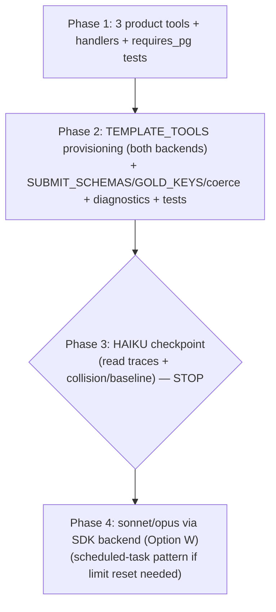

# Family 1 Phase B — multi-event window tool layer

## Overview

Family 1 has **8 templates**. Five are **event-keyed** (served by the existing `get_vote_event`
product tool) and are live-validated across haiku/sonnet/opus (the `party_breakdown` gradient
haiku 0 → sonnet 5 → opus 9 proves the benchmark discriminates). The remaining **three are
window-keyed** — they reason over a `(congress, chamber)` window of *many* events — and have no
live tool path. `get_vote_event` cannot serve them (`closest` needs every event's margin;
`member_summary`/`pairwise` need 1–2 members across hundreds of events → hundreds of single-event
calls = infeasible). **That gap is what Phase B closes.**

The three templates **already generate frozen gold + graders** (`lab/templates.py`); Phase B adds
**no template/grader/gold change**. It builds:
1. **Three new product RESEARCH_TOOLS** that return RAW window facts (the agent computes the
   aggregate — that is the difficulty), and
2. **Per-template tool provisioning** in the `AgentSolver` so each template is offered exactly the
   tools it needs, across BOTH backends (messages-api / agent-sdk), plus
3. The **answer-shape + fairness** plumbing (two new `fields` shapes + a window name-collision
   diagnostic) folded into the existing swappable machinery.

This is the third slice of Family 1 (after vote_lookup, PR #37; aggregate shapes + SDK backend,
PR #38). Same working rhythm: design-chat (done — 3 forks blessed) → this plan → 5-lens panel →
`/ce:work` with a **haiku checkpoint before sonnet/opus**.

## Blessed / locked decisions (from the design chat — do NOT re-open)

| # | Decision |
|---|----------|
| B1 | **Two general tools + a search tool** (not one polymorphic, not three purpose-built): `list_vote_events`, `find_people`, `get_member_voting_record`. |
| B2 | **Member resolution via `find_people`** (name→id), so same-name **collisions surface to the agent**; `get_member_voting_record` then keys on `person_id`. |
| B3 | **Product placement** — all three in `src/llm/tools.py` `RESEARCH_TOOLS` + `src/api/chat.py` handlers, so both backends (incl. the SDK `@tool` path, which sources from `RESEARCH_TOOLS`) get them. |
| B4 | **Tools return RAW facts; never pre-aggregate the gold quantity** (no `{yea,nay,other}` counts, no margin rank, no agreement count). |
| B5 | **No new grader** — reuse `set_match` (closest) and `fields` (member_summary, pairwise). |
| B6 | **Haiku validation checkpoint** across the 3 templates BEFORE sonnet/opus. |

## Panel resolutions (rev 2 — folded, authoritative)

**Panel verdict:** the data-integrity guardian **CONFIRMED tool↔gold parity for all three templates**
(closest↔list_vote_events; member_summary↔get_member_voting_record; pairwise↔2× record) — *no
frozen-core change, no STOP-and-surface required*. The other lenses surfaced real defects; all 21
findings are folded below. **No blessed fork reopened.**

### BLOCKERS (must land)
- **P1 — `set_match` key is hardcoded to `member_ids` in TWO functions** (kieran + data-integrity):
  `coerce` (`solvers.py:249-253`) **and `_answer_present`** (`:269-270`) both literal-read
  `member_ids`, template-blind. closest's field will be named **`roll_call_ids`** (clarity; the
  prompt says "List the roll-call ids"), so BOTH functions must resolve the field per-template via a
  new `SET_MATCH_FIELD = {"family1.crossed_party":"member_ids", "family1.closest_by_margin":
  "roll_call_ids"}` (or derive the sole property from `SUBMIT_SCHEMAS[tid]`). Add a `coerce` case +
  a `_map_answer` round-trip test (answerable closest → non-`NO_ANSWER` list). This is the one place
  the "composes for free" claim was false — it fails *silently* (every closest instance →
  `NO_ANSWER`) if missed.
- **P2 — Phase-1 "full suite green" is unsatisfiable without test/docstring updates** (architecture):
  `tests/test_mcp/test_server.py:61-85` pins `EXPECTED_TOOLS` (11 names) + `test_no_extra_tools`;
  adding 3 to `RESEARCH_TOOLS` breaks it. Phase 1 MUST also update `EXPECTED_TOOLS` (→14), the
  "10/11 tools" docstrings (`src/mcp/server.py:3`, `src/services/chat_service.py:498`), and add the
  3 tools to the `_tool_description` status map (`chat_service.py:~352`).

### SHOULD-FIX (land in rev 2)
- **P3 — system prompt names `get_vote_event`** (architecture): `_AGENT_SYSTEM_PROMPT`
  (`solvers.py:198-206`) says "Use the get_vote_event tool" — but 3 templates won't be given it →
  the model is told to call an absent tool (measurement-validity defect). Generalize to tool-neutral
  phrasing ("use the available retrieval tools to gather the records, then compute…"). Verify the 5
  event-keyed templates stay equivalent.
- **P4 — `_name_collisions` must regenerate with REAL `precompute(conn)`** (data-integrity): the
  current empty-`Precomputed()` shortcut is valid ONLY because vote_lookup ignores precompute;
  member/pairwise consume it via `_fully_complete_windows` → empty precompute yields **zero
  instances → the collision exclusion never fires** → colliding member/pairwise instances false-fail.
  Mirror `_trivial_baseline`'s `template.generate(conn, n, seed, precompute(conn))`.
- **P5 — `find_people` roster == gold's sampling roster, no option filter** (data-integrity): folded
  into R1 (name-first + window `EXISTS`, no option filter). The R6 collision check MUST query the
  **identical** predicate so the served-set and the excluded-set agree. Test: a `present`-only member
  resolves.
- **P6 — `find_people` name-first** (perf): folded into R1 (people-table scan → index-backed window
  EXISTS, not a ~500K-row live DISTINCT).
- **P7 — truncation diagnostic** (perf): when the SDK hits `max_budget_usd`/`max_turns`, `submit_box`
  is empty → `NO_ANSWER`, **indistinguishable from a wrong answer** → silently depresses the gradient.
  Capture the `ResultMessage` stop/result reason (alongside the existing `cost`) into `trace_extras`;
  bucket budget/turn-terminated rollouts **separately** in the run.py diagnostics. At the **haiku
  gate, record per-rollout cost** for closest/pairwise and extrapolate to opus (~10–15×) BEFORE
  Phase 4; bump per-template `max_budget_usd` if the extrapolation nears $3.
- **P8 — `NUMERIC_FIELDS == GOLD_KEYS` for the two new `fields` templates** (kieran): unlike `tally`
  (where `result` is a non-numeric field), member_summary `{yea,nay,other}` + pairwise
  `{agreements,shared_events}` are **all-int** — every key must be in `NUMERIC_FIELDS` or a `"5"`
  false-fails. Add the stringized-int coercion test for both (the key-set test doesn't catch this).
- **P9 — `TEMPLATE_TOOLS` completeness + `allowed_tools` lockstep** (kieran + architecture):
  `TEMPLATE_TOOLS[inst.template_id]` is an unguarded `KeyError` at rollout time for a future
  unmapped template — add a test `set(TEMPLATE_TOOLS) >= {family1 ids}`. And assert the SDK invariant
  `set(allowed_tools) == {f"mcp__lab__{n}" for n in TEMPLATE_TOOLS[tid]} | {"mcp__lab__submit_answer"}`
  (derive both from one comprehension).

### SIMPLIFY (folded)
- **P10 — DROP `party` from `find_people`** (simplicity #1, consensus) → R1 done.
- **P11 — trim `list_vote_events` to `{vote_event_id, yes_count, no_count}`** (simplicity #5 + perf)
  → R1 done.
- **P12 — ONE parametrized collision helper** (simplicity #4): `window_name_collisions(conn,
  instances, person_keys)` loops the key(s) (`["person_id"]` vs `["person_a","person_b"]`) — not two
  near-duplicate arms. `_name_collisions` dispatches data, not code.
- **P13 — fold tool-set assertions into existing `test_agent_seam`** (simplicity #6) rather than a
  whole new `test_template_tools.py`; keep only the genuinely-new tests (window handlers, the
  coerce/answer-shape cases, the completeness + lockstep invariants from P9).

### NIT (folded)
- **P14** `get_member_voting_record`: `ORDER BY vote_event_id`; description says "count the records
  **returned**" (members don't vote every event — don't infer `other = events − yea − nay`).
- **P15** Both multi-row tools `ORDER BY id` (deterministic payloads; aids pairwise intersection).
- **P16** Error strings leak no DB internals (replicate the `get_vote_event` error test).
- **P17** `research_tool_for(name: str) -> dict` (type hint); bare `next()` crashing loudly on a
  wiring typo is correct.
- **P18** Production payload exposure of `list_vote_events` is **accepted** (trimmed to 3 fields ≈
  ~12-15K tokens; it's a genuine research tool; the lab budget guard bounds it) — no production
  pagination; noted in Risks.
- **P19** (haiku trace-watch, not a code change) cross-year tie-break: gold sorts the full
  zero-padded id string (lexicographic == numeric); the tool returns full ids, so the data is
  consistent — watch only whether the *model* strips the prefix and compares roll numbers across the
  two House years on a boundary tie.

## Resolved mechanical residuals (concrete answers for the panel)

### R1 — Tool schemas, projections, param form, SQL, scale

All three take the window as `congress` = `sessions.identifier` (e.g. `"115"`) + `chamber` ∈
`{"house","senate"}`. Handlers mirror `_tool_get_vote_event` exactly: async SQLAlchemy ORM, whole
body guarded so a malformed/absent arg returns a clean JSON error (never a DB traceback), RAW rows.

**`list_vote_events(congress, chamber)`** → serves `closest_by_margin`.
- Returns `{"congress","chamber","events":[{"vote_event_id","yes_count","no_count"}],"count"}`
  **ORDER BY id**. **rev2:** projection trimmed to exactly what `closest` ranks on (margin =
  `|yes−no|`, tie-break id) — `motion_text`, `result`, AND `vote_date` all DROPPED (simplicity #5 +
  perf: shrinks the ~1200-row payload, eases the opus budget risk).
- ORM: `select(VoteEvent.id, VoteEvent.yes_count, VoteEvent.no_count)
  .join(Bill, Bill.id==VoteEvent.bill_id).join(Session, Session.id==Bill.session_id)
  .where(Session.identifier==congress, VoteEvent.chamber==chamber, VoteEvent.yes_count.isnot(None),
  VoteEvent.no_count.isnot(None)).order_by(VoteEvent.id)` — the `IS NOT NULL` filter is **identical
  to the template's gold filter** (R3); the `bill_id` join is index-backed (perf NIT: not a
  vote_records scan).
- **Refusal arm:** run the main query first; on an **empty** result, check `sessions` for the
  `congress` identifier → if absent `{"error":"Congress '<c>' not found."}` (the `closest` refusal
  twin is a nonexistent congress). Existence-check only on the empty branch saves a round trip on
  every real call (perf NIT).

**`find_people(name, congress, chamber)`** → name→id resolution for member templates.
- Returns `{"people":[{"person_id","name"}],"count"}`; **empty list = not found** (clean signal,
  not an error). **rev2: `party` DROPPED** (simplicity #1 + data-integrity: zero benchmark value,
  point-in-time drift; deletes the `PersonPartySpan` join + the session-start lookup + a test).
- **rev2 — NAME-FIRST query (perf SHOULD-FIX), do NOT copy the template's window-DISTINCT** (which
  scans ~500K `vote_records` rows live, ×2 for pairwise): (1) `select(Person.id, Person.name)
  .where(func.lower(Person.name)==func.lower(name))` — `people` is small (a few thousand
  legislators), no `name` index needed; this is also the collision signal. (2) Keep only candidates
  with **any** vote in the window via an index-backed `EXISTS` over `VoteRecord` (uses
  `ix_vote_records_person_id`) joined up through `vote_events→bills→sessions` on
  `(identifier, chamber)` — **NO option filter** (data-integrity SHOULD-FIX: gold samples
  `DISTINCT vr.person_id` with no option filter, so a `present`/`not_voting`-only member must still
  resolve, else its answerable instance false-fails).
- **Exact full-name, case-insensitive**; substring rejected (manufactures false collisions).

**`get_member_voting_record(person_id, congress, chamber)`** → serves member_summary (1 call) +
pairwise (2 calls).
- Returns `{"person_id","congress","chamber","records":[{"vote_event_id","option"}],"count"}` —
  **ALL options raw** (`yea/nay/present/not_voting`); the agent computes `other=present+not_voting`
  (member_summary) and the intersect/agreement (pairwise). **Never pre-bucket.**
- ORM: the `member_summary` template SQL **minus the `GROUP BY`**.
- **Refusal arm:** 0 records in the window → `{"error":"Member '<pid>' not found in <chamber>
  Congress <congress>."}`. The member/pairwise refusal twins pass a synthetic id directly → 0 rows →
  error → the agent refuses.

**Scale:** a House congress is ~700–1200 roll calls. `list_vote_events` returns ~1200 ×
`{id, date, 2 ints, result}` ≈ 25–30K tokens — large but well within a frontier context, and
`closest` *requires* the full set to rank, so **no pagination** (Phase 1 verifies the true max via a
`SELECT congress,chamber,COUNT(*)` and records it; only if a window is pathological do we revisit).

### R2 — `find_people` semantics
Resolved in R1: exact case-insensitive full-name, window-scoped, `party` informational, empty = not
found.

### R3 — `list_vote_events` NULL-count handling
**OMIT** NULL-count events (the `yes_count IS NOT NULL AND no_count IS NOT NULL` WHERE clause). This
exactly matches the template's rankable-gold filter → the agent's rankable set == gold's. It is
**leak-free**: a completeness filter reveals nothing about *which* events have small margins.

### R4 — `get_member_voting_record` rawness
Resolved in R1: return every option, agent buckets. Confirmed sufficient for pairwise — the agent
calls twice, intersects on `vote_event_id`, restricts to mutual `{yea,nay}` (shared), counts equal
options (agreements); `Instance.prompt` already states "shared = both voted yea or nay".

### R5 — Per-template tool map + SDK `@tool` factory + integrity gate

A single source of truth in `lab/solvers.py`:
```python
_EVENT_TOOLS  = ["get_vote_event"]
_MEMBER_TOOLS = ["find_people", "get_member_voting_record"]
TEMPLATE_TOOLS = {
    "family1.vote_lookup":        _EVENT_TOOLS,
    "family1.tally":              _EVENT_TOOLS,
    "family1.party_breakdown":    _EVENT_TOOLS,
    "family1.party_defection":    _EVENT_TOOLS,
    "family1.crossed_party":      _EVENT_TOOLS,
    "family1.closest_by_margin":  ["list_vote_events"],
    "family1.member_summary":     _MEMBER_TOOLS,
    "family1.pairwise_agreement": _MEMBER_TOOLS,
}
def research_tool_for(name): return next(t for t in RESEARCH_TOOLS if t["name"] == name)
```
**Minimal exact subsets** (not a uniform "all 3 window tools") so each template gets only what it
needs — `closest` shouldn't be tempted to call `find_people`, and `member_summary` shouldn't be
tempted toward `list_vote_events`.

- **`_asolve_messages`:** `tools = [research_tool_for(n) for n in TEMPLATE_TOOLS[inst.template_id]]
  + [submit_tool_for(inst.template_id)]` (replaces the hardcoded `[get_vote_event, submit]`).
- **`_asolve_sdk`:** extract the existing hardcoded `_sdk_get_vote_event` into a **factory**
  `_make_sdk_product_tool(tool_def, observations)` → an `@tool` that opens its own
  `async_session_factory` session, routes via `lab_execute_tool`, records a **bare-name**
  observation. Build `product_tools = [_make_sdk_product_tool(research_tool_for(n), observations)
  for n in TEMPLATE_TOOLS[inst.template_id]]`; `create_sdk_mcp_server(tools=[*product_tools, submit])`;
  `allowed_tools = [f"mcp__lab__{n}" for n in TEMPLATE_TOOLS[inst.template_id]] +
  ["mcp__lab__submit_answer"]`.
- **Integrity gate UNCHANGED:** `_DISALLOWED_BUILTINS`, `setting_sources=[]`, pop
  `ANTHROPIC_API_KEY`, `permission_mode`. `allowed_tools` is now the per-template subset's
  `mcp__lab__*` names. The vote_lookup tool-set assertion in `test_agent_seam` test #6 still holds
  (`vote_lookup → [get_vote_event] + submit`).
- **`max_turns`:** bump `8 → 10` (pairwise can be 5+ tool calls: `find_people`×2 +
  `get_member_voting_record`×2 + submit; headroom for a retry).

### R6 — Diagnostics
- **format-fail / agent-error / no-retrieval** key off `verdict.subscores` + `history` →
  template-agnostic → work unchanged (confirm in tests).
- **trivial-constant baseline** stays `defection`/`crossed` only — the window templates have **no
  degenerate constant floor** (`closest` gold is always exactly K=5 ids; member/pairwise `fields`
  have no constant). Mark **N/A** for window templates (a one-line guard).
- **NEW: window name-collision diagnostic.** Generalize `_name_collisions` to dispatch:
  `vote_lookup → vote_lookup_name_collisions` (event-scoped, existing); `member_summary` →
  flag if the sampled person's name is shared by >1 voter **in the (congress,chamber) window**;
  `pairwise` → flag if EITHER `person_a`/`person_b` collides in the window. Excluded instance ids
  drop from the *reported* clean rate (read-only; never touches gold) — exactly the vote_lookup
  pattern.

### R7 — Tests (no live calls in CI)
- `tests/test_api/test_window_tools.py` (`requires_pg`, skip-on-unreachable): per known window —
  `list_vote_events` rankable rows + no NULL-count + congress-not-found error; `find_people`
  exact/case-insensitive/window-scoped + collision (>1) + empty; `get_member_voting_record` raw
  all-options + member-not-found error.
- `tests/test_lab/test_answer_spec.py` additions: `coerce`/`_map_answer` for `member_summary`
  `{yea,nay,other}` + `pairwise` `{agreements,shared_events}` + `closest` set-of-ids (malformed →
  `NO_ANSWER`); **leak-free schema assertion** extended (no `min(`, `shared`, `same way`,
  `majority`, `closest`); KEY-SET cross-consistency for the 2 new `fields` templates
  (`generate → set(gold)==GOLD_KEYS[tid]`).
- `tests/test_lab/test_template_tools.py` (NEW): `TEMPLATE_TOOLS` subsets; `_asolve_messages` builds
  the right tool list per template; submit always present.
- `tests/test_lab/test_agent_sdk_backend.py` extension: the fake `query()` drives the **real
  generalized `@tools`** for a window template (member_summary → `find_people` +
  `get_member_voting_record` present, observation capture, `allowed_tools` lockdown = those + submit).
- Existing **10 `test_agent_solver` + 4 `test_agent_seam` + 2 SDK** stay green; **`test_hashes`
  green** (no frozen-core change). SYNC defs where the solver spins its own loop.

## Architecture

| Layer | File | Change |
|-------|------|--------|
| Product tool defs | `src/llm/tools.py` | +3 entries in `RESEARCH_TOOLS` (`list_vote_events`, `find_people`, `get_member_voting_record`) |
| Product handlers | `src/api/chat.py` | +3 `_tool_*` async handlers (mirror `_tool_get_vote_event`) + 3 `_TOOL_HANDLERS` entries |
| Solver provisioning | `lab/solvers.py` | `TEMPLATE_TOOLS` map + `research_tool_for`; per-template tools in `_asolve_messages`; `_make_sdk_product_tool` factory + per-template `allowed_tools` in `_asolve_sdk`; `max_turns 8→10` |
| Answer shapes | `lab/solvers.py` | +`GOLD_KEYS`/`NUMERIC_FIELDS`/`SUBMIT_SCHEMAS` for `member_summary` (`yea,nay,other`) + `pairwise` (`agreements,shared_events`); `closest` `SUBMIT_SCHEMAS` (roll-call-id array) |
| Diagnostics | `lab/run.py` | generalize `_name_collisions` (window scope for member/pairwise); `_trivial_baseline` N/A guard for window templates |
| Tests | `tests/test_api/`, `tests/test_lab/` | as R7 |

**Frozen core untouched:** `scoring.py`, `graders.py`, `validate_gold`, the `TraceRecord` field
contract, `vote_parsers` vocab, **and the 3 templates' gold/graders**. `grading_contract_hash` +
`content_hash` stay UNMOVED (the new tools live in product `src/`; the shape/map/diagnostic
extensions live in NON-hash `solvers.py`/`run.py`). `test_hashes` is the guardrail.

## Dependency graph



## Phase 1 — product window tools (Option-X-ready)

- [x] Add `list_vote_events`, `find_people`, `get_member_voting_record` to `RESEARCH_TOOLS`
  (`src/llm/tools.py`) — input_schemas per R1, descriptions state the QUANTITY/return, lift phrasing
  from `get_vote_event`.
- [x] Add `_tool_list_vote_events`, `_tool_find_people`, `_tool_get_member_voting_record` to
  `src/api/chat.py` (mirror `_tool_get_vote_event`: ORM joins per R1, guarded body, RAW rows, clean
  JSON error arms) + register in `_TOOL_HANDLERS`.
- [x] **(P2)** Update `tests/test_mcp/test_server.py` `EXPECTED_TOOLS` (11→14); the "10/11 research
  tools" docstrings in `src/mcp/server.py:3` + `src/services/chat_service.py:498`; add the 3 tools to
  the `_tool_description` status map (`chat_service.py:~352`).
- [x] Verify the true max events-per-window (a one-off `COUNT(*)` query); record it; confirm a
  single-response payload is acceptable (no pagination). **MEASURED: max = 1763 rankable events (Congress 110 house) ≈ 140KB / ~40K tokens — within context; flagged for the P7 opus budget check at the haiku gate.**
- [x] `tests/test_api/test_window_tools.py` (`requires_pg`) — per R7; incl. **(P16)** an error-arm
  test that no DB internals leak (replicate the `get_vote_event` error test).
- [x] `ruff check/format`; **full suite green (incl. `tests/test_mcp/`)**; **`test_hashes` green**.
- **Checkpoint:** product tools land + the production tool-surface tests/docstrings updated + tests
  green (no solver change yet). Commit.

## Phase 2 — solver provisioning + answer shapes + diagnostics

- [ ] `TEMPLATE_TOOLS` map + `research_tool_for(name: str) -> dict`; rewire `_asolve_messages` to the
  per-template tool list.
- [ ] `_make_sdk_product_tool` factory; rewire `_asolve_sdk` (per-template `@tools` + `allowed_tools`
  derived from the SAME comprehension — **P9** lockstep); `max_turns 8→10`.
- [ ] **(P3)** Generalize `_AGENT_SYSTEM_PROMPT` to tool-neutral phrasing (no `get_vote_event` name).
- [ ] `GOLD_KEYS`/`SUBMIT_SCHEMAS` for `member_summary`{yea,nay,other} + `pairwise`
  {agreements,shared_events}; **(P8)** `NUMERIC_FIELDS[tid] == GOLD_KEYS[tid]` for BOTH (all-int).
  `closest` `SUBMIT_SCHEMAS` with field **`roll_call_ids`**. Leak-safe descriptions.
- [ ] **(P1)** `SET_MATCH_FIELD` map; generalize the `member_ids` literal in BOTH `coerce` AND
  `_answer_present` to resolve the field per-template.
- [ ] **(P4/P12)** `window_name_collisions(conn, instances, person_keys)` (one parametrized helper);
  `_name_collisions` regenerates member/pairwise with **real `precompute(conn)`**; `_trivial_baseline`
  N/A guard for window templates.
- [ ] **(P7)** Capture the SDK `ResultMessage` stop/result reason into `trace_extras`; bucket
  budget/turn-truncated rollouts separately in the run.py agent diagnostics.
- [ ] Tests: `test_answer_spec` additions (incl. **P1** set_match round-trip + **P8** stringized-int
  for both new templates); the **P9** completeness + `allowed_tools` lockstep invariants + window
  tool-set cases **folded into `test_agent_seam`** (P13); `test_agent_sdk_backend` extension drives
  the real generalized `@tools`. Existing agent/seam/sdk tests stay green.
- [ ] `ruff`; full suite green; **`test_hashes` green**.
- **Checkpoint:** Option X (messages-api) can run the 3 window templates end-to-end on a cheap
  model. Commit.

## Phase 3 — HAIKU validation checkpoint (manual; STOP)

- [ ] Prep the 3 commands: `uv run python -m lab.run --template {closest_by_margin,member_summary,
  pairwise_agreement} --agent --model claude-haiku-4-5 --n 10` (user fires; gentle pacing).
- [ ] **Read traces together** (trust bar): per template check pass-rate, the **name-collision
  exclusions**, format-fail/agent-error/**(P7) budget-or-turn-truncation** (bucketed separately) /
  no-retrieval, and whether the agent used the right tool sequence (closest→list; member→find+record;
  pairwise→find×2+record×2).
- [ ] **(P7)** Record actual per-rollout **cost** for closest/pairwise from the haiku run; extrapolate
  to opus (~10–15×) and **bump per-template `max_budget_usd`** if it nears $3 BEFORE Phase 4. **STOP**
  for review + off-ramp decision before sonnet/opus.

## Phase 4 — sonnet/opus via the SDK backend (Option W)

- [ ] After the haiku checkpoint approves: `--backend agent-sdk --model {claude-sonnet-4-6,
  claude-opus-4-1}` per template; reuse the one-time **scheduled-task** pattern if a limit reset is
  needed. Read traces; compare to the event-keyed gradient.

## System-Wide Impact

### Interaction graph (both backends + production)
- **messages-api:** `solve → _asolve_messages → run_agentic_chat(tools=per-template)` → `_record`
  wraps `lab_execute_tool → execute_tool → _tool_*` (opens the request `db`). New tools join the same
  dispatch.
- **agent-sdk:** `solve → _asolve_sdk →` per-template `@tools` (each opens its OWN
  `async_session_factory` session on the persistent Runner) `→ lab_execute_tool → execute_tool`.
  Multiple tool calls per rollout (member/pairwise) → multiple short-lived sessions; lab is
  sequential per solver, so ≤ a few concurrent — pool is fine.
- **Production chat (side effect):** adding the 3 tools to `RESEARCH_TOOLS` means the production
  assistant, the MCP server (`src/mcp/server.py`), and the production SDK path now **expose** them
  too. This is desired (genuinely useful research tools) and additive. **Verify:** no hardcoded
  tool-count assumption; `execute_tool` dispatches them; the MCP server enumerates `RESEARCH_TOOLS`
  (gets them for free).

### Error propagation
Every handler is fully guarded (mirror `get_vote_event`): malformed/absent args + not-found →
clean JSON `{"error": …}`, never a DB traceback into a trace. A live SDK failure still
`NO_ANSWER`s the instance via `_safe_err` (token redaction unchanged).

### State lifecycle
Read-only tools; no writes, no orphan risk. The `@tool` sessions are per-call `async with` (acquire
+ release within one `query()` on the Runner loop) — loop-consistent with the existing pool
discipline.

### API surface parity
The per-template provisioning is the parity mechanism: **both** backends read the SAME
`TEMPLATE_TOOLS` + the SAME product `RESEARCH_TOOLS` defs (tool-doc parity), so messages-api and
agent-sdk prompt the model identically. The mocked SDK test asserts this.

### Integration test scenarios (panel-relevant, not unit-mocked)
1. `closest` on a real window: `list_vote_events` returns the rankable set; agent's top-5 (margin
   ASC, id ASC) == gold (tie-break behavior).
2. `member_summary`: `find_people(name)` → 1 id → `get_member_voting_record` → agent's
   `yea/nay/other` == gold.
3. `pairwise`: 2 resolutions + 2 records → intersect on `vote_event_id`, mutual `{yea,nay}` →
   `{agreements, shared_events}` == gold.
4. Refusal: synthetic person id → `get_member_voting_record` error → agent refuses (member +
   pairwise); nonexistent congress → `list_vote_events` error → agent refuses (closest).
5. Collision: a sampled member whose name is shared in the window → `find_people` returns >1 → the
   instance is excluded from the clean rate (diagnostic), not scored as an agent error.

## Risks & mitigations

| Risk | Mitigation |
|------|------------|
| **(P7) budget/turn truncation masquerading as model failure** on opus closest/pairwise (empty `submit_box` → `NO_ANSWER`, looks like a wrong answer → silently depresses the gradient) | Capture the SDK stop/result reason → bucket truncations separately; record per-rollout cost at the haiku gate + extrapolate to opus + bump per-template budget BEFORE Phase 4 |
| `list_vote_events` payload (~1200 events) — token-heavy `closest`; budget interaction | **rev2: trimmed to 3 fields** `{id,yes,no}` (~12-15K tokens); closest *needs* all events (no cap); `ORDER BY id` |
| `find_people` doing a ~500K-row live DISTINCT | **rev2: name-first** (people-table scan → index-backed window `EXISTS`); no migration |
| Name-collision exclusions shrink the answerable denominator | Same as vote_lookup; read-only, reported; **(P4) regenerated with real precompute** so the exclusion actually fires |
| Agent uses the wrong approach (e.g. member_summary via list) | **Minimal per-template tool subsets** — each template only sees its tools |
| `pairwise` is the hardest (2 resolves + 2 records + intersect + 2 counts) | Expected lower pass rate = the measurement; `max_turns→10` headroom |
| Adding 3 tools perturbs the production assistant | **(P2)** Phase-1 updates `EXPECTED_TOOLS` + docstrings + status map; **(P18)** production payload exposure accepted (3-field projection, research tool, lab budget guard) |

## Out of scope
- Any frozen-core change (graders, scoring, the 3 templates' gold) — **stop & surface** if needed.
- New grader modes (reuse `set_match`/`fields`/`refusal_correct`).
- Pagination / multi-congress windows (the templates are single-`(congress,chamber)`).
- Production chat UX for the new tools (they become available; no UI work).
- Family 2+ templates.

## Sources & References
- Scope: `docs/scopes/2026-06-24-family1-harness-scope.md`
- Prior plans: `docs/plans/2026-06-26-feat-family1-live-agent-vote-lookup-plan.md`,
  `docs/plans/2026-06-26-feat-family1-agent-aggregate-sdk-plan.md`
- Corpus shape: `docs/condorcet/2026-06-26-family1-corpus-shape.md`
- Templates: `lab/templates.py` (`generate_closest_by_margin` L194, `_fully_complete_windows` L277,
  `generate_member_summary` L304, `generate_pairwise_agreement` L391)
- Tool pattern: `src/llm/tools.py`, `src/api/chat.py:196` (`_tool_get_vote_event`), `:507`
  (`execute_tool`)
- Solver: `lab/solvers.py` (`_asolve_messages` L388, `_asolve_sdk` L432, `SUBMIT_SCHEMAS`/`coerce`)
- Diagnostics: `lab/run.py` (`vote_lookup_name_collisions` L27, `_trivial_baseline` L49,
  `_name_collisions` L72)
- Completeness gates: `lab/precompute.py` (`completed_congresses`, `complete_events`)
- Prior live result: PR #38 (party_breakdown haiku 0 → sonnet 5 → opus 9)
