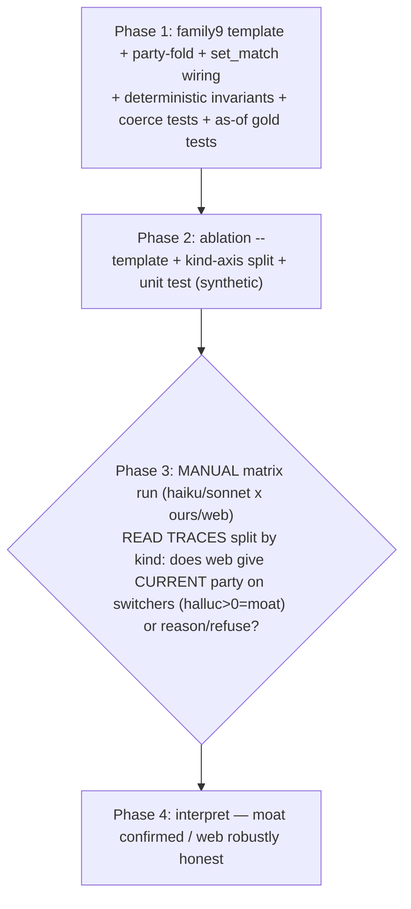

# Tool-surface ablation — Pass 2: point-in-time party probe

> **Rev 2** folds a 5-lens technical-review panel (architecture / kieran-python / data-integrity /
> simplicity / performance). The authoritative panel resolutions are the **"## Panel resolutions
> (rev 2 — folded, authoritative)"** appendix; where the body and the appendix conflict, the appendix
> wins. The blessed forks B1–B6 were off-limits to the panel **except** the panel surfaced a
> measurement-validity flaw in B4's control definition → **B4 amended by user decision** (self-control;
> see PR-1).

## Overview

Pass 1 (the control) validated the trust-weighted metric + the ablation harness and found web is
**honest** on a simple lookup (`halluc=0` — it refuses, never fabricates). So the moat thesis isn't
yet tested. **Pass 2 hunts for where web flips to confident-wrong (`halluc>0`)**, in the sharpest
arena: **point-in-time party.** Our DB preserves a member's *vote-time* party (the half-open
`person_party_spans` as-of join `get_vote_event` already returns); the web returns their
*current/famous* party. For a party-switcher (Sinema D→I, Manchin D→I, Van Drew D→R, …), those
differ — so web is **confidently wrong** for a historical vote *unless* it reasons about the timeline.

This builds **`family9.member_party_at_vote`** — a minimal answerable-only Family 9 (temporal
reconstruction) template that doubles as the pass-2 arena (advances the roadmap, as pass 1 reused
`vote_lookup`) — then runs the existing ablation matrix on it with a **switcher/control split** (the
moat lives in the switcher subset's `halluc` rate; it must not be averaged away). **Pure harness +
content** — `grading_contract_hash` UNMOVED; `content_hash` moves (new template, legit). Same rhythm:
this plan → 5-lens panel → `/ce:work`, with a manual control checkpoint.

## Blessed / locked decisions (scope-review + design chat — do NOT re-open)

| # | Decision |
|---|----------|
| B1 | **`family9.member_party_at_vote`**, a MINIMAL **answerable-only** probe (no refusal twins — deferred). |
| B2 | **Prompt:** *"What party was {name} representing when they voted on roll call {eid}?"* (member + internal eid; no explicit year → web must reason about the timeline). |
| B3 | **Gold = the VOTE-TIME party** via the existing half-open `person_party_spans` as-of join — NEVER current `people.party` (that's the web's wrong answer). |
| B4 | **Two marked instance kinds:** `switcher` (as-of ≠ current = discriminating) + `control` (as-of == current = isolates the point-in-time effect). **⚠ AMENDED rev 2 (PR-1):** the control is the switchers' **own post-switch votes** (same person, same fame, only the timeline flips), NOT random non-switcher members. |
| B5 | **Grader = `set_match` singleton** (party isn't an `OPTION_BUCKET` → `exact` rejects it; the cite_record_id pattern). NO new grader. + a **party-alias-fold** (non-frozen, in `coerce`). |
| B6 | **Run the matrix** `surface{ours,web} × model{haiku,sonnet}`, **report split by switcher/control**. Both "web confidently wrong" (moat) and "web robustly honest" (reframes thesis) are high-value. |

## Resolved mechanical residuals (grounded in the code + data)

### R3 — the as-of gold + eligibility (**the make-or-break; validated against real PG**)
The `person_party_spans` as-of join is **non-unique in span count** (904,964 (person, date) pairs have
>1 covering span) BUT those overlaps are **redundant** — `TRULY ambiguous (covering spans disagree on
party) = 0`. So the gate is on **`COUNT(DISTINCT as-of party) = 1`**, NOT span count (span-count
uniqueness would wrongly drop all 7,664 switchers, which each have multiple same-party spans).

- **Gold (one grouped query, generation-time invariant — PR-1):** the single distinct covering-span
  party, computed atomically as `GROUP BY person, event HAVING COUNT(DISTINCT s.party) = 1`, gold =
  `MIN(s.party)` (under distinct=1, `MIN` *is* the unique party). **Never** re-fetched via
  `get_vote_event`'s first-covering-row collapse. **Skip** the 0.2% no-cover (`DISTINCT=0`), the
  (currently 0) truly-ambiguous (`DISTINCT>1`), and `vote_date IS NULL`. **Assert at emit:**
  `gold ∈ {D,I,L,R}`, and `gold != current` for a switcher / `gold == current` for a control — so a
  gold-inversion is provably un-emittable, not merely caught in a test.
- **Open-span convention (verified — PR-1):** `person_party_spans.end_date` is `NOT NULL`
  (migration 014); open/current spans use a **term-end sentinel** (max in DB = 2031-01-04, zero spans
  beyond 2100), so the half-open `vote_date < end_date` resolves **current-term** votes correctly —
  the same join `_party_eligible_events` runs in production. The generator asserts the covering span
  used for a gold has non-NULL `start_date`/`end_date` (belt-and-suspenders on the schema guarantee).
- **Vocab normalization (PR-1):** span vocab is `{D,I,L,R}`; current `people.party` is `{D,I,ID,R}`.
  Fold current `ID → I` **before** the switcher/control inequality so an always-Independent member
  (`I` span vs `ID` current) is **not** mislabeled a switcher. **Skip** rows with NULL `people.party`
  (`as-of <> NULL` and `as-of == NULL` are both NULL → such a member would silently fall out of *both*
  buckets; make it an explicit skip).
- **Switcher candidates** = clean pairs (one of the 10 switchers, a **pre-switch** vote) where the
  unique as-of party `<>` the `ID→I`-normalized current party (**7,664**, verified).
- **Control candidates (AMENDED — self-control, PR-1)** = the **same switchers' post-switch** clean
  pairs where as-of `==` normalized current. Bounded to ~10 people → holds member-fame constant,
  needs **no** multi-million-row control universe (kills the materialization risk), and makes the
  control a *pure* point-in-time isolation. A switcher with no post-switch votes (e.g. a very recent
  switch) contributes only to the switcher bucket; the control sample stratifies over switchers that
  *have* post-switch votes.
- **No completed-congress / complete-event gate** — a single member's party as-of a date is
  unambiguous given the distinct-party gate (mirrors `vote_lookup`, which consults neither set).
- **Sampling (stratified — PR-1):** the 7,664 pairs are only **~10 independent clusters** (10 people),
  so effective n ≈ 10, not 7,664. Sample **stratified ~1-per-switcher** (`ceil(n/k)` per person), not
  hash-order-and-hope (which can let one switcher take most slots and collapse the headline to "does
  web know Sinema"). Deterministic `sample()`/`pick_one` *within* each switcher's candidate ids. The
  per-switcher breakdown is **mandatory** in the report, and the headline carries a cluster caveat
  (n_effective ≈ k). Gold built from the as-of join, NEVER `people.party`.

### R2 — the `set_match` singleton answer shape + party-fold
A party is **scalar**, so a `{party: array}` field (cite/crossed style) would format-fail every time
the agent submits a bare string — pure measurement noise on the very arm (web) we're measuring. So:
- **`SUBMIT_SCHEMAS["family9.member_party_at_vote"] = {party: string ("D"/"R"/"I"/…), refused}`** — a
  natural scalar field. `SET_MATCH_FIELD[...] = "party"`.
- **One registry, not two (simplicity S1 — PR-2):** scalar-acceptance and the party-fold are
  co-extensive (both apply to exactly this one template), so collapse `SET_MATCH_SCALAR` +
  `SET_MATCH_FOLD` into a single `SET_MATCH_SCALAR_FOLD = {TEMPLATE_PARTY: _fold_party}` — **presence**
  ⇒ scalar-accept (bare string → `[string]`), **value** ⇒ the per-element fold. Absent (crossed/
  closest/cite) ⇒ the existing `list|tuple` gate + identity fold (their tests stay byte-identical).
- **coerce** set_match branch becomes: look up `fold = SET_MATCH_SCALAR_FOLD.get(tid)`; if `fold` and
  `ids` is a bare `str` → `ids = [ids]`; then the `isinstance(list|tuple)` gate (a `["D","R"]` → still
  `NO_ANSWER`, not a silent `[D]`); then `[fold(str(x)) for x in ids]` (or identity if no fold). The
  fold runs **before** grading.
- **`_fold_party`** (beside `_fold_option`, non-frozen) is **robust but minimal (PR-2):** lowercase,
  strip a trailing "party"/"caucus", token-match → `democrat/democratic/dem/d → D`, `republican/
  gop/r → R`, `independent/i → I`, `libertarian/l → L`. No `ID→ID` entry (a current-only code no web
  page or gold token emits). Under-folding is the **false-moat direction** (it penalizes web-only,
  since `ours` always submits the canonical letter) → harden it; verify the alias set against the 10
  switchers' actual as-of parties during Phase 1. No-op for `ours`.
- `_answer_present` (`set_match` → `args.get("party") is not None`) works unchanged (a string is
  present).

### R1 — the switcher/control split in the orchestrator
**One template, `params["kind"] ∈ {switcher, control}`** (NOT two registry entries). **Implement the
split as a matrix axis, not a nested-Counter return (simplicity N1 — PR-3):** partition the shared
instance list once by kind and run each `(surface, model, kind)` as its own cell, tagging each run
record with its kind. This leaves `_run_cell`'s frozen-core-adjacent classify→Counter loop **byte-for-
byte unchanged** (no `{kind: Counter}` rewrite, no per-kind N-guard inside the hot loop, and — the
trap kieran/architecture caught — **no break of the per-rep print loop** that reads flat
`r["rates"]`). The switcher-subset `ours`-vs-`web` delta then falls out of `_agg`/`delta` by filtering
run records on `kind == "switcher"`. The control subset is the calibration baseline (web should ≈ ours
there). **Orchestrator template-selection (PR-3):** `run_ablation` is currently hardcoded to
`TEMPLATE_REGISTRY["vote_lookup"]` with a "pass 1" banner — add a `--template` arg threaded through
`run_ablation → prepare_run`, default-able, with the pass-2 banner; otherwise Phase 3 re-runs
vote_lookup. (`validate_gold` only enforces `valid_options` for `*vote_lookup` → the party gold won't
false-trip.)

## Architecture

| Layer | File | Change |
|-------|------|--------|
| Template (content) | `lab/templates.py` | +`TEMPLATE_PARTY = "family9.member_party_at_vote"`; +`generate_member_party_at_vote` (switcher + self-control, atomic as-of gold via `HAVING COUNT(DISTINCT party)=1` + emit-asserts, `ID→I`-normalized switcher test, per-switcher stratified sampling, `params["kind"]`); +`TEMPLATE_REGISTRY` entry (**flips `content_hash` — legit**) |
| Answer shape | `lab/solvers.py` | +`_fold_party` (robust/minimal); +`SET_MATCH_SCALAR_FOLD` (one registry); `coerce` set_match scalar-accept + per-element fold; +`SET_MATCH_FIELD`/`SUBMIT_SCHEMAS`/`TEMPLATE_TOOLS[party]=[get_vote_event]` |
| Report split | `lab/ablation.py` | +`--template` selection + pass-2 banner; `kind` as a matrix axis (partition instances by kind, tag run records); `_print_summary` splits switcher/control + mandatory per-switcher breakdown + the switcher-subset delta; matrix-envelope log; web-arm `max_turns` bump |
| Tests | `tests/test_lab/` | as below |

**Frozen core UNMOVED:** `scoring.py`, `graders.py`, `validate_gold`, the `TraceRecord` contract,
`vote_parsers` vocab, existing templates' gold → `grading_contract_hash` stays put; `content_hash`
moves (the new template). **No `src/` change** (the OURS arm reads vote-time party from the existing
`get_vote_event`) → zero production impact.

## Dependency graph

## Phase 1 — the template + answer shape
- [ ] `generate_member_party_at_vote`: switcher (pre-switch) + self-control (post-switch) instances;
  gold from the **one grouped query** (`HAVING COUNT(DISTINCT s.party)=1`, gold = `MIN(s.party)`);
  skip no-cover/null-date/null-`people.party`/ambiguous; normalize current `ID→I` before the
  switcher/control inequality; **per-switcher stratified** sampling; **emit-asserts** (gold ∈ {D,I,L,R};
  gold ≠ current for switcher / == current for control; covering span dates non-NULL);
  `params={person_id, vote_event_id, kind, switcher_name}`; prompt names member + eid (leak-safe —
  never the gold party, never the year). Register `TEMPLATE_REGISTRY["member_party_at_vote"]` with
  `.template_id = TEMPLATE_PARTY`.
- [ ] `_fold_party` (robust/minimal) + `SET_MATCH_SCALAR_FOLD` (one registry); `coerce` set_match
  scalar-string acceptance + per-element fold (order: scalar-wrap → list gate → fold);
  `SET_MATCH_FIELD`/`SUBMIT_SCHEMAS`/`TEMPLATE_TOOLS` entries.
- [ ] Deterministic invariants pass (oracle 100% / wrong 0% — answerable-only, so no over-refuse arm).
  `WrongBaselineSolver` on a set gold → adds `NX-wrong` → fails cleanly (the cite pattern).
- [ ] **`coerce` unit tests (PR-2 — the invariants go through `grade()`, NOT `coerce`, so the fold +
  scalar path are otherwise untested):** a **bare web-shaped string** `"Republican"` on a switcher
  whose gold is `{"D"}` → folds to `["R"]` → grades substantive-**wrong** → lands in the
  **`hallucination`** bucket (NOT `format_fail`), with `_answer_present` True; `"Democratic Party"` →
  `["D"]`; a 2-element `["D","R"]` → `NO_ANSWER`; identity-fold templates (cite) unchanged.
- [ ] **Leak-safe test (PR-2):** the prompt contains no 4-digit **year** and no party **word**
  (`gold in prompt` is meaningless when gold is `"D"` — the real leak is the date the agent must
  reason to).
- [ ] `test_member_party_at_vote.py` (`requires_pg`): switcher instances have **as-of ≠ normalized
  current** + gold == the as-of party; control instances have as-of == normalized current; the
  distinct-party=1 gate holds; both buckets stratify across switchers.
- [ ] ruff; full suite green; **`test_hashes` green** (content moves, contract frozen). Commit.

## Phase 2 — the orchestrator split
- [ ] `run_ablation`: `--template` selection + pass-2 banner (PR-3). Partition the shared instance
  list by `inst.params["kind"]`; run each `(surface, model, kind)` as a cell; tag run records with
  `kind` (and `switcher_name`). `_run_cell` classify→Counter loop **unchanged**.
- [ ] `_print_summary`: per-cell rates **split by kind** + the **switcher-subset `ours`-vs-`web`
  delta** (the headline, via a `kind=="switcher"` filter on `_agg`/`delta`) + the **mandatory
  per-switcher breakdown** + a cluster caveat (n_effective ≈ k). `N==0`-guard per kind.
- [ ] `test_ablation.py`: the split on synthetic verdicts (a mixed switcher/control batch partitions
  + per-kind rates + the switcher-subset delta; the closed-match `classify` unchanged). NO live calls.
- [ ] ruff; full suite green. Commit.

## Phase 3 — MANUAL matrix run (STOP)
- [ ] `uv run python -m lab.ablation --template member_party_at_vote --models haiku,sonnet
  --surfaces ours,web --n 10 --repeats 3`. **Matrix envelope (PR-5):** ~2×2×3 cells × (10 switcher +
  10 control) = ~240 rollouts (~120 web, the cost driver); caps (`$1`/`180s`/turns) bound it; the run
  logs the expected envelope so a runaway web cell is visible. **Web-arm turn cap (PR-5):** the
  timeline-reasoning task is turn-hungrier than pass-1's lookup — bump the **web** `max_turns`
  (10 → ~20) so a truncated reasoning chain doesn't classify as `errored` and **silently mask the
  moat**; pre-register "high web `errored` on switchers" as a Phase-4 interpretation hazard, not a
  null result.
- [ ] **Read traces split by kind** (the trust bar): on **switchers**, does web (a) confidently submit
  the **current** party (`halluc>0` = the moat), (b) correctly **reason** to the vote-time party, or
  (c) **refuse** (robustly honest)? On **controls** (self-control), web should ≈ ours (calibration —
  if web is *also* wrong on the same person's post-switch votes, the gap isn't point-in-time).
  Integrity per cell (ours no web; web no lab tool). **STOP** for review.

## Phase 4 — interpret
- [ ] `halluc>0` on switchers **with control-parity** ⇒ the point-in-time trust-moat is real (web
  confidently gives stale current-state for the historical vote but is correct on the same person's
  current-era vote). `halluc≈0` + refuse/reason ⇒ web is robustly honest ⇒ the moat is *access*, not
  *trust* (reframes the thesis). A switcher gap **without** control-parity (web also wrong on
  self-control) ⇒ the effect is the person/prompt, not point-in-time — discard the moat read. Either
  interpretable outcome decides the next arena. **Never tune to manufacture a moat.**

## System-Wide Impact
- **The split** is the one report change; everything else (surface knob, fetch_url, classify, the
  matrix) is reused unchanged. Kind as a matrix axis ⇒ the classify→Counter core is untouched.
- **Party-fold** is surface-agnostic + template-scoped (`SET_MATCH_SCALAR_FOLD` keyed by the family9
  id) → zero effect on the existing set_match templates (crossed/closest/cite — identity fold, list
  gate).
- **Gold integrity (the load-bearing one):** gold comes ONLY from the atomic as-of grouped query with
  the distinct-party=1 gate + emit-asserts; `people.party` (current, `ID→I`-normalized) is consulted
  **only** for switcher/control classification, never as the gold. A truly-ambiguous date (0 today) is
  skipped, not guessed; a gold-inversion is un-emittable.
- **Production NON-impact:** lab-only; the OURS arm reuses the existing `get_vote_event` (already
  returns vote-time party); no `src/` change, no new tool, no migration.

## Risks & mitigations
| Risk | Mitigation |
|------|------------|
| **As-of gold ambiguity** (overlapping spans) | distinct-party=1 gate (validated: 0 truly-ambiguous, all 7,664 switchers clean) + emit-assert; skip no-cover/null-date |
| **Span-count gate would drop all switchers** | gate on `COUNT(DISTINCT party)`, NOT span count (the trap) |
| **Open-span NULL `end_date`** would drop current-term votes | `end_date NOT NULL` (migration 014) + term-end sentinel (verified max 2031-01-04) → current votes resolve; generator asserts non-NULL covering dates |
| **Fame confound** (control differs in fame AND timeline) | **self-control** (switchers' own post-switch votes) holds fame constant — only the timeline flips; control-parity is the moat's validity check |
| **`I`/`ID` vocab mismatch** mislabels independents as switchers | normalize current `ID→I` before the inequality; skip NULL `people.party` |
| **Effective n ≈ 10 clusters, not 7,664** | per-switcher **stratified** sampling + mandatory per-switcher breakdown + cluster caveat in the headline |
| **Web truncation misread as `errored`** masks the moat | bump web `max_turns`; pre-register high web `errored` as a Phase-4 hazard |
| **Under-folding inflates web `halluc`** (false moat) | robust `_fold_party` (strip "party"/"caucus", token-match); fold is web-only-penalizing so harden it |
| **Scalar-string format noise** (web submits "D" not ["D"]) | scalar acceptance in coerce (string→[string]) removes the noise |
| **Web *reasons* correctly (no moat)** | a valid, high-value outcome (web robustly honest); the trace read distinguishes reason-correctly vs default-to-current vs refuse |
| **A "moat" that's a prompt artifact** | self-control calibration: a switcher-only gap *with* control-parity is a real point-in-time effect; never tune to manufacture it |

## Out of scope
- Refusal twins / the full frozen Family 9 treatment; a *random non-switcher* control baseline (the
  self-control is the headline; a random pool is a deferred secondary baseline); other moat arenas
  (aggregation, no-link over-claim); `both`/`neither` surfaces; opus; any frozen-core change
  (STOP-and-surface).

## Sources & References
- **Origin scope:** `docs/scopes/2026-06-27-ablation-pass2-pointintime-scope.md`. Eval philosophy +
  the pass-1 result: the `project_condorcet_eval_philosophy` memory.
- Pattern: `lab/templates.py` (`generate` vote_lookup; `generate_cite_record_id` — the set_match-
  singleton shape + `TEMPLATE_REGISTRY.template_id`; `_party_eligible_events`/`_event_party_splits` —
  the existing as-of join helpers, **span-count** gate, which this template deliberately diverges from
  to **distinct-party**); `lab/solvers.py` (`coerce` set_match L355, `_fold_option`/`_ALIAS_FOLD` L316,
  `SET_MATCH_FIELD`); `src/api/chat.py:197` (`_tool_get_vote_event` — the vote-time as-of join, already
  returns party); `lab/ablation.py` (`run_ablation` hardcoded to vote_lookup, `_run_cell`,
  `_print_summary`, `_agg`/`delta`, caps L36-38).
- Prior plans: `docs/plans/2026-06-27-feat-tool-surface-ablation-pass1-plan.md`,
  `docs/plans/2026-06-27-feat-family10-provenance-slice1-plan.md` (set_match singleton).
- Data (verified 2026-06-27): 7,664 clean switcher pairs / 10 switchers; 0 truly-ambiguous; party
  vocab {D,I,L,R} span / {D,I,ID,R} current; `end_date` sentinel max 2031-01-04 (non-NULL); Sinema
  pre-switch spans D / post-2022 span I (current I) — clean self-control.

## Panel resolutions (rev 2 — folded, authoritative)
Where this section conflicts with the body, **this section wins.** Blessed forks B1–B6 were
off-limits; the panel's job was execution, structure, and measurement validity.

- **PR-1 — Control = self-control (B4 amended; user decision).** The blessed random-non-switcher
  control confounds the point-in-time effect with member fame (web refuses obscure members = "honest"
  for the wrong reason; the switcher gap could be a fame effect, not point-in-time). **Fix:** the
  control is the switchers' **own post-switch votes** (as-of == current) — same person, same fame,
  only the timeline flips. Verified clean (Sinema post-2022 span I == current I). Collapses the fame
  confound, the 5.4M-row control materialization risk, and stratification into one ~10-person design.
  Also in PR-1: the **atomic grouped-query gold** with emit-asserts (un-emittable inversion), the
  **open-span sentinel** convention (verified) + non-NULL assert, the **`ID→I` normalization** + NULL
  `people.party` skip, and **per-switcher stratified** sampling with a cluster caveat (n_eff ≈ k).
- **PR-2 — Grading-path tests + minimal folds.** The deterministic invariants go through `grade()`,
  not `coerce`, so add **direct `coerce` tests** asserting the web failure mode (bare `"Republican"` →
  folded → substantive-wrong → **`hallucination`**, not `format_fail` — load-bearing for the moat
  being *visible*). Make `_fold_party` **robust** (strip "party"/"caucus", token-match) because
  under-folding penalizes web only (false moat); drop the dead `ID→ID` entry. **Leak test** checks no
  year + no party word (not naive `gold in prompt`).
- **PR-3 — Orchestrator wiring (BLOCKER, 4 reviewers).** `run_ablation` is hardcoded to `vote_lookup`
  with a "pass 1" banner — add `--template` selection or Phase 3 re-runs the wrong template.
  Implement the kind-split as a **matrix axis** (partition + tag run records), NOT a `{kind: Counter}`
  nested return — that keeps the classify→Counter core byte-identical and **avoids breaking the
  per-rep print loop** that reads flat `r["rates"]`.
- **PR-4 — Registry collapse (simplicity).** `SET_MATCH_SCALAR` + `SET_MATCH_FOLD` are two single-
  entry registries keyed by the same template → collapse to one `SET_MATCH_SCALAR_FOLD =
  {TEMPLATE_PARTY: _fold_party}` (presence ⇒ scalar-accept, value ⇒ fold; absent ⇒ unchanged list
  gate + identity).
- **PR-5 — Run envelope + turn cap (performance).** State the ~240-rollout (~120 web) envelope so a
  runaway cell is visible; **bump the web-arm `max_turns`** (10 → ~20) because the timeline task is
  turn-hungrier — a truncated web reasoning chain classifies as `errored` (ablation.py L49) and would
  **silently mask the moat**; pre-register high web `errored` on switchers as a Phase-4 hazard.
- **Affirmed by the panel (do not "harden" away):** the distinct-party gate is the simplest correct
  form; the symmetric fold cannot manufacture a moat (it only credits correct-but-spelled answers,
  shrinking `halluc`); no new grader / no new solver (`WrongBaselineSolver` + `_answer_present` work
  unchanged); dropping the completed-congress/complete-event gates is YAGNI-correct; the scalar field
  (vs array) is the right trade (removes format noise from the arm under measurement); phasing is
  right-sized.
