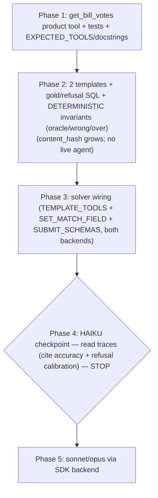

# Family 10 (integrity / provenance) — Slice 1

## Overview

Family 10 targets the one unsurvivable failure mode — **confident hallucination** — and, with Family 1
done, completes the benchmark's trust floor (roadmap: `docs/condorcet/lab-factual-layer-task-suite.md`
→ "What to build first" pairs Family 10 + Family 1). **Slice 1 (rev 2, post-panel) = ONE template +
one product tool**, reusing the existing `lab/` factual-layer harness wholesale (both agent backends,
the graders, the frozen-spine hashes, the deterministic-invariant validation, the trust-bar
diagnostics):

- **`cite_record_id` (the spine):** the agent must return a *real, correct, non-fabricated* roll-call
  vote id for member X's vote on bill Y — or **refuse** when no such vote exists (don't fabricate).
  This single template already tests provenance + existence + over-refusal (`decision_correct=0` when
  it refuses an answerable) + fabrication (`refusal_correct` on the twins) — so the panel had us drop
  the originally-planned second template (`refusal_calibration`) as a re-skin (see appendix).

Same rhythm: this plan → 5-lens panel → `/ce:work`, haiku checkpoint before sonnet/opus.

## Blessed / locked decisions (from scope-review + the 4-fork design chat — do NOT re-open)

| # | Decision |
|---|----------|
| B1 | Slice 1 = **2 templates + 1 tool**, votes only, **existing graders only**, frozen contract unmoved. |
| B2 | **Bill-keyed citation, restricted to single-roll-call (member, bill) pairs** → a UNIQUE gold id. |
| B3 | New tool **`get_bill_votes(bill_id)`** (bill→roll-call resolution; `get_bill_detail` doesn't expose roll-calls). |
| B4 | Adversarial-negative **centerpiece = both-real-but-no-link** (X & Y real, X never voted on Y → refuse). |
| B5 | **Collapse standalone existence into the spine** (the spine already tests "is there a record to cite?"). |
| B6 | Deferred: quote-verify (slice 2, needs bill-text ingest), crosswalk (with Family 6), source-URL & multi-roll-call citation. |

## Panel resolutions (rev 2 — folded, authoritative)

**Verdict:** the load-bearing mechanics CONFIRMED against real code — the `set_match`-singleton (`closest_by_margin` already grades vote-event ids this way), `content_hash` growth, the `WrongBaselineSolver` set-branch, per-instance grader-mixing. Citation gold uniqueness is a **schema guarantee** (the `(vote_event_id, person_id)` unique constraint). No frozen-contract change. This appendix **supersedes** R3/R4/R5 below where they conflict.

### Scope change (user decision)
- **DROP `refusal_calibration` — slice 1 is the `cite_record_id` spine ALONE** (1 template + 1 tool). The spine already tests provenance + existence + over-refusal + fabrication, so the 2nd template re-skinned it + the existing `vote_lookup`. A genuinely-distinct calibration template is a future slice. *(Amends B1: 2→1 on the panel's YAGNI finding. R5 below is dropped entirely.)*

### BLOCKERS
- **P1 — the "everything is `family1`" coupling.** `TEMPLATE_REGISTRY` is a flat `{bare_name: namespace}` with no family info; `tests/test_lab/test_agent_seam.py:104` hardcodes `f"family1.{name}"`. Family 10 is the first to violate it → P9 completeness test breaks. **Fix at the registry:** add a `template_id` field (the qualified `family1.*`/`family10.*` id) to each `SimpleNamespace` and rewrite P9 to iterate `ns.template_id`. (Touches `templates.py` → `content_hash` moves; legitimate.)
- **P2 — land the template + solver wiring in ONE phase.** Adding `cite_record_id` to `TEMPLATE_REGISTRY` without its `TEMPLATE_TOOLS`/`SET_MATCH_FIELD`/`SUBMIT_SCHEMAS` entries leaves the suite red (P9). Merge so every commit is green.

### CRITICAL (data-integrity) — no-link airtightness
- **P3 — structurally-disjoint no-link (closes the mis-attribution residual).** The complete-event gate closes *dropped-record* undercounts, but NOT a vote mis-parsed onto a phantom person (count preserved → event still "complete" → false no-link). Resolution — which also satisfies simplicity's *one-construction* point: the no-link X is a **real voter whose entire vote record is in a different congress than Y**, so X structurally could not have voted on Y (zero mis-attribution surface). ONE construction, airtight. Plus:
  - **assert X is a real active voter** (≥ some `vote_records` in their own congress) — in CODE, not prose;
  - the no-link proof is its **own assertion class** (real X + real Y: assert `COUNT(X's records on Y's roll-calls) == 0`), NOT the synthetic-absent pattern;
  - **index-backed SQL** (perf): pull Y's roll-calls via `ix_vote_events_bill_id`, prove via `WHERE person_id=:x AND vote_event_id IN (:y_rc…) LIMIT 1` on the composite index — bounded by |Y's roll-calls|, **never** a 5.4M correlated anti-join;
  - read `complete_events` from the passed `precomputed` (**no fresh 5.4M scan**).

### SHOULD-FIX
- **P4 — refusal twins = 2, not 4.** Only a distinct *agent trajectory* earns a variant: keep **no-link** (centerpiece) + **nonexistent-bill** (uniquely exercises `get_bill_votes`'s bill-not-found error arm). DROP nonexistent-member (behaviorally identical to no-link) + nonexistent-roll-call (doesn't fit the (member, bill) prompt). **Floor the no-link** so it isn't starved at the haiku-gate `n` (don't inherit `_n_refusals`' even split blindly).
- **P5 — production gate precision:** the real gate is `test_mcp/test_server.py`'s **two `len(...) == 14` asserts (L31, L35)** + `EXPECTED_TOOLS` + `test_no_extra_tools` → all 14→**15**. The `mcp/server.py` + `chat_service.py` docstrings are **count-free** (precautionary only). `_tool_description` status map is optional (has a fallback). Derive the count from `len(RESEARCH_TOOLS)`.
- **P6 — leak-safe + array-steering submit:** `SET_MATCH_FIELD["family10.cite_record_id"] = "vote_event_ids"`; the `SUBMIT_SCHEMAS` array description must steer the agent to the **array** channel (a bare string → `coerce` → `NO_ANSWER`) and pass `test_no_method_leak` (no `min(`/`minority`/`majority`/`same way`/`closest`).

### Affirmed (do NOT add)
- cite is roll-call-keyed → **name-collision-immune** → NO collision diagnostic (the `run.py` dispatch correctly returns `set()` for unknown templates).
- cite (`set_match`) takes **neither** `GOLD_KEYS` nor `NUMERIC_FIELDS` (those are `fields`-only).
- `test_answer_spec.py` auto-iterates `TEMPLATE_REGISTRY` → the coerce spec auto-covers cite once registered → **don't hand-write a duplicate**; net-new tests = **gold-uniqueness + no-link-airtightness** only.
- generate guards: build the answerable gold from a **real `vote_records` row** (skip a sampled (member, bill) yielding no record); None/empty guards per the `vote_lookup` pattern.

## Resolved mechanical residuals (concrete answers — grounded in the code)
*(rev 2: the appendix above supersedes R3 → structurally-disjoint no-link, R4 → 2 twins, and R5 → dropped.)*

### ⚠️ R6 (grader) — the blessed `exact` is INFEASIBLE; use `set_match` (singleton)
`graders.py` is frozen, and `_format_valid` for `exact`/`refusal_correct` is hardcoded to
`_is_canonical` — it accepts **only a vote OPTION_BUCKET or REFUSAL** (`graders.py:88-102`). A
`vote_event_id` string ("us-house-115-2017-0009") is **not** an option → it would **format-fail**
`exact`. Changing the gate would move `grading_contract_hash` (forbidden).
**Resolution:** `cite_record_id` uses **`set_match` with a singleton id set** — identical
unique-exact-match semantics (a single id must equal the single gold id), but `set_match`'s format
gate accepts a list (`graders.py:108`) and `grade_set_match` does normalized set-equality on the id
strings. **Bonus:** it also sidesteps the `WrongBaselineSolver` crash (R8). gold = `{the_unique_id}`;
answer = `[cited_id]`; `SET_MATCH_FIELD["family10.cite_record_id"] = "vote_event_ids"`. Generalizes
to multi-record citation in slice 2. *No new grader, no contract change.*

### R7 (frozen-spine) — `content_hash` growth is LEGITIMATE; no STOP-and-surface
`test_hashes.py` pins **no golden value** — it asserts only that the *split* holds (a `templates.py`
change flips `content_hash` but NOT `grading_contract_hash`; `test_content_file_change_flips_content_only`).
The docstring is explicit: `content_hash` *"grows legitimately as templates are added."* So adding
the 2 templates flips `content_hash` (expected) while `grading_contract_hash` stays unmoved (we touch
only `templates.py` + the swappable `solvers.py`/`run.py`, never graders/scoring/vocab). **`test_hashes`
keeps passing as-is.** Not a frozen-contract change.

### R8 (deterministic invariants) — work as-is; `set_match` choice is load-bearing
The oracle/wrong/over invariants hold for both templates **provided each has ≥1 answerable instance**:
- `SqlOracleSolver` returns gold → 100% (both).
- `WrongBaselineSolver` (`solvers.py`): for a **`dict` gold with no int field it raises
  AssertionError** ("no int field to perturb") — so a `fields`-string citation would CRASH the
  invariant. **`set_match` gold (a set) hits the `set|list|tuple` branch → adds an `NX-wrong`
  sentinel → fails cleanly. This is the second reason to pick `set_match` over `fields`.** No solver
  change needed.
- `OverRefuseSolver` refuses everything → fails the answerable instances → "over-refuse fails
  answerable" holds (cite_record_id has citations; refusal_calibration MUST have answerable controls).

### R5 (refusal_calibration shape) — a MIX is required (not pure-refusal)
A pure-refusal template makes `OverRefuseSolver` pass everything → the "over-refuse fails answerable"
invariant goes vacuous, AND there's no over-refusal penalty. **Resolution:** `refusal_calibration` is
a **balanced mix** — answerable controls (a real (member, roll-call) vote question → gold = the
option → `exact`; the agent must answer, NOT refuse) + unanswerable twins across record types
(nonexistent member / nonexistent roll-call / both-real-no-link → `refusal_correct`). This makes it a
true calibration metric (penalizes BOTH fabrication and over-refusal) and distinct from `vote_lookup`
by spanning the **full spread** of not-in-data triggers in one template. *(Note: yes/no existence
answers are NOT usable — "yes"/"no" aren't OPTION_BUCKETS → would format-fail `exact`; the controls
are vote-option questions, which is why B5 folds existence into the spine instead.)*

### R1 (`get_bill_votes`) — schema, SQL, error arm
- `input_schema`: `{bill_id: string}` required. Returns `{"bill_id", "roll_calls":[{vote_event_id,
  chamber, vote_date, motion_text, result}], "count"}` **ORDER BY id**. Mirror `_tool_get_vote_event`
  (guarded body, clean JSON error).
- SQL: `select(VoteEvent.id, VoteEvent.chamber, VoteEvent.vote_date, VoteEvent.motion_text,
  VoteEvent.result).where(VoteEvent.bill_id == bill_id).order_by(VoteEvent.id)` (uses
  `ix_vote_events_bill_id`). **Error arm:** on empty result, check `bills` for the id → absent →
  `{"error": "Bill '<id>' not found."}`; a real bill with no roll-calls → `{"roll_calls": [], "count":
  0}`. `get_bill_detail` is **not** extended (keep the tool single-purpose).

### R2 (single-roll-call gold) + the agent flow
- Single-roll-call bills: `SELECT bill_id FROM vote_events GROUP BY bill_id HAVING COUNT(*)=1`
  (~3,773). Sample (member, bill) where the member has a `vote_record` on that bill's single
  roll-call → **gold = `{that vote_event_id}`** (a singleton set). The member is named in the PROMPT
  (reuse the Family-1 name format `'Sen. Last, First [P-ST]'`); the agent cites the VOTE id, not a
  person lookup — so `find_people` is NOT in the flow.
- **Provisioning:** `cite_record_id → [get_bill_votes, get_vote_event]`. Flow: `get_bill_votes(Y)` →
  the roll-call → `get_vote_event(roll_call)` → verify X is in the records → cite the id (answerable)
  or refuse (no-link). Both tools are needed precisely so the no-link refusal forces verification.

### R3 (both-real-but-no-link) — AIRTIGHT via the complete-event gate
Pick a real, active voter X + a real bill Y where X has **zero** `vote_records` on **any** of Y's
roll-calls, and **all of Y's roll-calls are `precomputed.complete_events`** (resolved records reconcile
exactly with the official tally). The complete-event gate is what makes it airtight: on an UNDERcount
event a dropped record would manufacture a *false* no-link; on a complete event X's absence is a
genuine "no recorded vote." Restrict no-link Y to ≤ a few roll-calls so the agent's verification is
tractable. (A trivially-airtight cross-chamber variant — a Senator on a House-only bill — is available
but easier; keep within-chamber as the primary.)

### R4 (other refusal types) — fabrication is the FAILURE MODE, not an input
"Don't fabricate an id" is enforced by `refusal_correct` on EVERY refusal twin (any non-REFUSAL answer
fails) — it is not a separate input. The distinct refusal INPUTS are: nonexistent member (synthetic
`NX-…` person id, proven absent), nonexistent bill (synthetic bill id, proven absent), nonexistent
roll-call (synthetic canonical-looking `us-house-NNN-YYYY-NNNN`, proven absent), and the no-link
centerpiece. All gold = REFUSAL, grader `refusal_correct`, proven absent before emit (the
`vote_lookup` pattern, `templates.py:96-98`).

## Architecture

| Layer | File | Change |
|-------|------|--------|
| Product tool | `src/llm/tools.py`, `src/api/chat.py` | +`get_bill_votes` def + `_tool_get_bill_votes` handler + `_TOOL_HANDLERS`; P2 `EXPECTED_TOOLS` 14→15 + docstrings + status map |
| Templates (content) | `lab/templates.py` | +`generate_cite_record_id`, +`TEMPLATE_REGISTRY` entry + a `template_id` field on every namespace (P1) (**flips `content_hash` — legitimate**) |
| Answer shapes | `lab/solvers.py` | +`SET_MATCH_FIELD[TEMPLATE_CITE]="vote_event_ids"`, +`SUBMIT_SCHEMAS[TEMPLATE_CITE]={vote_event_ids[], refused}`, +`TEMPLATE_TOOLS[TEMPLATE_CITE]=[get_bill_votes, get_vote_event]` |
| Tests | `tests/test_api/`, `tests/test_lab/` | handler tests; deterministic invariants for both templates; gold-uniqueness; no-link airtightness; leak-safe prompt |

**Frozen core UNMOVED:** `scoring.py`, `graders.py`, `validate_gold`, the `TraceRecord` contract,
`vote_parsers` vocab → `grading_contract_hash` stays put (`test_hashes` green). `content_hash` flips
(new templates) — expected.

## Dependency graph

## Phase 1 — `get_bill_votes` product tool
- [x] Add `get_bill_votes` to `RESEARCH_TOOLS` (leak-safe description) + `_tool_get_bill_votes`
  (mirror `_tool_get_vote_event`: guarded body, RAW rows, clean JSON error; bill-not-found vs
  real-bill-no-roll-calls empty) + `_TOOL_HANDLERS`.
- [x] **(P5)** `tests/test_mcp/test_server.py`: `EXPECTED_TOOLS` + **both `len(...) == 14` asserts
  (L31, L35)** + `test_no_extra_tools` → 14→15. Docstrings (`mcp/server.py`, `chat_service.py`) are
  count-free — leave or derive from `len(RESEARCH_TOOLS)`; status map optional.
- [x] `tests/test_api/test_provenance_tools.py` (`requires_pg` + hermetic guard/no-DB-leak; mirror
  `test_window_tools.py`): a real bill's roll-calls; bill-not-found error; real-bill-no-roll-calls
  empty.
- [x] ruff; full suite green (incl. `test_mcp`); `test_hashes` green. **Commit. Checkpoint.**

## Phase 2 — the `cite_record_id` template + solver wiring + deterministic validation
*(One phase — P2: registry + wiring land together so every commit is green.)*
- [x] **(P1)** Give every `TEMPLATE_REGISTRY` namespace a `template_id` field (qualified id) and
  rewrite the P9 completeness test (`test_agent_seam.py`) to iterate `ns.template_id` — kills the
  `f"family1.{name}"` coupling.
- [x] `generate_cite_record_id` (`TEMPLATE_CITE = "family10.cite_record_id"`): **answerable** =
  single-roll-call (member, bill) gold built from a REAL `vote_records` row → `set_match`, gold =
  `{vote_event_id}`. **Refusal twins (P4, 2 types):** (a) **no-link centerpiece (P3)** — real X whose
  entire record is in a *different congress* than Y, proven `COUNT(X on Y's roll-calls)==0` via the
  index-backed probe, X asserted a real active voter, with a per-type **floor**; (b) **nonexistent
  bill** (synthetic id proven absent → `get_bill_votes` error arm). All → `refusal_correct`.
- [x] Solver wiring: `TEMPLATE_TOOLS[TEMPLATE_CITE] = [get_bill_votes, get_vote_event]`;
  `SET_MATCH_FIELD[TEMPLATE_CITE] = "vote_event_ids"`; `SUBMIT_SCHEMAS[TEMPLATE_CITE] =
  {vote_event_ids: array<string> (P6 array-steering, leak-safe), refused}`. NOT in
  `GOLD_KEYS`/`NUMERIC_FIELDS`. Both backends via the existing `_make_sdk_product_tool` factory.
- [x] Deterministic invariants pass (oracle 100% / wrong 0% / over-refuse fails answerable) —
  `set_match` keeps `WrongBaselineSolver` off the no-int-field crash; no solver edit.
- [x] Net-new tests only (the `TEMPLATE_REGISTRY` auto-loop covers the coerce spec): **gold-uniqueness**
  (sampled (member, bill) has exactly 1 roll-call → gold is that id) + **no-link airtightness** (X
  truly 0 votes on Y; X's record is in a different congress; X is a real voter). Leak-safe prompt
  (names X + Y, never the gold id). `test_hashes` (content flips, contract unmoved).
- [x] ruff; full suite green; `test_hashes` green. **Commit. Checkpoint.**

## Phase 3 — HAIKU checkpoint (manual; STOP)
- [ ] `uv run python -m lab.run --template cite_record_id --agent --model claude-haiku-4-5 --n 10`.
  **Read traces** (trust bar): does the agent cite the REAL id (vs fabricate)? does it refuse the
  no-link (vs invent an id)? does it call `get_bill_votes`→`get_vote_event` to verify? Check
  format-fails + the refusal-arm coverage (the no-link floor actually sampled). **STOP** for review +
  off-ramp before sonnet/opus.

## Phase 4 — sonnet/opus via the SDK backend
- [ ] After the haiku checkpoint approves: `--backend agent-sdk --model claude-sonnet-4-6` (then opus).
  Read traces; compare the provenance/refusal gradient to Family 1. *(NB per eval-philosophy memory:
  the SDK compute-lockdown confounds opus on LARGE results — N/A here, cite results are tiny.)*

## System-Wide Impact
- **Product tool surface:** `get_bill_votes` joins `RESEARCH_TOOLS` → exposed to the production chat
  assistant + MCP server (additive, read-only). P2 updates `EXPECTED_TOOLS`/docstrings (the
  window-tools slice proved this is the one place a stale count bites).
- **Both backends** read the same `TEMPLATE_TOOLS`/`SUBMIT_SCHEMAS` (parity); the SDK `@tool` factory
  picks them up unchanged.
- **Frozen-spine:** `content_hash` intentionally moves; `grading_contract_hash` must not — the one
  STOP-and-surface trigger is if a template needs a grader/scoring/vocab change (it does not: cite =
  set_match, calibration = exact/refusal_correct).
- **Refusal-twin airtightness:** the data-integrity hazard is a *false* no-link (a data-gap
  masquerading as "no vote") — gated out by `complete_events` + proven-absent synthetics, mirroring
  Family 1's completeness discipline.
- **Integration scenarios (not unit-mocked):** (1) answerable cite — `get_bill_votes`→`get_vote_event`
  → exact id; (2) no-link — both real, X absent on a complete event → refuse; (3) nonexistent
  member/bill/roll-call → refuse; (4) calibration control — must answer, not refuse.

## Risks & mitigations
| Risk | Mitigation |
|------|------------|
| `exact` infeasible for an id (frozen format gate) | **set_match singleton** (R6) — same semantics, no contract change |
| `WrongBaselineSolver` crash on a string dict gold | set_match gold hits the set branch (R8) — no solver edit |
| False no-link from an undercount data gap | complete-event gate + proven-absent synthetics (R3) |
| `refusal_calibration` ≈ `vote_lookup` re-skin | distinct = full not-in-data spread + balanced controls as a calibration metric (R5) |
| Multi-roll-call no-link → many `get_vote_event` calls | restrict no-link Y to ≤ a few roll-calls (R3) |
| Lazy agent cites the single roll-call without verifying X | the no-link refusal punishes it (forces the `get_vote_event` check) |

## Out of scope
- Quote-in-bill-text verification (slice 2 — needs a bounded random bill-text ingest + adversarial
  negatives; bill_text is 68/144,088 today).
- Crosswalk identity resolution (with Family 6 — the `congress-legislators`/ICPSR ingest).
- Source-URL citation (multiple valid → membership, not equality) + multi-roll-call citation.
- Any frozen-contract change (graders/scoring/vocab) — STOP-and-surface if one appears needed.

## Sources & References
- **Origin scope:** `docs/scopes/2026-06-27-family10-integrity-provenance-scope.md` (slice 1 = 2
  templates + 1 tool; quote-verify/crosswalk deferred; both-real-no-link centerpiece).
- Roadmap: `docs/condorcet/lab-factual-layer-task-suite.md` (Family 10 + Family 1 = the trust floor).
- Pattern: `lab/templates.py` (`generate` vote_lookup L43-115 — answerable + proven-absent refusal
  twins), `lab/graders.py` (`exact`/`refusal_correct`/`set_match` + the `_format_valid` gate L88-109),
  `lab/solvers.py` (deterministic solvers, `SET_MATCH_FIELD`, `TEMPLATE_TOOLS`, the SDK factory),
  `tests/test_lab/test_hashes.py` (content grows / contract frozen), `src/api/chat.py:197`
  (`_tool_get_vote_event` mirror), prior window-tools plan `docs/plans/2026-06-26-feat-family1-window-tools-plan.md`.
- Prior live results: Family 1 PRs #37/#38/#39.
