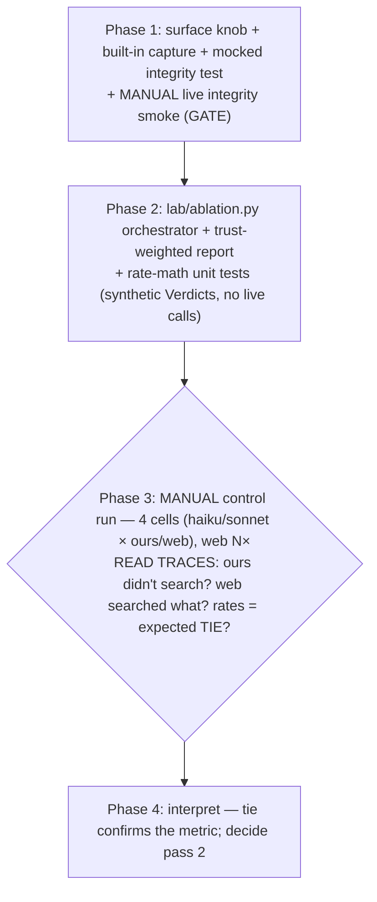

# Tool-surface "moat" ablation — Pass 1 (vote_lookup control)

## Overview

As frontier base models commoditize, the existential question for a domain-specialized product is
**"how much of a correct, trustworthy answer is the MODEL vs. OUR tools/data layer?"** This work
stream promotes **tool-surface** to a first-class experimental axis (model × surface). **Pass 1 is
the deliberate CONTROL:** prove the harness + the trust-weighted metric are sound on a case we
*expect to tie* (simple lookups — web finds them on Congress.gov), before betting on the
moat-revealing arenas (pass 2). **A spurious moat on pass 1 means the metric is broken**, not that we
have a moat — that is the entire point of running the control first.

It is a **pure harness experiment**: a `surface` knob on `AgentSolver` + a new orchestrator module +
tests. **No template / grader / scoring change** (`grading_contract_hash` + `content_hash` UNMOVED).
Same rhythm: this plan → 5-lens panel → `/ce:work`, with a **manual control checkpoint** (read traces
+ check the expected tie) before any conclusion.

## Blessed / locked decisions (scope-review + 3-fork design chat — do NOT re-open)

| # | Decision |
|---|----------|
| B1 | **Arena = `vote_lookup`, ANSWERABLE arm only, frozen template reused unchanged** (identical prompt to both surfaces). No synthetic-id refusal twins in pass 1 (they telegraph fakeness → under-test web over-claiming; deferred to a real-member no-link in pass 2). |
| B2 | **Matrix = surface {ours, web} × model {haiku, sonnet} = 4 cells.** `ours`-vs-`web` (model held constant) isolates the tool effect; haiku+ours vs sonnet+web is the money cell. |
| B3 | **Backend held constant = `agent-sdk`** for BOTH arms (surface is the SOLE variable; web *requires* the SDK). vote_lookup results are tiny → no opus-style offload confound. |
| B4 | **Surface mechanism (minimal):** a per-surface allow/disallow toggle. `ours` = today's lockdown; `web` = WebSearch/WebFetch + submit_answer ONLY (lab tools dropped; filesystem/shell still blocked). NO compute sandbox. |
| B5 | **Separate orchestrator** (`lab/ablation.py`) owns the matrix + the trust-weighted report; does NOT touch `lab/run.py`. |
| B6 | **Trust-weighted metric: 3 rates PER surface, separately** (accuracy / hallucination / over-refusal) — NOT one aggregate. Web = moving baseline (run N×, variance); `ours` cells are the reproducible spine. **Expected result = a TIE.** |

## Panel resolutions (rev 2 — folded, authoritative)

**The 5-lens panel did exactly what a control is for: it found the experiment, as rev-1 designed,
would print a SPURIOUS MOAT and had an integrity LEAK — before any run.** This appendix is the
authoritative delta; it **supersedes** R2/R3/R4 below where they conflict.

### User decisions
- **D1 — REUSE the frozen vote_lookup prompt + targeted fixes** (not a neutral prompt; B1 stands).
  The prompt already includes the motion text → web has a neutral search handle (it can ignore the
  internal `eid`). Residual asymmetries handled by the vocab alias-fold (below) + Phase-3 id-match
  discipline.
- **D2 — DROP WebFetch.** The web arm = **`WebSearch` + `submit_answer` ONLY.** Closes the
  `WebFetch`→`localhost`/`file://`→our-DB leak; WebSearch is the intended channel. (Snippet-only web
  is an accepted pass-1 limitation; revisit for moat passes that need page reads.)

### BLOCKERS (must land)
- **P1 — vocabulary asymmetry → spurious moat (the headline finding).** `ours` submits our
  pre-normalized token; `web` reads Congress.gov's faithful "Aye/No/yes/not voting" → frozen
  `_norm` (strip+lower only) → `format_fail` → web accuracy artificially tanked → a fabricated gap on
  the case meant to tie. **FIX (non-frozen):** fold the existing `src/ingestion/vote_parsers.MAP`
  aliases into the **vote_lookup answer-coercion in `solvers.py`** (`coerce`/`_map_answer` path) so
  "Aye"/"yes"/"no"/"not voting" → canonical BEFORE grading. Surface-agnostic (no-op for `ours`,
  already canonical). **Frozen grader untouched** → `grading_contract_hash` unmoved. Confirm Family 1
  deterministic invariants still hold (oracle submits canonical gold → the fold is a no-op there).
- **P2 — WebFetch DB-leak (D2):** web `allowed_tools = ["WebSearch", "mcp__lab__submit_answer"]`;
  `disallowed` keeps `WebFetch` IN it, removes only `WebSearch`. The integrity smoke asserts the web
  trajectory's tool-set is **EXACTLY `{WebSearch, submit_answer}`** (a positive whitelist — the SDK
  denylist has leaked before and is now badly out of date), not merely "no `mcp__lab__`".
- **P3 — never mutate the module-global disallow list.** `_DISALLOWED_BUILTINS` is a shared mutable
  list; a `.remove()` would permanently leak web into the subsequent `ours` cells (the exact
  integrity failure, introduced by the harness). Build a **fresh list per call** (or make the source a
  `frozenset`, materialize a list per call). Update the existing
  `test_agent_sdk_backend.py:86` assertion if the type changes.
- **P4 — validate `surface`.** `surface: Literal["ours","web"] = "ours"`; **raise** on unknown (a typo
  silently behaving as `ours` while `policy` records `"web"` = invalid data in the one experiment
  about whether the gap is real). Also **raise if `surface=="web"` and `backend!="agent-sdk"`** (the
  messages-api path ignores `surface` → would mislabel a lab-tool run as web).
- **P5 — per-rollout cost/turn cap (real money).** The inherited `max_turns=14`/`max_budget_usd=6.0`
  (tuned for 1138-event windows) gives a **$6 × 60 web rollouts = $360 ceiling** on a trivial lookup.
  Thread `max_turns`/`max_budget_usd` overrides into `AgentSolver.__init__` (default `None` → today's
  values → Family 1 unaffected); the orchestrator sets **`max_turns=6`, `max_budget_usd=1.0`**
  (→ ~$60 ceiling, realistic ~$15-30). **Verify in the smoke whether `total_cost_usd` is even
  populated under subscription** — if null, `max_turns` is the *only* real guard (and "mean cost" in
  the report is meaningless → report **latency + turn-count** instead).

### SHOULD-FIX (land in rev 2)
- **P6 — closed-match partition, not `else: hallucination`.** The 4 buckets are exhaustive only
  because of `build_verdict` *internals* (`dc1 ⇒ ac present`; `dc None ⇔ fv0`), which the `Subscores`
  TypedDict doesn't enforce. Check `format_valid` FIRST, then `assert dc is not None`,
  `assert ac is not None` on the `correct`/`hallucination` split — **raise** on an unreachable state
  (else a future None-returning grader silently lands in the trust-fatal `hallucination` bucket). The
  synthetic-Verdict unit test must construct the illegal `{fv1,dc1,ac:None}` and assert it **raises**.
  Guard `N==0` (empty cell → `—`, not a crash).
- **P7 — capture the search RESULTS, not just the queries.** Built-in tool *results* arrive as a
  `ToolResultBlock` on a later `UserMessage` (not the `AssistantMessage` the loop reads) — so rev-1's
  capture gives `{tool, arguments}` with **no `result`**. Phase 3's "couldn't-find vs couldn't-parse"
  call needs what web *returned*. Capture `ToolResultBlock` (match `block.id`→`ToolUseBlock.id`),
  attach as the observation `result`. Filter stream-capture on **`mcp__`** (not `mcp__lab__`).
- **P8 — automate the live integrity check.** Make it an opt-in `@requires_sdk` test (skipped in CI,
  run on demand + on every SDK bump — the leak is version-dependent): one rollout/surface, assert the
  EXACT tool-set (`ours` → no `WebSearch`; `web` → `WebSearch` present, tool-set == `{WebSearch,
  submit}`). The mocked test must **yield a `ToolUseBlock(name="WebSearch")`** to actually exercise
  the capture branch + assert no submit double-capture + `ours` keeps web disallowed. Keep the manual
  trace-read for the TIE *interpretation* (that needs a human).
- **P9 — retrieved-rate gate (parametric-memory confound).** Federal votes are in-corpus; a model may
  answer from memory without searching → a memory-driven TIE *falsely* validates the metric (no tool
  was exercised). Report **retrieved-rate per cell** (`ours`: `get_vote_event` observed; `web`:
  `WebSearch` observed) and require accuracy be *backed by* retrieval; a tie with low retrieved-rate
  is NOT a validated metric.
- **P10 — run `ours` N× too + pin ONE instance set.** `ours` at n=1 has no variance estimate → a
  "tie vs gap" at n=10 (~±15pp binomial) is indistinguishable from luck. Run `ours` N× as well; report
  min/max/mean per rate (inline, no stats machinery). **Generate the answerable set ONCE under
  `--seed` and reuse it across all cells + all repeats** — else repeats measure sample-variance, not
  the model-variance they're meant to, and ours-vs-web compares different questions.
- **P11 — split `errored` out of `format_fail`.** The web arm is structurally infra-flakier
  (WebSearch latency/limits); folding crashes into `format_fail` inflates web's number with
  operational noise, not capability. Use the existing `errored` flag; cross-tab `format_fail` ×
  `result_subtype` so truncation (`error_max_turns`) is visibly distinct from a genuine no-submit.
- **P12 — orchestrator reuse + safety:** extract a zero-behavior `prepare_run` (load glue:
  `precompute`/`RunContext` hashes/`validate_gold`) from `harness.run` so the orchestrator reuses it
  (no duplicated frozen-adjacent logic), pre-filters `is_refusal==False`, drives `solve_grade_write`
  (the canonical `write_trace` IS the per-instance artifact — drop the bespoke jsonl; print the
  summary table to stdout + optional md). **No in-process parallelism** (the `ANTHROPIC_API_KEY`
  pop/restore is a process-global race); **fresh `AgentSolver` per (cell, repeat) with a guaranteed
  `.close()`**; a **per-rollout `asyncio.wait_for(~180s)`** wall-clock timeout (one hung WebSearch
  must fail that instance, not stall the 60-rollout matrix). Extract `_sdk_tool_config(surface, inst)`
  so `_asolve_sdk` doesn't sprout 3 scattered surface branches.

### Phase-3 interpretation discipline (the control's actual deliverable)
Per instance, the trust-read must: (a) confirm `ours` did NOT web-search + `web` did NOT touch a lab
tool [P8]; (b) **id-match** — did web retrieve the roll call our `eid` actually denotes (vs a
misparse)?; (c) check accuracy is retrieval-backed [P9]; (d) attribute web `format_fail` to truncation
vs no-submit [P11]; (e) watch web over-refusal triggered by the schema's "copied from get_vote_event"
line (a tool web lacks). Only then is "tie vs gap" interpretable.

## Resolved mechanical residuals (grounded in the code)
*(rev 2: the appendix above supersedes R2's WebFetch/allowed_tools, the budget caps, the partition's
implementation, and the orchestrator's artifact shape.)*

### R1 — trust-weighted rate definitions (derived from FROZEN subscores; no grader change)
For an **answerable** item (`is_refusal=False`), the existing `Verdict.subscores`
(`scoring.py:30-60`) partition every outcome into **4 mutually-exclusive, exhaustive** buckets:

| Bucket | Condition (from subscores) | Meaning |
|--------|---------------------------|---------|
| **correct** | `format_valid==1` & `decision_correct==1` & `answer_correct==1` | right answer (accuracy numerator) |
| **hallucination** | `format_valid==1` & `decision_correct==1` & `answer_correct==0` | **confident-WRONG** (the trust-fatal case) |
| **over_refusal** | `format_valid==1` & `decision_correct==0` | refused an answerable (`answer==REFUSAL`) |
| **format_fail** | `format_valid==0` | never submitted / non-canonical (`NO_ANSWER`) |

`accuracy = correct/N`, `hallucination_rate = hallucination/N`, `over_refusal_rate = over_refusal/N`,
`format_fail_rate = format_fail/N` — over the **answerable** subset, summing to 1.0. **Purely derived;
no new grader logic** (confirmed against `build_verdict` `graders.py:112-144`). `format_fail` reported
**separately** so a no-submit is never silently folded into hallucination or over-refusal.

### R2 — the `AgentSolver` surface knob
New `surface: str = "ours"` param on `__init__` (**default preserves byte-identical current behavior**;
the messages-api path is untouched — `surface` only branches inside `_asolve_sdk`).
- **`ours`** (today): `product_tools` from `TEMPLATE_TOOLS`; `allowed_tools = [mcp__lab__<n>…,
  mcp__lab__submit_answer]`; `disallowed_tools = _DISALLOWED_BUILTINS` (web IS disallowed).
- **`web`** *(rev2: WebSearch ONLY — see P2/D2)*: build **NO** lab product @tools — only the
  `submit_answer` @tool (the answer channel must exist); `allowed_tools = ["WebSearch",
  "mcp__lab__submit_answer"]`; `disallowed_tools` = a **fresh copy** of `_DISALLOWED_BUILTINS` with
  only `WebSearch` removed (**`WebFetch` STAYS disallowed** — the DB-leak vector) while
  Bash/Read/Write/Task/etc. stay blocked. System prompt unchanged — the
  tool-neutral `_AGENT_SYSTEM_PROMPT` ("use the available retrieval tools…") already fits; the
  vote_lookup prompt names the roll-call id + member, and the web model uses WebSearch.
- **Observation capture (new mechanic — the description under-specified this):** built-in
  `WebSearch`/`WebFetch` calls do **NOT** route through our `@tool` side-effects, so the web
  trajectory would be **opaque**. Extend the `query()` loop to also capture `ToolUseBlock`s from the
  stream whose name does **not** start with `mcp__lab__` (i.e. the built-ins) into `observations`
  (`{tool: name, arguments: input}`). Lab @tools + submit keep self-capturing → **no double-count**
  (filter on the `mcp__lab__` prefix). This makes `history["retrieved"]` correctly True for a web
  search, and lets the trust bar SEE what the model searched.

### R3 — integrity verification (the make-or-break; the SDK once leaked `ToolSearch`)
A mocked test proves the **options are built right**, but cannot prove the SDK **honors** them
(eval-philosophy memory: `ToolSearch` leaked past `disallowed_tools` once). So **both** are required:
- **Mocked (CI):** extend `test_agent_sdk_backend.py` — a `surface="web"` solver builds the
  `submit_answer` @tool but **no** `get_vote_event` @tool; `allowed_tools` contains `WebSearch` +
  `WebFetch` + `mcp__lab__submit_answer` and **NOT** `mcp__lab__get_vote_event`; `WebSearch`/
  `WebFetch` are **absent** from `disallowed_tools`. And a `surface="ours"` solver keeps
  `WebSearch`/`WebFetch` IN `disallowed_tools`.
- **Live integrity smoke (MANUAL — a Phase 1 GATE before any matrix run):** run one vote_lookup
  prompt per surface and assert from the trajectory: `ours` → **no** `WebSearch` observation (web
  truly blocked); `web` → a `WebSearch` observation **present** AND **no** `get_vote_event`/
  `mcp__lab__*` observation (lab truly absent). **If integrity leaks either way, STOP** — every web
  number is invalid until it holds. (Integrity note: web may reach Congress.gov, a legitimate alt
  source; our DB/gold is **not** web-published, so web cannot reach the answer key.)

### R4 — the orchestrator (`lab/ablation.py`)
A CLI + function that runs the matrix and **reports** (it ASSERTS nothing — a measurement, like
`_run_agent`; integrity is the separate test/smoke in R3).
- For each cell `(model, surface)`: **generate vote_lookup, pre-filter to `is_refusal==False`**
  (honor "answerable-only"; don't spend web calls on the dropped synthetic-id twins), drive each
  answerable instance through the existing harness grade+write seam
  (`AgentSolver(model=…, backend="agent-sdk", surface=…)` + `grade` + `build_record` + trace write —
  reuse, don't reimplement; do NOT modify `harness.run`).
- **Web cells run N× (`--web-repeats`, default 3)** for variance; `ours` cells once (deterministic
  spine — modulo live-LLM noise).
- **Collect per cell:** the 4 buckets → accuracy / hallucination / over_refusal / format_fail, mean
  cost, `result_subtype` distribution.
- **Emit** a markdown table (rows = cells, cols = n / accuracy / hallucination / over_refusal /
  format_fail / cost) + the **ours-vs-web delta per model** + **web variance** (mean ± range across
  repeats), to `lab/runs/ablation_<ts>.md` + a `.jsonl` of the raw per-instance records (mirror the
  `lab/runs/` pattern). CLI: `--models`, `--surfaces`, `--n`, `--seed`, `--web-repeats`.

## Architecture

| Layer | File | Change |
|-------|------|--------|
| Surface knob | `lab/solvers.py` | `AgentSolver.__init__(surface="ours")`; `_asolve_sdk` branches on surface (tools / `allowed_tools` / `disallowed_tools`); stream-capture built-in `ToolUseBlock`s |
| Orchestrator | `lab/ablation.py` (NEW) | matrix runner + trust-weighted report + artifact; reuses `AgentSolver` + the harness grade/write seam |
| Tests | `tests/test_lab/test_agent_sdk_backend.py`, `tests/test_lab/test_ablation.py` (NEW) | web-surface option/lockdown assertions; rate-math on synthetic Verdicts |

**Frozen core UNMOVED:** `scoring.py`, `graders.py`, `validate_gold`, the `TraceRecord` contract,
`vote_parsers` vocab, **and `vote_lookup`'s template/gold** → `grading_contract_hash` +
`content_hash` both unchanged (`test_hashes` green). **No product/`src/` change** (RESEARCH_TOOLS
untouched; no new tool) → zero production impact.

## Dependency graph

## Phase 1 — surface knob + vocab fix + integrity
- [x] **(P1)** Vocab alias-fold in the vote_lookup answer-coercion (`solvers.py`, non-frozen): apply
  `vote_parsers.MAP` so web's "Aye"/"yes"/"no"/"not voting" → canonical pre-grade. Confirm Family 1
  invariants unaffected (no-op for canonical gold) + `test_hashes` green.
- [x] **(P4)** `AgentSolver.__init__(surface: Literal["ours","web"]="ours", max_turns=None,
  max_budget_usd=None)`; raise on unknown surface + on `web`+non-sdk backend; record `surface` in
  `policy`. **(P3)** fresh disallow list, never mutate the global.
- [x] `_asolve_sdk` branches via an extracted `_sdk_tool_config(surface, inst)` (P12): web =
  WebSearch + submit only (**P2**, no WebFetch); ours unchanged. Per-rollout `max_turns`/
  `max_budget_usd` overrides (**P5**).
- [x] **(P7)** Built-in capture: `ToolUseBlock`s (filter on `mcp__`) → observations, **plus the
  matching `ToolResultBlock`** (by id) as the result. Surface-independent (no-op for ours).
- [x] **(P8)** Mocked tests in `test_agent_sdk_backend.py`: web yields a `WebSearch` `ToolUseBlock`
  (exercise the capture branch + no submit double-capture); web `allowed_tools`=={WebSearch,submit},
  WebFetch absent from allowed + present in disallowed, no `get_vote_event` @tool; ours keeps web
  disallowed. A `@requires_sdk` **automated live integrity test** (exact tool-set per surface).
- [x] **MANUAL live integrity smoke (GATE):** run the `@requires_sdk` test live — ours has no
  WebSearch; web tool-set == {WebSearch, submit}; **print `total_cost_usd`** (is the budget guard
  real?) + force a `max_turns=1` truncation and confirm a `ResultMessage` subtype is captured (not a
  raise). **STOP and surface** before Phase 2.
- [x] ruff; full suite green; `test_hashes` green. Commit.

## Phase 2 — orchestrator + report
- [ ] **(P12)** Extract a zero-behavior `prepare_run` from `harness.run`; `lab/ablation.py` reuses it
  + `solve_grade_write` (canonical `write_trace` = the artifact; no bespoke jsonl). Pre-filter
  `is_refusal==False`. **(P10)** generate the answerable set ONCE, reuse across all cells+repeats; run
  BOTH surfaces N× (default 3). Sequential only (env-key race); fresh solver per (cell,repeat) +
  guaranteed `.close()`; per-rollout `asyncio.wait_for(~180s)`.
- [ ] **(P6)** Closed-match 4-bucket partition with asserts (format_valid first; raise on unreachable);
  `N==0` guard. **(P9)** retrieved-rate per cell; **(P11)** split `errored` from `format_fail` +
  cross-tab vs `result_subtype`. Report: accuracy/hallucination/over_refusal/format_fail/errored +
  retrieved-rate + latency/turns (cost may be null) + ours-vs-web delta + min/max/mean over repeats.
  Print to stdout (+ optional md table). CLI: `--models --surfaces --n --seed --repeats`.
- [ ] `tests/test_lab/test_ablation.py`: rate-math on **synthetic Verdicts** — the 4-bucket partition
  + the illegal `{fv1,dc1,ac:None}` **raises** + `N==0` guard. NO live calls.
- [ ] ruff; full suite green; `test_hashes` green. Commit.

## Phase 3 — MANUAL control run (STOP)
- [ ] `uv run python -m lab.ablation --models haiku,sonnet --surfaces ours,web --n 10 --repeats 3`.
- [ ] **Read traces — the Phase-3 interpretation discipline (appendix):** integrity per instance
  (ours no-search / web search-only) [P8]; the **id-match** check (did web retrieve the roll call our
  `eid` denotes, vs a misparse?); accuracy is **retrieval-backed** [P9] (a memory-driven tie is a
  false validation); web `format_fail` attributed to truncation vs no-submit [P11]; the vocab-fold
  actually caught web's "Aye/yes/not voting" [P1]. **Then** read tie-vs-gap: a gap on this easy lookup
  ⇒ suspect the **metric/harness**, not a moat. **STOP** for review.

## Phase 4 — interpret + decide pass 2
- [ ] Tie ⇒ metric validated → green-light the moat-revealing arenas (party_breakdown point-in-time +
  the real-member no-link over-claim probe). Surprise ⇒ debug the metric before trusting any moat.

## System-Wide Impact
- **Interaction graph:** `surface` defaults to `"ours"` → every existing caller (run.py, the family
  runs, the messages-api path) is **byte-identical**; only an explicit `surface="web"` changes
  behavior, and only inside `_asolve_sdk`.
- **Integrity boundary (the load-bearing one):** the mocked test guards option-construction; the
  **live smoke** guards SDK enforcement. Both required — the SDK has leaked a built-in before. Web
  reaches Congress.gov (fine) but never our DB/gold (not web-published) or the shell/fs (still
  disallowed). The `submit_answer` @tool is the only tool shared by both surfaces.
- **Capture parity:** lab tools self-capture via @tool side-effects; built-ins capture via the stream
  (prefix-filtered) → both surfaces produce a readable trajectory for the trust bar.
- **Production NON-impact:** lab-only; no `src/` change, no RESEARCH_TOOLS change, no migration.
- **Integration scenarios (not unit-mocked):** (1) ours-blocks-web [live smoke]; (2) web-enables-web
  + blocks-lab [live smoke]; (3) the 4-bucket partition [unit]; (4) web variance across repeats
  [multi-run report].

## Risks & mitigations
| Risk | Mitigation |
|------|------------|
| **Integrity leak** — SDK doesn't honor allow/disallow (it leaked `ToolSearch` once) → invalid web numbers | Mocked option test + **mandatory live smoke GATE** before any matrix run; STOP if it leaks |
| **Spurious moat = broken metric** (the control's whole reason) | Expected outcome is a TIE; an ours-vs-web gap on an easy lookup ⇒ debug metric/harness FIRST, don't claim a moat |
| **Interpretation trap** — web scores low because it can't parse our internal roll-call id, not because it hallucinated | The trust bar (read what web actually searched) distinguishes artifact from hallucination; ties to the deferred neutral-prompt option |
| **Web non-reproducibility** (drift) | N× repeats + reported variance; `ours` cells are the reproducible spine; web is explicitly a moving baseline |
| **Web arm cost/latency** (real searches + subscription LLM) — inherited $6×60=**$360 ceiling** | **P5:** per-rollout override `max_turns=6`/`max_budget_usd=1.0` (~$60 ceiling); verify `total_cost_usd` is non-null else `max_turns` is the guard; per-rollout 180s timeout; sequential only |
| **Built-in double-capture** (lab tool counted twice) | Stream-capture filters on `mcp__` (P7) |
| **Vocab asymmetry** → spurious moat (web's "Aye/yes" → format_fail) | **P1:** alias-fold (`vote_parsers.MAP`) in the answer-coercion, before grading; frozen grader untouched |
| **WebFetch → localhost/`file://` → our DB** (integrity breach) | **P2/D2:** WebFetch dropped; web = WebSearch + submit only; smoke asserts exact tool-set |
| **Parametric-memory false-validation** (tie without retrieval) | **P9:** retrieved-rate gate — accuracy must be retrieval-backed |
| **n=1 / n=10 → tie-vs-gap is noise** | **P10:** both surfaces N×, pinned instance set, min/max/mean per rate |
| **Integrity leak via mutated global / unvalidated surface** | **P3/P4:** fresh disallow list; `Literal` surface + raise; web+non-sdk raises |

## Out of scope
- Pass 2 moat-revealing arenas (party_breakdown point-in-time; the real-member no-link over-claim
  probe); `both`/`neither` surfaces; the cite "product-demonstration"; the compute-over-tool-outputs
  sandbox; any frozen-core change (STOP-and-surface if one seems needed).

## Sources & References
- **Origin scope:** `docs/scopes/2026-06-27-tool-surface-moat-ablation-scope.md`.
- Eval philosophy (the thesis + the cite-is-ontology-loaded correction + the metric/variance caveats):
  the `project_condorcet_eval_philosophy` memory.
- SDK-knob pattern: `lab/solvers.py` (`_asolve_sdk` L545-624, `_DISALLOWED_BUILTINS`, the
  `_make_sdk_product_tool` factory, `allowed_tools` lockstep); `lab/scoring.py` (L30-60 subscores —
  the rate source); `lab/graders.py` (`build_verdict`); `tests/test_lab/test_agent_sdk_backend.py`
  (the mock-`query()` pattern to extend). Prior SDK plans:
  `docs/plans/2026-06-26-feat-family1-agent-aggregate-sdk-plan.md`,
  `docs/plans/2026-06-26-feat-family1-window-tools-plan.md`.
- Prior live result: vote_lookup haiku 13/13 (PR #37) — the expected ceiling on this easy lookup.
