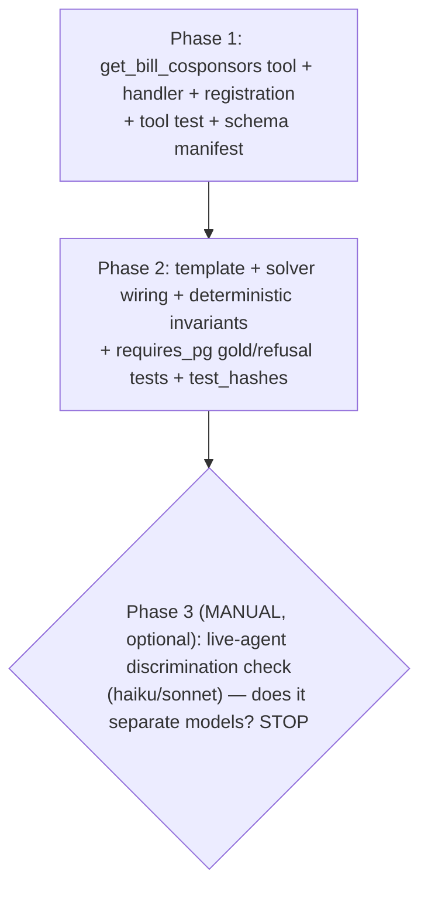

# Family 2 — cosponsored bill Y AND voted against it

> **Rev 2** folds a 5-lens panel (architecture / kieran-python / data-integrity / simplicity /
> performance). The authoritative resolutions are the **"## Panel resolutions (rev 2 — folded,
> authoritative)"** appendix (PR-1…PR-12); where the body and the appendix conflict, the appendix
> wins. Blessed forks B1–B6 held. Two correctness BLOCKERs were fixed (the vacuous-∅ pool gate;
> the mechanical prompt wording vs procedural motions) — neither touches a blessed fork.

## Overview

The first **Family 2 (sponsorship)** slice and the lab's first **Tier-3 two-table join** — the doc's
"first place frontier models start to fabricate." One frozen benchmark template
`family2.cosponsored_and_voted_against`: *"Which members who cosponsored bill Y voted against it on
its roll-call vote?"* gold = the **set of cosponsor person_ids who voted nay** (∅ when all cosponsors
supported it). It is structurally a sibling of two shipped templates — `crossed_party` (set_match over
`member_ids`, ∅-valid) and `cite_record_id` (single-roll-call eligibility gate + identical-shape
refusal twins) — so it adds **no new grader** and touches **no frozen core** (`content_hash` moves for
the new template; `grading_contract_hash` UNMOVED). The one genuinely new piece is a minimal product
tool, `get_bill_cosponsors`, for the OURS arm. Same cadence: this plan → 5-lens panel → `/ce:work`.

## Blessed / locked decisions (scope-approved — do NOT re-open)

| # | Decision |
|---|----------|
| B1 | **One template** `family2.cosponsored_and_voted_against` (scope mode = HOLD). Sibling joins (never-cross-aisle, blocs, passage-rate) are deferred fast-follows. |
| B2 | **Single-roll-call gate** (bills with exactly 1 vote_event) so "the vote on bill Y" is unambiguous — pure tier-C, no `passage` definition to freeze. |
| B3 | **"cosponsored"** = `classification ∈ {cosponsor, original-cosponsor}` (excludes `primary`). |
| B4 | **gold = set of person_ids** who cosponsored Y AND have a `nay` record on its roll call; grader = **set_match** (`member_ids` field — the `crossed_party` shape). **∅ is valid** (all cosponsors supported it). |
| B5 | **One new minimal tool** `get_bill_cosponsors` (bill → cosponsor person_ids + names) — NOT `get_bill_detail` (heavy: full text + AI summary = noise/leak surface). |
| B6 | Federal-only (all voted bills are `us`). No completeness/point-in-time gate (a cosponsor's own nay record is unambiguous even on an overcount event — mirrors `cite_record_id`). |

## Resolved design (the scope's open questions)

### Gold construction (mirrors `crossed_party`'s one-query + `cite_record_id`'s single-roll-call gate)
1. **Eligibility (one query):** single-roll-call bills (`WITH single AS (SELECT bill_id, MIN(id) AS
   eid FROM vote_events WHERE bill_id IS NOT NULL GROUP BY bill_id HAVING COUNT(*)=1)` — `MIN(id)` IS
   the unique event) with ≥1 cosponsor **AND ≥1 cosponsor who cast a recorded yea/nay vote on `eid`**
   (**PR-1 — the vacuous-∅ gate:** without it, a bill whose event has no resolved cosponsor votes
   yields gold ∅ that is byte-identical to true unanimous support, polluting the `clean` pool and
   mis-scoring an honest refusal as over-refusal; the gate makes ∅ mean "voting cosponsors didn't
   defect," not "no data." ≈2,612 resolvable, not 2,904).
2. **Gold (per sampled bill), one query — `SELECT DISTINCT` (PR-4):** the cosponsors who voted nay on
   `eid`: `SELECT DISTINCT s.person_id, p.name FROM sponsorships s JOIN people p ON p.id=s.person_id
   JOIN vote_records vr ON vr.person_id=s.person_id AND vr.vote_event_id=%s WHERE s.bill_id=%s AND
   s.classification IN ('cosponsor','original-cosponsor') AND vr."option"='nay'`. gold = `{person_id}`
   (∅ valid). **DISTINCT** because the `(bill_id, person_id, classification)` UniqueConstraint lets a
   person hold BOTH a `cosponsor` and `original-cosponsor` row → the join would double them. **NO
   `len(gold)==count` assert** (unlike `crossed_party`'s `min(yea,nay)` check — there is no valid
   count analog here; the set IS the answer).
3. **Partition from the SAME gold predicate (PR-3, set-based — perf):** compute `has_defectors` =
   `{bill : the gold query over its eid is non-empty}` as ONE set-based pass (`SELECT DISTINCT
   single.bill_id FROM single JOIN sponsorships … JOIN vote_records vr ON vr.vote_event_id=single.eid
   AND vr.person_id=s.person_id WHERE … vr."option"='nay'`), NEVER a per-bill loop over 2,612 (N+1).
   `clean = eligible − has_defectors` in Python over the small id lists. Same classification set + same
   `eid` as the gold → the partition cannot drift from the gold (closes the mis-binning seam).
4. The agent works in **person_id space end-to-end** (both tools return person_ids) → a clean
   id-intersection, NOT name-matching (avoids the window-template name bug).
5. **Prompt wording (PR-2 — mechanical, not "against it"):** the lone roll call may be a *procedural*
   motion (recommit/table/previous-question) where a nay is NOT "against the bill" — so the prompt
   describes the **mechanical gold** and includes `motion_text`, like `vote_lookup`/`crossed_party`:
   *"Among the members who cosponsored bill {identifier} (bill id {bid}), which voted nay on its
   roll-call vote ({motion})? List the member ids."* This anchors "nay" to the actual motion.

### Stratification (the 94/6 ∅-vs-defector skew — reuse the family9 kind-axis pattern)
- Two pools (PR-3): **`has_defectors`** (gold non-∅ — 155 bills) and **`clean`** (gold ∅ over a
  resolved event, PR-1 — ~2,457). Sample a **floor of each** (target ~`n//2` per pool, deterministic
  `sample()`). **Fill-from-short-pool (PR-11):** if a pool has `< n//2`, take all of it and EXTEND the
  donor pool's hash-ordered sample by the deficit (`sample(donor, n//2 + deficit, seed)`, slice the
  tail) — a deterministic, dup-free extension, never a restart. The pools are disjoint.
- **Mark `params["kind"] = "has_defectors" | "clean"` (PR-5 — a STRING, the family9 axis), NOT a
  `has_defectors` bool** — `lab/ablation.py::_partition_by_kind` reads `params.get("kind","all")`, so
  the string key makes per-kind reporting reuse the existing machinery (a bool key would be ignored).
  `params` is metadata, NEVER in the prompt → leak-safe (verified: the solver builds messages from
  `inst.prompt` only). **Derive `kind` from `len(gold)>0` at emit + assert (PR-3):**
  `assert (len(gold) > 0) == (params["kind"] == "has_defectors")` → a kind/gold mismatch is
  un-emittable.
- **Headline contract (PR-12):** the analysis reports **clean-accuracy (don't-fabricate-a-defector)**
  and **defector-recall (find-them)** as TWO separate numbers — NEVER a blended "family2 score" over
  the forced ~50/50 sample (which is neither population-representative (94/6) nor a natural quantity).
  Over-sampling the rare hard case is correct for a capability benchmark; the only risk is downstream
  blending. (`clean` ≈ "voting cosponsors didn't defect," per PR-1 — not literally "all supported.")

### Refusal twins (identical prompt shape — distinguish only by verifying the data; `cite` discipline)
- **Twin A — nonexistent bill (PR-7 — CLONE, don't reinvent):** synthetic `NX-BILL-{seed}-*` ids
  proven absent → `get_bill_cosponsors`/`get_bill_votes` error arm → REFUSE. Clone
  `generate_cite_record_id`'s nonexistent-bill block near-verbatim (templates.py ~L905-927). The
  shared `_party_event_refusals` helper does NOT apply (it mints vote_event ids, not bill ids).
- **Twin B — real bill, cosponsors, but NO roll-call vote (PR-6 — explicit per-emit proof):** a real
  bill with ≥1 cosponsor that never received a roll call (~124k exist). `get_bill_votes` returns an
  empty list → the agent must **REFUSE** (no vote happened), NOT answer ∅ (∅ would falsely imply
  unanimous support — the trust-critical "no-vote ≠ unanimous" case). **Prove per-emit in code**
  (cite's explicit-probe discipline, not a pool query alone): assert the bill has **0 vote_events
  keyed on `vote_events.bill_id=%s`** (the SAME column `_tool_get_bill_votes` uses → answerable-vs-B
  is provably tool-consistent) AND ≥1 cosponsor; raise if a roll call exists.
- **Candidate set for Twin B (PR — perf):** `SELECT DISTINCT bill_id FROM sponsorships WHERE
  classification IN (…)` MINUS the voted-bill set, as an anti-join / one-pass scan over the small id
  lists — never `bill_id NOT IN (<13.8k list>)`, never pulling sponsorship rows. Only `_n_refusals`
  (floor 3) are needed.

### The new tool `get_bill_cosponsors` (mirrors `_tool_get_bill_votes` exactly)
- One index-backed `SELECT DISTINCT person_id, name` on `sponsorships.bill_id` filtered to
  `{cosponsor, original-cosponsor}`, joined to `people` for names (DISTINCT so the double-row person
  isn't emitted twice); guarded body (try/except → clean JSON error). **Empty result pays the
  existence check** (missing bill → not-found error = the refusal basis; a real bill with no
  cosponsors → empty list). Returns `{bill_id, cosponsors:[{person_id, name}], count}`. Keep `name`
  (it's a product tool — `/chat`+MCP humans need it). Stays OUT of `_HARNESS_REQUIRED_TOOLS`.

## Architecture

| Layer | File | Change |
|-------|------|--------|
| Product tool | `src/llm/tools.py` | +`get_bill_cosponsors` def in `RESEARCH_TOOLS` |
| Tool handler | `src/api/chat.py` | +`_tool_get_bill_cosponsors` (mirrors `_tool_get_bill_votes`); register in `_TOOL_HANDLERS` |
| Template (content) | `lab/templates.py` | +`TEMPLATE_COSPONSOR_VOTE`; +`generate_cosponsored_and_voted_against` (eligibility, gold, stratified kind, 2 refusal twins); +`TEMPLATE_REGISTRY` entry (**flips `content_hash` — legit**) |
| Solver wiring | `lab/solvers.py` | +`SUBMIT_SCHEMAS` (`member_ids` array — clone `crossed_party`); +`SET_MATCH_FIELD["family2…"]="member_ids"`; +`TEMPLATE_TOOLS["family2…"]=["get_bill_cosponsors","get_bill_votes","get_vote_event"]` |
| Schema manifest | `tests/test_lab/conftest.py` | +`sponsorships: {id, bill_id, person_id, classification}` (lab gold SQL now depends on it) |
| Drift test (hardcoded) | `tests/test_lab/test_schema_columns.py` | import `Sponsorship` + add to the `_MODELS` tuple (else KeyErrors on the new manifest key) — PR-8 |
| MCP roster (hardcoded) | `tests/test_mcp/test_server.py` | +`get_bill_cosponsors` in `EXPECTED_TOOLS` (else `test_no_extra_tools` fails) — PR-8 |
| Tests | `tests/test_api/test_vote_tool.py` + `tests/test_lab/test_cosponsored_and_voted_against.py` | as below |

**Frozen core UNMOVED:** `scoring.py`, `graders.py`, `validate_gold`, vocab, the `TraceRecord`
contract, existing templates' gold → `grading_contract_hash` stays put. **No `coerce` change** —
set_match over `member_ids` is the unchanged existing path (no scalar fold; that was family9-only).

## Dependency graph

## Phase 1 — the `get_bill_cosponsors` tool ✅ COMPLETE (branch feat/lab-family2-cosponsor-vote)
- [x] `_tool_get_bill_cosponsors` in `src/api/chat.py` (mirrors `_tool_get_bill_votes`: `SELECT
  DISTINCT person_id, name`, guarded body, empty-result existence check); registered in
  `_TOOL_HANDLERS` (NOT `_HARNESS_REQUIRED_TOOLS`). Filter `classification IN ('cosponsor',
  'original-cosponsor')`. **Real-data smoke OK** (a 3-cosponsor bill resolves; nonexistent → clean
  error).
- [x] `get_bill_cosponsors` def in `src/llm/tools.py` `RESEARCH_TOOLS` (minimal schema: `bill_id`).
- [x] **The green-suite gate edits (PR-8) — the panel caught two; execution found a THIRD:**
  (a) `sponsorships` added to `tests/test_lab/conftest.py::REQUIRED_COLUMNS`; (b) `Sponsorship`
  imported + added to the `_MODELS` tuple in `tests/test_lab/test_schema_columns.py`;
  (c) `get_bill_cosponsors` added to `EXPECTED_TOOLS` in `tests/test_mcp/test_server.py`; **(d) NEW —
  `test_convert_all_research_tools` had a SECOND hardcoded count (`len==15`, two asserts) the panel
  missed → bumped to 16.** MCP server auto-enumerates `RESEARCH_TOOLS` (verified) → no `server.py`
  change.
- [x] Tool tests in `tests/test_api/test_provenance_tools.py` (the actual `get_bill_votes` sibling,
  NOT test_vote_tool.py) (PR-9): 4 hermetic (shape; nonexistent→error; real-bill-no-cosponsors→empty;
  DB-error guard → generic error, no traceback leak) + 1 `requires_pg` (primary EXCLUDED; BOTH
  `cosponsor` and `original-cosponsor` included; the double-role person DISTINCT-deduped). The
  `requires_pg` test follows the codebase's best-effort-skip convention (async pg tests skip in the
  full suite when not first; passes in isolation). ruff clean; full test_api/test_mcp/test_lab suite
  green; `test_hashes` UNMOVED (no lab file touched). Commit.

## Phase 2 — the template + wiring ✅ COMPLETE
- [x] `generate_cosponsored_and_voted_against`: eligibility (single-roll-call ∩ has-cosponsor ∩ **≥1
  cosponsor with a yea/nay record on `eid`**, PR-1); gold = the nay-voting cosponsor set (one
  `DISTINCT` query + a Python set, NO count-assert, PR-4); the **set-based** `has_defectors`/`clean`
  partition from the same `SUM(CASE … nay …)` predicate (PR-3) + `_stratified_bills` floor-of-each
  with the deterministic tail-extension fill (PR-11) + `params["kind"]` (PR-5) + the emit assert
  `(len(gold)>0)==(kind=="has_defectors")`; Twin A (cloned cite's `NX-BILL-*` block, PR-7) + Twin B
  (real bill, cosponsors, 0 `vote_events`-by-`bill_id`, proven per-emit via an anti-join candidate +
  per-bill assert, PR-6). Registered in `TEMPLATE_REGISTRY`. SQL is portable (`SUM(CASE)`/CTE — passes
  `test_sql_portability`).
- [x] Solver wiring: `SUBMIT_SCHEMAS` (`member_ids`, cloned `crossed_party`), `SET_MATCH_FIELD`,
  `TEMPLATE_TOOLS=[get_bill_cosponsors, get_bill_votes, get_vote_event]`. NO coerce change (existing
  set_match path). `test_agent_seam` (TEMPLATE_TOOLS↔RESEARCH_TOOLS parity) green.
- [x] **Validated vs real PG:** 5/5 `has_defectors`/`clean` split + 2+2 refusal twins; oracle 14/14,
  wrong 0/14, over-refuse 0/10 (answerable, incl. ∅); 0 prompt leaks; **gold ⊆ `get_bill_cosponsors`
  10/10 (PR-10)**.
- [x] `test_cosponsored_and_voted_against.py`: hermetic `_stratified_bills` (balanced/fill/determinism)
  + `requires_pg` gold-predicate (cosponsor + nay on the single roll call; kind↔gold-emptiness;
  leak-safe), refusal twins (A absent; B has cosponsors + 0 roll calls), deterministic invariants, and
  the async **gold⊆tool superset** (PR-10). **185 lab tests pass; `test_hashes` green** (`content_hash`
  moved — new template; `grading_contract_hash` UNMOVED). ruff clean (ASCII-only per the cp1252 rule).
  Commit.

## Phase 3 — MANUAL live-agent discrimination check (optional, STOP)
- [ ] Run the live AgentSolver (haiku/sonnet, agent-sdk) on the template; **read traces**: does the
  3-tool multi-hop join (`get_bill_cosponsors` → `get_bill_votes` → `get_vote_event` → intersect)
  separate models (the backlog's D=High prior)? Does the agent correctly return ∅ on `clean` items
  (no fabricated defector) and REFUSE Twin B (no-vote ≠ ∅)? STOP for review; numbers update the
  build backlog (discrimination is empirical).

## System-Wide Impact
- **New product tool is exposed beyond the lab.** `get_bill_cosponsors` joins `RESEARCH_TOOLS`, so the
  **product chat assistant** (`/chat`) and the **MCP server** (`src/mcp/server.py`, which reuses
  `chat.py` handlers) gain it. Read-only, low-risk, genuinely useful — but verify the MCP server picks
  it up (it may enumerate `RESEARCH_TOOLS`/`_TOOL_HANDLERS`, or need an explicit list entry).
- **Schema dependency widened:** the lab gold SQL now reads `sponsorships` → the `conftest`
  REQUIRED_COLUMNS manifest + the ORM/live drift tests (`test_schema_columns`/`test_schema_live`) must
  include it, or the drift guard goes stale.
- **`autoresearch/prepare.py`** has hardcoded SQL referencing `sponsorships` columns (per the model's
  schema-drift comment) — we only READ existing columns, so no break, but don't rename.
- **No frozen-core / migration / data change.** `content_hash` moves (new template — expected).
- **Integration scenarios:** (1) a bill where a cosponsor defects (`has_defectors`, non-∅ gold); (2) a
  bill where all cosponsors supported (`clean`, ∅ gold — must not fabricate); (3) a bill with no roll
  call (Twin B — must refuse, not answer ∅); (4) a nonexistent bill (Twin A — refuse).

## Risks & mitigations
| Risk | Mitigation |
|------|------------|
| **Vacuous ∅** (event with no resolved cosponsor votes → ∅ ≡ "supported") | PR-1: gate the pool on ≥1 cosponsor yea/nay record on `eid` → ∅ means "voting cosponsors didn't defect" |
| **Procedural motion** makes "against it" ≠ mechanical nay-gold | PR-2: mechanical prompt with `motion_text` ("voted nay on its roll call (motion)"), not "against it" |
| **∅-gold dominates** (94%) → an always-∅ model scores ~94% | stratify `has_defectors`/`clean` (`params["kind"]`, PR-5) + report the two as SEPARATE numbers, never blended (PR-12) |
| **"no roll call" graded as ∅** instead of REFUSE | Twin B, proven per-emit on `vote_events.bill_id`=0 + ≥1 cosponsor (PR-6) — no-vote ≠ unanimous |
| **Partition drifts from gold** / N+1 over 2,612 bills | PR-3: partition from the SAME gold predicate as ONE set-based pass; emit assert binds kind↔gold-emptiness |
| **`original-cosponsor` double-row** double-counts | PR-4: `SELECT DISTINCT`; NO `len==count` assert (no valid count analog) |
| **Two-layer "cosponsored" literal drift** (handler vs gold SQL) | PR-10: invariant `gold ⊆ get_bill_cosponsors(bill)` + a lockstep comment in both spots |
| **Name-matching fragility** (bit the window templates) | both tools return person_ids; the agent intersects on ids, never names |
| **Phase-1 green-suite blocked** by hardcoded test rosters | PR-8: edit `_MODELS` (schema_columns) + `EXPECTED_TOOLS` (mcp) in the same phase |
| **Overcount / absent cosponsor** | `(vote_event_id, person_id)` unique → one record/cosponsor; a non-voter has no `nay` row → excluded |
| **Defector-pool difficulty confound** (defector bills have more cosponsors → longer retrieval) | note it so clean-vs-defector deltas aren't over-read (inherent to the construct) |
| **System prompt is family1-framed** (no cosponsor cue) → may depress all models uniformly | Phase-3 trace-reading hypothesis; the tool descriptions carry the cue; revisit if discrimination is flat |

## Out of scope
- Other Family 2 templates (fast-follows); multi-roll-call / `passage`-vote C-def; a tool-surface
  ablation on this template (moat work stream paused); any frozen-core change (STOP-and-surface).

## Sources & References
- **Origin scope:** `docs/scopes/2026-06-28-family2-cosponsor-vote-join-scope.md`; the build backlog
  `docs/condorcet/2026-06-28-task-suite-build-backlog.md` (why this slice is next).
- Patterns: `lab/templates.py` `generate_crossed_party` (set_match `member_ids`, ∅-valid, one-query
  set+membership) + `generate_cite_record_id` (single-roll-call gate, identical-shape refusal twins);
  `src/api/chat.py::_tool_get_bill_votes` (the handler template) + `_TOOL_HANDLERS` registration;
  `src/llm/tools.py` `RESEARCH_TOOLS`; `lab/solvers.py` `SET_MATCH_FIELD`/`SUBMIT_SCHEMAS`/
  `TEMPLATE_TOOLS` (the `crossed_party` entries to clone); `tests/test_lab/conftest.py` REQUIRED_COLUMNS.
- `src/models/sponsorship.py` (bill_id, person_id, classification; UniqueConstraint).
- Data (verified 2026-06-28): classification {cosponsor 1.63M, primary 151k, original-cosponsor 345};
  5,707 bills w/ both; 2,904 single-roll-call w/ cosponsors; 2,612 resolvable; 155 (6%) have a
  defecting cosponsor.

## Panel resolutions (rev 2 — folded, authoritative)
Where this conflicts with the body, this wins. Blessed forks B1–B6 held. The panel verified (no
action): the layering + the `execute_tool` seam; MCP auto-enumerates `RESEARCH_TOOLS` (no `server.py`
change); the hash split (`templates.py`→`content_hash`; `solvers.py` feeds neither); set_match wiring
is genuinely zero-core-change; the determinism invariants hold without special-casing; every query is
index-backed (no N+1) given PR-3; both twins + the stratification are necessary, not gold-plating;
keep `name` in the tool; 3 phases right-sized; the gold membership predicate (a non-voter / present /
yea / pure-primary all land correctly).

- **PR-1 (BLOCKER, data) — vacuous-∅ pool gate.** Gate the answerable pool on the single event having
  ≥1 cosponsor with a yea/nay record, so ∅ means "voting cosponsors didn't defect," not "no data"
  (~2,612 resolvable, not 2,904). Without it the `clean` pool is polluted and honest refusals score as
  over-refusal.
- **PR-2 (BLOCKER, data) — mechanical prompt, not "against it."** The lone roll call may be a
  procedural motion where a nay isn't "against the bill"; phrase the prompt mechanically with
  `motion_text` ("voted nay on its roll call ({motion})") so the prompt faithfully describes the
  nay-gold.
- **PR-3 (SHOULD, data+perf) — partition from the SAME gold predicate, set-based.** Compute
  `has_defectors` via ONE set-based pass over the gold predicate (same classification set + `eid`),
  never a per-bill loop (N+1); `clean = eligible − has_defectors`; emit assert
  `(len(gold)>0)==(kind=="has_defectors")` → mis-binning un-emittable.
- **PR-4 (SHOULD, data) — DISTINCT dedup, no count-assert.** `original-cosponsor` lets a person hold 2
  rows on one bill → `SELECT DISTINCT`; do NOT port `crossed_party`'s `len==min(yea,nay)` assert (no
  valid count analog). Test the double-row case.
- **PR-5 (SHOULD, arch+simplicity) — `params["kind"]` string, not a bool.** Use `kind ∈
  {has_defectors, clean}` so `ablation.py::_partition_by_kind` (reads `params.get("kind")`) picks it
  up; a `has_defectors` bool would be ignored. Leak-safe (params never in the prompt).
- **PR-6 (SHOULD, data+kieran) — Twin B explicit per-emit proof.** Assert in code: bill has 0
  `vote_events` keyed on `vote_events.bill_id=%s` (the tool's column → tool-consistent) AND ≥1
  cosponsor; raise if a roll call exists. Don't trust the pool query alone.
- **PR-7 (SHOULD, simplicity) — clone Twin A.** Clone `generate_cite_record_id`'s nonexistent-bill
  block (`NX-BILL-*`, proven absent); `_party_event_refusals` does NOT apply (it mints vote_event ids).
- **PR-8 (BLOCKER, arch — Phase-1 green gate) — two hardcoded rosters.** Add `Sponsorship` to
  `test_schema_columns.py::_MODELS` (else KeyError on the new manifest key) and `get_bill_cosponsors`
  to `test_mcp/test_server.py::EXPECTED_TOOLS` (else `test_no_extra_tools` fails).
- **PR-9 (SHOULD, kieran) — tool-test gaps.** Add the hermetic DB-error guard (generic error, no
  traceback leak) + all three classifications (`primary` excluded; `cosponsor` + `original-cosponsor`
  included) via inserted `requires_pg` rows.
- **PR-10 (SHOULD, arch) — gold ⊆ tool invariant.** Test `gold ⊆ {get_bill_cosponsors(bill)
  person_ids}` — the "cosponsored" literal is duplicated in the handler + the gold SQL (lab doesn't
  import src); this asserts the OURS tool is a faithful superset + a lockstep comment in both spots.
- **PR-11 (SHOULD, kieran) — deterministic fill.** If a pool is short, EXTEND the donor's hash-ordered
  sample by the deficit (`sample(donor, n//2+deficit, seed)`, take the tail) — never restart.
- **PR-12 (SHOULD, data) — no blended headline.** Report clean-accuracy and defector-recall as two
  separate numbers; never average the forced ~50/50 into one "family2 score."
- **Notes (NICE):** `clean` ≈ "voting cosponsors didn't defect" (describe accurately, not "all
  supported"); "cosponsor of record ≈ at vote time" is a known low-risk approximation (no `withdrawn-*`
  class; B6 waives point-in-time); the defector-pool difficulty confound + the family1-framed system
  prompt are Phase-3 trace-reading hypotheses, not code changes.
